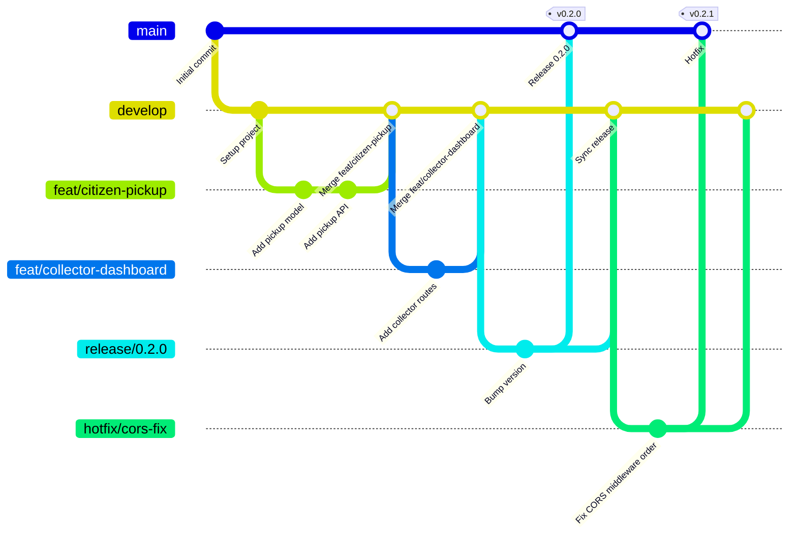

# Contributing to Waste-IQ ♻️

Thank you for your interest in contributing to Waste-IQ! This document provides everything you need to know to get started, follow our workflows, and submit high-quality contributions.

> **Please read our [Code of Conduct](CODE_OF_CONDUCT.md) before contributing.** All contributors are expected to uphold these standards.

---

## Table of Contents

1. [Getting Started](#getting-started)
2. [Development Environment Setup](#development-environment-setup)
3. [Project Workflow & Git Flow](#project-workflow--git-flow)
4. [Branch Naming Convention](#branch-naming-convention)
5. [Commit Message Convention](#commit-message-convention)
6. [Coding Standards](#coding-standards)
7. [Testing Requirements](#testing-requirements)
8. [Pull Request Process](#pull-request-process)
9. [Review Process](#review-process)
10. [Branch Protection](#branch-protection)
11. [Issue Reporting](#issue-reporting)
12. [Documentation Requirements](#documentation-requirements)
13. [Definition of Done](#definition-of-done)

---

## Getting Started

1. **Fork** the repository on GitHub.
2. **Clone** your fork:
   ```bash
   git clone https://github.com/<your-username>/waste-iq.git
   cd waste-iq
   ```
3. **Add the upstream remote**:
   ```bash
   git remote add upstream https://github.com/your-org/waste-iq.git
   ```
4. Follow the [Development Environment Setup](#development-environment-setup) section.
5. Create a branch following the [Branch Naming Convention](#branch-naming-convention).
6. Make your changes, write tests, and submit a [Pull Request](#pull-request-process).

---

## Development Environment Setup

### Backend (FastAPI / Python)

**Prerequisites:** Python 3.12+, Git

```bash
cd backend

# Create a virtual environment
python -m venv .venv

# Activate it
# Windows:
.venv\Scripts\activate
# macOS / Linux:
source .venv/bin/activate

# Install runtime + dev dependencies
pip install -r requirements.txt -r requirements-dev.txt

# Copy environment configuration
cp .env.example .env
# Edit .env with your local values (SQLite is the default for local dev)

# Apply database migrations
alembic upgrade head

# Start the backend server with auto-reload
uvicorn app.main:app --reload --port 8000
```

Backend is available at `http://localhost:8000`. Swagger docs at `http://localhost:8000/docs`.

### Frontend (React / TypeScript)

**Prerequisites:** Node.js 20+, npm

```bash
cd frontend

# Install dependencies
npm install

# Copy environment configuration
cp .env.example .env
# Set VITE_API_BASE_URL=http://localhost:8000

# Start the development server
npm run dev
```

Frontend is available at `http://localhost:5173`.

### Using Docker Compose (Recommended for Full Stack)

```bash
# Configure environment
cp backend/.env.example backend/.env
# Edit backend/.env: set DATABASE_URL=postgresql://wasteiq:wasteiq@db:5432/wasteiq

# Start all services
docker compose up --build

# On first run, apply migrations
docker compose exec backend alembic upgrade head
```

---

## Project Workflow & Git Flow

Waste-IQ follows a simplified **Git Flow** branching strategy.



### Branch Rules

| Branch | Purpose | Created From | Merges Into |
|--------|---------|--------------|-------------|
| `main` | Production-ready code | — | — |
| `develop` | Integration branch for next release | `main` | `main` (via release) |
| `feat/*` | New features | `develop` | `develop` |
| `fix/*` | Bug fixes | `develop` | `develop` |
| `hotfix/*` | Critical production fixes | `main` | `main` + `develop` |
| `release/*` | Release preparation | `develop` | `main` + `develop` |
| `docs/*` | Documentation changes | `develop` | `develop` |
| `chore/*` | Tooling, deps, CI | `develop` | `develop` |
| `refactor/*` | Code refactoring | `develop` | `develop` |

---

## Branch Naming Convention

Use **kebab-case** with a prefix that matches the commit type.

| Type | Pattern | Example |
|------|---------|---------|
| Feature | `feat/<short-description>` | `feat/inventory-marketplace` |
| Bug Fix | `fix/<issue-or-description>` | `fix/cors-middleware-order` |
| Hotfix | `hotfix/<description>` | `hotfix/jwt-expiry-crash` |
| Documentation | `docs/<description>` | `docs/api-specification` |
| Refactor | `refactor/<description>` | `refactor/pickup-service-layer` |
| Chore | `chore/<description>` | `chore/upgrade-sqlalchemy-2` |
| Release | `release/<version>` | `release/0.2.0` |

**Rules:**
- Use **lowercase** only
- Use **hyphens**, not underscores or spaces
- Keep it **concise but descriptive** (2–5 words)
- Include an **issue number** when applicable: `feat/GH-42-dealer-profile`

---

## Commit Message Convention

Waste-IQ uses [**Conventional Commits**](https://www.conventionalcommits.org/en/v1.0.0/) specification.

### Format

```
<type>(<scope>): <short summary>

[optional body]

[optional footer(s)]
```

### Types

| Type | Description | Example |
|------|-------------|---------|
| `feat` | A new feature | `feat(auth): add JWT refresh token endpoint` |
| `fix` | A bug fix | `fix(cors): move middleware before include_router` |
| `docs` | Documentation only | `docs(api): document /dealer/inventory endpoints` |
| `style` | Formatting, no logic change | `style(frontend): run prettier on src/` |
| `refactor` | Code change, no feature/fix | `refactor(pickup): extract service layer` |
| `test` | Adding or fixing tests | `test(collector): add unit tests for accept flow` |
| `chore` | Build, tooling, deps | `chore(deps): upgrade fastapi to 0.115` |
| `ci` | CI/CD changes | `ci: add codecov upload step to backend workflow` |
| `perf` | Performance improvement | `perf(db): add index on pickup_requests.status` |
| `revert` | Revert a previous commit | `revert: feat(auth): add JWT refresh token endpoint` |

### Scopes (Examples)

| Scope | Covers |
|-------|--------|
| `auth` | Authentication, JWT, login/register |
| `pickup` | Pickup request lifecycle |
| `collector` | Collector-specific features |
| `dealer` | Dealer profiles and marketplace |
| `admin` | Admin-only features |
| `inventory` | Inventory lots, pricing, categories |
| `db` | Database models, migrations |
| `frontend` | General frontend |
| `ci` | GitHub Actions workflows |
| `docs` | Documentation |

### Rules

- Summary line: **max 72 characters**, **imperative mood** ("add" not "adds/added")
- Reference issues in footer: `Closes #42`, `Relates to #15`
- Mark breaking changes: add `!` after type/scope (`feat(auth)!:`) or `BREAKING CHANGE:` in footer

### Examples

```
feat(inventory): add dealer lot reservation with 24hr expiry

Dealers can now reserve an inventory lot for 24 hours.
A background check on reservation_expires_at enforces expiry.

Closes #78
```

```
fix(cors): move CORSMiddleware registration before include_router

Starlette applies middleware in reverse insertion order.
Adding CORS after routers caused OPTIONS preflight to bypass it.

Closes #91
```

```
feat(auth)!: require phone number on registration

BREAKING CHANGE: /auth/register now requires a `phone` field.
Existing integrations must be updated to include this field.
```

---

## Coding Standards

### Python (Backend)

| Tool | Purpose | Config |
|------|---------|--------|
| **Ruff** | Linting (replaces Flake8 + isort) | `pyproject.toml` |
| **Black** | Code formatting | `pyproject.toml` |
| **MyPy** | Static type checking | `pyproject.toml` |
| **PEP 8** | Style guide | enforced by Ruff |

**Run all checks locally:**

```bash
cd backend

# Lint
ruff check app/ tests/

# Format check (CI) or auto-fix (dev)
black --check app/ tests/
black app/ tests/

# Type check
mypy app/

# Auto-fix linting issues
ruff check --fix app/ tests/
```

**Key conventions:**
- All functions and methods must have **type annotations**
- All public modules, classes, and functions must have **docstrings**
- Use `from __future__ import annotations` in all model files
- Follow the repository's **layered architecture**: Routes → Services → Repositories → Models
- Never put business logic in route handlers; always delegate to service layer
- Use **Pydantic v2** schemas for all request/response validation
- Database access must go through the **repository layer**, not directly in services where possible

### TypeScript (Frontend)

| Tool | Purpose | Config |
|------|---------|--------|
| **ESLint** | Linting | `eslint.config.js` |
| **TypeScript strict** | Type safety | `tsconfig.app.json` |
| **Prettier** *(recommended)* | Formatting | Add `.prettierrc` |

**Run all checks locally:**

```bash
cd frontend

# Lint
npm run lint

# Type check
npx tsc --noEmit
```

**Key conventions:**
- **No `any` types** — use proper types or `unknown` with guards
- All React components must be **typed with proper prop interfaces**
- Use **TanStack Query** for all server state; avoid `useEffect` for data fetching
- Form validation uses **React Hook Form + Zod** schemas
- All API calls must go through the `/src/api/` layer — no inline `axios.get()` in components
- Component files: `PascalCase.tsx` | Hook files: `useHookName.ts` | Utility files: `camelCase.ts`
- Prefer **named exports** over default exports for components

---

## Testing Requirements

### Backend (Pytest)

- All new features must include **unit tests**
- All bug fixes must include a **regression test**
- Minimum coverage target: **80%** on `app/` module
- Tests live in `backend/tests/`

```bash
cd backend

# Run full test suite
pytest tests/ -v

# Run with coverage report
pytest tests/ --cov=app --cov-report=term-missing

# Run specific test file
pytest tests/test_auth.py -v

# Run tests matching a keyword
pytest tests/ -k "pickup" -v
```

**Testing approach:**
- Use `pytest` with `httpx.AsyncClient` for API route tests
- Mock external services (Cloudinary) using `unittest.mock.patch`
- Use a separate SQLite test database (configured via `DATABASE_URL` in test env)
- Fixtures defined in `conftest.py` at the `tests/` root level

### Frontend

- Run ESLint and TypeScript checks before submitting PRs
- Manual testing of all changed UI flows required
- E2E tests (Playwright) — add for critical paths as the test suite grows

---

## Pull Request Process

1. **Sync with upstream** before creating a branch:
   ```bash
   git fetch upstream
   git rebase upstream/develop
   ```

2. **Create your branch** from `develop`:
   ```bash
   git checkout -b feat/your-feature-name develop
   ```

3. **Make your changes** following the coding standards above.

4. **Write or update tests** to cover your changes.

5. **Run the full test suite** locally:
   ```bash
   # Backend
   cd backend && pytest tests/ -v

   # Frontend
   cd frontend && npm run lint && npx tsc --noEmit && npm test
   ```

6. **Commit** using Conventional Commits format.

7. **Push** your branch:
   ```bash
   git push origin feat/your-feature-name
   ```

8. **Open a Pull Request** against `develop` on GitHub.
   - Fill in the [PR template](.github/PULL_REQUEST_TEMPLATE.md) completely
   - Link to any related issues
   - Add screenshots for UI changes

9. **Address review feedback** promptly and push additional commits to the same branch.

10. Once approved, a maintainer will **squash-merge** your PR into `develop`.

### PR Rules

- ✅ Must target `develop` (not `main`) unless it is a hotfix or release
- ✅ Must pass all CI checks (backend lint/test + frontend lint/build)
- ✅ Must pass the **PR Gate** check (see below)
- ✅ Must have at least **1 approved review** from a maintainer
- ✅ Must not have unresolved review comments
- ✅ Must be up-to-date with `develop` before merging
- ❌ Do not force-push to a PR branch after review has started

### CI Enforcement — the PR Gate

The specialized workflows (`Backend CI`, `Frontend CI`, `Agent CI`, `Docker CI`) stay
path-filtered, so a docs-only PR legitimately runs none of them. Enforcement therefore
happens through one always-running check, **`PR Gate`** (`.github/workflows/pr-gate.yml`),
which is the status check required by branch protection on `main` and `develop`.

How it works:

1. The gate recomputes which areas the PR changed (backend / frontend / agent / docker /
   compose) using rules that mirror the path filters of the specialized workflows.
2. It then requires every *relevant* specialized workflow to have completed successfully
   for the same commit. Irrelevant workflows are allowed to remain skipped.
3. Docs-only PRs (e.g. `docs/*` branches) pass without running any expensive suite.

| Changed area | Required to succeed |
|--------------|---------------------|
| `backend/**` | Backend CI + Docker CI |
| `frontend/**` | Frontend CI + Docker CI |
| `agent/**` | Agent CI |
| `docker-compose*.yml`, `backend/.dockerignore` | Docker CI |
| `.github/workflows/*.yml` (CI changes) | the corresponding workflow (the gate validates itself) |
| docs / markdown only | nothing — gate passes |

A failed required workflow fails the PR Gate; there is no "always green" bypass. See
[`docs/SYSTEM_ARCHITECTURE.md § 10.5`](docs/SYSTEM_ARCHITECTURE.md#105-ci-pipeline--pr-gate-wiq-v1-010)
for details.

---

## Branch Protection

Both `main` and `develop` are protected branches. The rules are identical and
are enforced server-side by GitHub; they cannot be bypassed by contributors or
maintainers, including the repository owner.

### What is enforced

| Rule | Setting |
|------|---------|
| Direct push (commit straight to the branch) | **Blocked** |
| Force push | **Disabled** |
| Branch deletion | **Disabled** |
| Merging without a pull request | **Blocked** |
| Required approving reviews | **At least 1** from a maintainer |
| Stale approvals after new pushes | **Dismissed** (reviewer must re-approve) |
| Required conversation resolution | **All review comments must be resolved** |
| Required status check | **`PR Gate`** (strict — branch must be up to date) |
| Admin bypass | **Disabled** — admins are subject to the same rules |

### Why `PR Gate` is the only required status check

`PR Gate` (`.github/workflows/pr-gate.yml`) is an always-running aggregate
check. It recomputes the change set for the PR, maps it to the relevant
specialized CI workflows (`Backend CI`, `Frontend CI`, `Agent CI`,
`Docker CI`), and only requires those workflows to succeed for the head
SHA. The specialized workflows stay path-filtered, so a `docs/*` PR or a
markdown-only change passes the gate without running heavy CI.

Requiring the specialized workflows directly would break legitimate
docs-only PRs because they are correctly skipped. Requiring `PR Gate`
preserves the repository's existing CI architecture.

### Docs-only PRs

`PR Gate` classifies the change set itself, so documentation-only PRs
(e.g. updates to `README.md`, `docs/**`, or comments) pass the gate
without triggering `Backend CI`, `Frontend CI`, `Agent CI`, or
`Docker CI`. The rest of branch protection still applies: a PR is
required, an approving review is required, and conversation
resolution is required.

### Hotfixes and emergency merges

A critical production incident that needs to bypass the PR Gate
flow must follow this process — **do not** relax the branch
protection settings to "fix" it:

1. Open a `hotfix/*` branch from `main` (per the [Branch Rules](#branch-rules)
   table above).
2. Open a **pull request** into `main`. The PR still requires review
   and a green `PR Gate`; a hotfix is a regular PR with elevated
   urgency, not a privileged bypass.
3. After merging into `main`, open a second PR from `hotfix/*` into
   `develop` to keep the integration branch in sync.
4. If the change truly cannot wait for a review (rare, document the
   reason in the PR description), tag a second maintainer for an
   out-of-band review before merging.

The only supported way to merge a hotfix is through a pull request.
There is no maintained mechanism to merge directly to `main` or
`develop`.

### Dependabot and other automation

The branch protection rules above apply to **all** actors, including
Dependabot and other GitHub Apps. Dependabot PRs are not exempted
from the required review, the `PR Gate` check, or conversation
resolution. If Dependabot noise becomes a problem, the supported
mitigations are:

- Maintain a small `waste-iq/dependabot-maintainers` team and assign
  the auto-approve permission to that team for Dependabot PRs only.
- Use `gh actions` to auto-merge Dependabot PRs **after** they have
  a green `PR Gate` and a reviewer approval.

Do not add Dependabot to the `restrictions` list or otherwise weaken
the required reviews to make automation pass. Security is enforced
uniformly; automation is expected to satisfy the same bar as
human contributors.

---

## Review Process

### For Reviewers

- Review PRs within **2 business days** of assignment
- Distinguish between blocking issues (🚫 must fix) and suggestions (💡 consider this)
- Approve only if the PR meets the [Definition of Done](#definition-of-done)
- Use GitHub's **"Request Changes"** for blocking issues, **"Comment"** for suggestions

### For Authors

- Respond to all review comments (resolve or explain why you disagree)
- Do not mark comments as resolved yourself — let the reviewer do it
- If a review discussion stalls, tag a second maintainer for a tiebreaker

---

## Issue Reporting

Use the appropriate GitHub Issue template:

| Template | When to Use |
|----------|-------------|
| 🐛 [Bug Report](.github/ISSUE_TEMPLATE/bug_report.md) | Something is broken or behaving unexpectedly |
| ✨ [Feature Request](.github/ISSUE_TEMPLATE/feature_request.md) | You have an idea for a new feature or improvement |
| 📋 [Task](.github/ISSUE_TEMPLATE/task.md) | A technical task, chore, or internal improvement |

**Before opening an issue:**
- Search existing issues to avoid duplicates
- Check the [CHANGELOG](CHANGELOG.md) to ensure the issue hasn't been fixed
- For security vulnerabilities, **do not open a public issue** — email [security@waste-iq.dev](mailto:security@waste-iq.dev)

---

## Documentation Requirements

- Every new API endpoint must be documented in [`docs/API_SPECIFICATION.md`](docs/API_SPECIFICATION.md)
- Every new database model or schema change must be reflected in [`docs/DATABASE_SCHEMA.md`](docs/DATABASE_SCHEMA.md)
- Significant architectural changes require updates to [`docs/SYSTEM_ARCHITECTURE.md`](docs/SYSTEM_ARCHITECTURE.md)
- New features should include an entry in [CHANGELOG.md](CHANGELOG.md) under `[Unreleased]`
- Public functions/classes must have docstrings (Python) or JSDoc comments (TypeScript)

---

## Definition of Done

A contribution is considered complete when **all** of the following are true:

- [ ] Code is written and follows project coding standards
- [ ] Ruff, Black, and MyPy pass without errors (backend)
- [ ] ESLint and TypeScript type-check pass without errors (frontend)
- [ ] Unit tests written for all new code paths
- [ ] All existing tests continue to pass
- [ ] Backend test coverage remains at or above 80%
- [ ] PR template is fully filled out
- [ ] Related documentation is updated (API spec, schema, README, etc.)
- [ ] CHANGELOG.md updated under `[Unreleased]`
- [ ] At least 1 maintainer has approved the PR
- [ ] All review comments are resolved
- [ ] CI pipeline (backend + frontend) passes on the PR branch
- [ ] The **PR Gate** check passes (it enforces whichever specialized CI is relevant to the change set; docs-only PRs pass without them)
- [ ] Branch is up to date with `develop`
- [ ] No merge conflicts

---

Thank you for helping make Waste-IQ better! 🌿