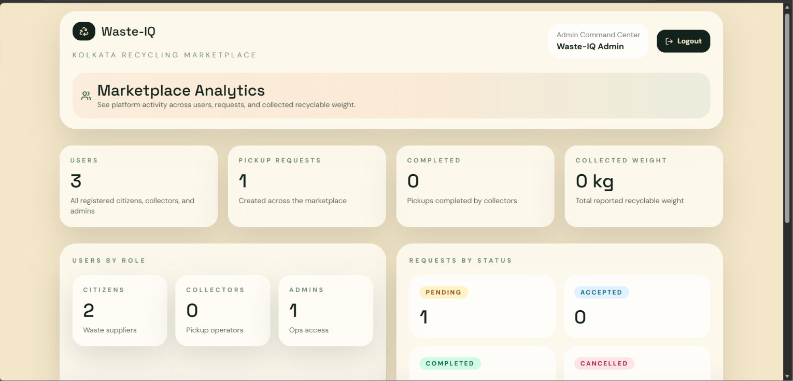
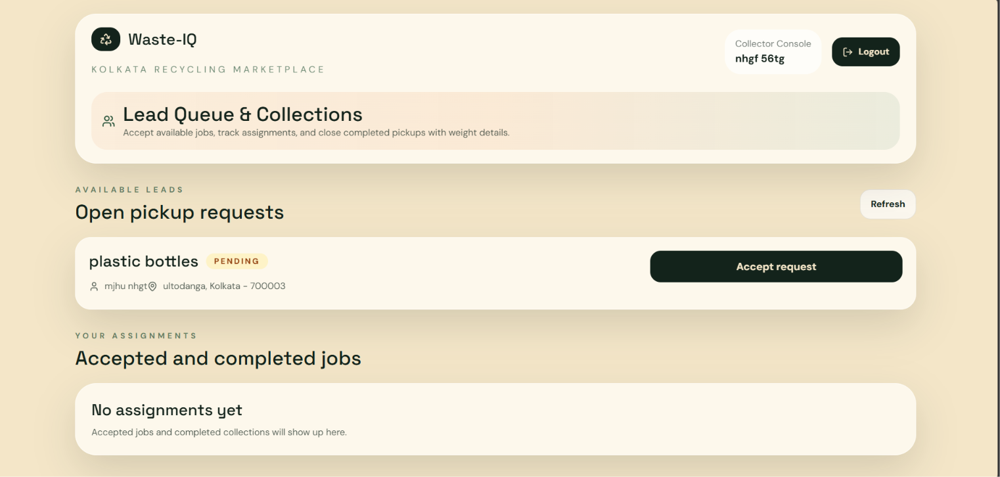
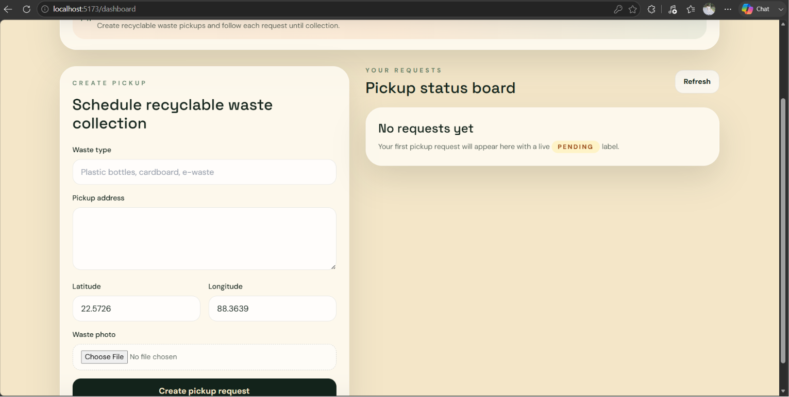
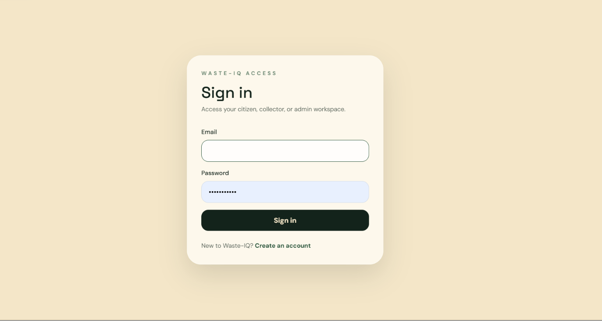
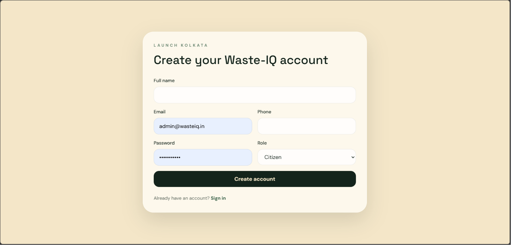
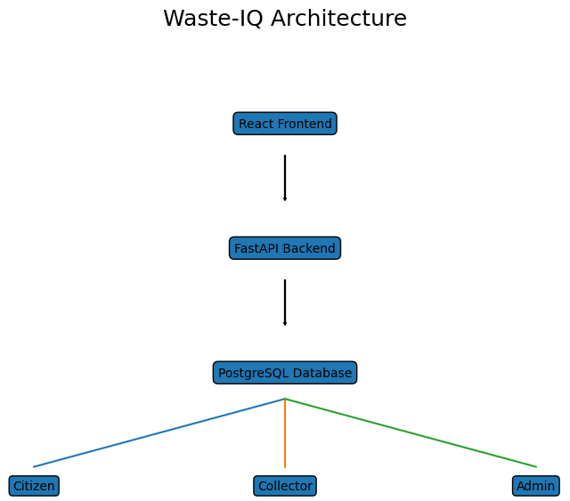

 # ♻️ Waste-IQ

**Waste-IQ** is an AI-ready recyclable waste pickup marketplace that connects citizens, waste collectors, and administrators through a centralized digital platform. The system streamlines recyclable waste collection, enables efficient pickup management, and provides real-time analytics for monitoring marketplace activity.

---

## 🚀 Problem Statement

Traditional recyclable waste collection is often unorganized, inefficient, and lacks transparency. Citizens struggle to find collectors, collectors have no centralized lead management system, and administrators lack visibility into operations.

Waste-IQ solves these challenges by providing:

* Digital waste pickup requests
* Collector assignment and workflow management
* Administrative analytics dashboard
* Scalable cloud-ready architecture
* Future AI-powered waste classification support

---

## ✨ Key Features

### 👤 Citizen Portal

* User registration and login
* JWT-based authentication
* Create waste pickup requests
* Upload waste images
* Track pickup status

### 🚛 Collector Portal

* View available pickup requests
* Accept pickup assignments
* Complete pickups with collected weight
* Manage assigned jobs

### 🛠️ Admin Portal

* User management dashboard
* Marketplace analytics
* Request status monitoring
* Platform activity tracking

### 🔒 Security

* JWT Authentication
* Password Hashing (bcrypt)
* Role-Based Access Control (RBAC)
* Protected API endpoints

---

## 📸 Screenshots

### Admin Dashboard



### Collector Dashboard



### Citizen Dashboard



### Login Page



### Registration Page



---

## 🏗️ System Architecture



### Workflow

Citizen → Create Pickup Request
↓
FastAPI Backend
↓
PostgreSQL Database
↓
Collector Accepts Request
↓
Collector Completes Pickup
↓
Admin Monitors Analytics

---

## 🛠️ Technology Stack

### Backend

* FastAPI
* SQLAlchemy
* PostgreSQL
* Alembic
* JWT Authentication
* Passlib (bcrypt)

### Frontend

* React
* Vite
* Tailwind CSS
* React Router
* Axios

### Cloud & Deployment

* Docker
* Docker Compose
* Render
* Cloudinary

---

## 📂 Project Structure

```text
waste-iq/
│
├── backend/
│   ├── app/
│   │   ├── api/
│   │   ├── core/
│   │   ├── db/
│   │   ├── models/
│   │   ├── schemas/
│   │   └── services/
│   ├── alembic/
│   ├── Dockerfile
│   └── requirements.txt
│
├── frontend/
│   ├── src/
│   │   ├── api/
│   │   ├── components/
│   │   ├── contexts/
│   │   └── pages/
│   ├── Dockerfile
│   └── package.json
│
├── docs/
│   ├── screenshots/
│   ├── architecture.png
│   └── project-report.pdf
│
├── docker-compose.yml
├── render.yaml
└── README.md
```

---

## 🔌 Core API Endpoints

### Authentication

```http
POST /auth/register
POST /auth/login
GET  /auth/me
```

### Pickup Requests

```http
POST /pickup-requests
GET  /pickup-requests
GET  /pickup-requests/{id}
PATCH /pickup-requests/{id}
```

### Collector Operations

```http
POST /collector/accept/{request_id}
POST /collector/complete/{request_id}
```

### Admin Operations

```http
GET /admin/users
GET /admin/analytics
```

---

## 💻 Local Development

### Backend

```bash
cd backend

python -m venv .venv
.venv\Scripts\activate

pip install -r requirements.txt

alembic upgrade head

uvicorn app.main:app --reload
```

Backend:

```text
http://localhost:8000
```

Swagger Documentation:

```text
http://localhost:8000/docs
```

### Frontend

```bash
cd frontend

npm install

npm run dev
```

Frontend:

```text
http://localhost:5173
```

---

## 🐳 Docker Setup

```bash
docker compose up --build
```

Services:

* Frontend → http://localhost:5173
* Backend → http://localhost:8000
* PostgreSQL → localhost:5432

---

## 🌐 Deployment

Waste-IQ is deployment-ready using:

* Docker
* PostgreSQL
* Render Blueprint Deployment

Infrastructure includes:

* FastAPI Backend Service
* React Frontend Service
* PostgreSQL Database

---

## 🔮 Future Enhancements

* AI Waste Image Classification
* Smart Collector Geo-Matching
* Waste Value Prediction
* Demand Forecasting
* WhatsApp Notifications
* Mobile Application

---

## 👨‍💻 Author

**Subhajit Das**

B.Tech (AI & ML)

GitHub: https://github.com/Subhajitdas99

---

## 📜 License

This project is licensed under the MIT License.
