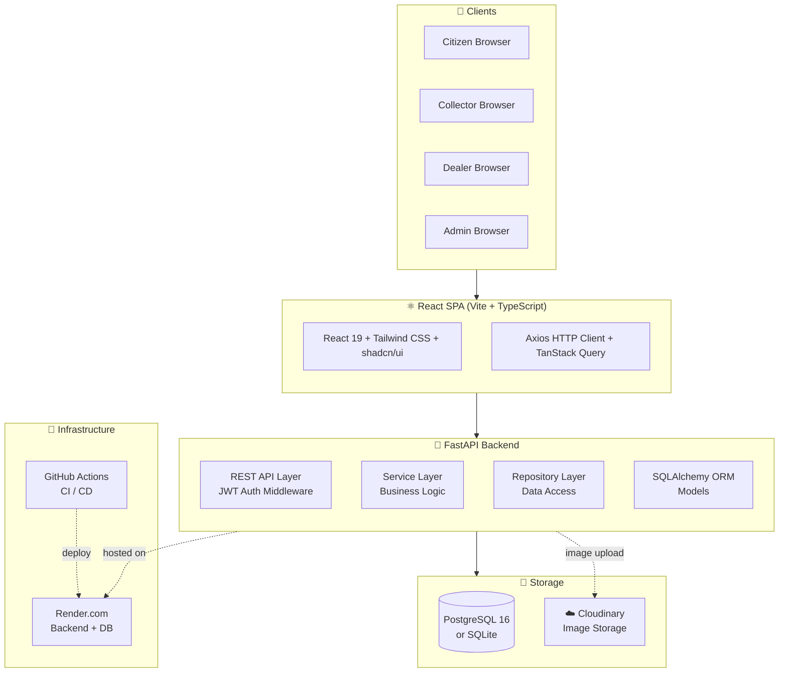
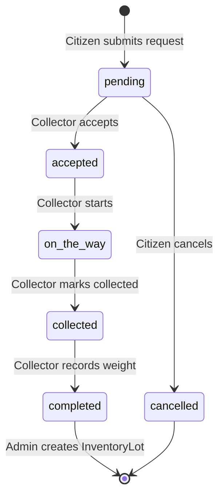

# Waste-IQ ♻️

> **AI-powered recyclable waste management — connecting citizens, collectors, and dealers in one platform.**

[](LICENSE)
[](CONTRIBUTING.md)
[](https://python.org)
[](https://nodejs.org)
[](https://fastapi.tiangolo.com)
[](https://react.dev)
[](/.github/workflows/backend-ci.yml)
[](/.github/workflows/frontend-ci.yml)

---

## Table of Contents

- [Overview](#overview)
- [Features](#features)
- [Architecture](#architecture)
- [Technology Stack](#technology-stack)
- [Folder Structure](#folder-structure)
- [Prerequisites](#prerequisites)
- [Local Development](#local-development)
- [Environment Variables](#environment-variables)
- [Running the Backend](#running-the-backend)
- [Running the Frontend](#running-the-frontend)
- [Docker Setup](#docker-setup)
- [Screenshots](#screenshots)
- [API Documentation](#api-documentation)
- [Contributing](#contributing)
- [License](#license)
- [Contact](#contact)

---

## Overview

Waste-IQ is a full-stack, AI-powered marketplace that digitizes the recyclable waste supply chain. Citizens submit pickup requests, collectors accept and fulfill them, and approved scrap dealers browse a verified inventory marketplace to source materials — all tracked through a transparent, role-based platform.

The system bridges the gap between informal waste collection practices and a modern, data-driven circular economy by providing:

- **Structured pickup lifecycle** from request to completion
- **Real-time status tracking** for all stakeholders
- **Verified inventory marketplace** connecting collectors to dealers
- **AI-ready waste classification** (image upload with category + confidence fields)
- **Analytics dashboard** for administrators and municipalities

---

## Features

### By User Role

| Role | Core Features |
|------|--------------|
| 🏘️ **Citizen** | Submit pickup requests with waste photo & GPS location · Track status in real-time · View pickup history · Cancel pending requests · Dashboard with personal metrics |
| 🚛 **Collector** | View all available & nearby pickup requests · Accept, start, collect, and complete pickups · Record waste weight on completion · Personal earnings & completion dashboard |
| 🏭 **Scrap Dealer** | Register business profile · Wait for admin verification · Browse & filter inventory marketplace · Reserve lots (24-hour hold) · Confirm purchases |
| 🛡️ **Admin** | Platform-wide analytics · User management · Dealer verification (approve/reject) · Create inventory lots from completed pickups · Manage material categories & pricing rules · Archive/restore lots |

### Platform-Wide

- 🔔 **Notification & Communication System** — centralized in-app inbox for every role: pickup lifecycle updates, dealer approval results, inventory reserve/purchase/expiry alerts, system messages, and admin broadcasts (`POST /admin/notifications/broadcast`); served by `GET /notifications` + unread count/list + mark-read / delete APIs, with a header bell (live unread badge + preview dropdown) and a full notifications page at `/{role}/notifications` with All/Unread/Read filters and pagination
- 🔐 JWT-based authentication with role-based access control
- 📸 Cloudinary image upload with graceful fallback in development
- 🗄️ Alembic database migrations with PostgreSQL (SQLite for local dev)
- 🐳 Docker Compose for one-command local development
- ⚙️ GitHub Actions CI for backend (lint + type-check + test) and frontend (lint + test + build)

---

## Architecture


```mermaid
flowchart TB
    subgraph Clients["👥 Clients"]
        C[Citizen Browser]
        COL[Collector Browser]
        D[Dealer Browser]
        A[Admin Browser]
    end

    subgraph Frontend["⚛️ React SPA (Vite + TypeScript)"]
        direction TB
        FE[React 19 + Tailwind CSS + shadcn/ui]
        AX[Axios HTTP Client + TanStack Query]
    end

    subgraph Backend["🐍 FastAPI Backend"]
        direction TB
        API[REST API Layer\nJWT Auth Middleware]
        SVC[Service Layer\nBusiness Logic]
        REPO[Repository Layer\nData Access]
        ORM[SQLAlchemy ORM\nModels]
    end

    subgraph Storage["💾 Storage"]
        DB[(PostgreSQL 16\nor SQLite)]
        CDN[☁️ Cloudinary\nImage Storage]
    end

    subgraph Infra["🚀 Infrastructure"]
        RENDER[Render.com\nBackend + DB]
        GHA[GitHub Actions\nCI / CD]
    end

    Clients --> Frontend
    Frontend --> Backend
    Backend --> Storage
    Backend -.->|image upload| CDN
    GHA -.->|deploy| RENDER
    Backend -.->|hosted on| RENDER
```

### Pickup Request Lifecycle


```mermaid
stateDiagram-v2
    [*] --> pending: Citizen submits request
    pending --> accepted: Collector accepts
    pending --> cancelled: Citizen cancels
    accepted --> on_the_way: Collector starts
    on_the_way --> collected: Collector marks collected
    collected --> completed: Collector records weight
    completed --> [*]: Admin creates InventoryLot
    cancelled --> [*]
```

---

## Technology Stack

| Category | Technology | Version |
|----------|-----------|---------|
| **Frontend Framework** | React | 19.x |
| **Language (FE)** | TypeScript | 5.5+ |
| **Build Tool** | Vite | 5.x |
| **Styling** | Tailwind CSS + shadcn/ui | 3.4 |
| **Routing** | React Router | v6 |
| **Data Fetching** | TanStack Query (React Query) | v5 |
| **HTTP Client** | Axios | 1.7+ |
| **Forms** | React Hook Form + Zod | 7.x / 3.x |
| **Animations** | Framer Motion | 11.x |
| **Icons** | Lucide React | 0.424+ |
| **Backend Framework** | FastAPI | 0.115 |
| **Language (BE)** | Python | 3.12 |
| **Database** | PostgreSQL | 16 (SQLite for dev) |
| **ORM** | SQLAlchemy | 2.0 |
| **Migrations** | Alembic | 1.16 |
| **Validation** | Pydantic | v2 |
| **Authentication** | JWT (python-jose) + bcrypt | - |
| **Image Storage** | Cloudinary | 1.44 |
| **ASGI Server** | Uvicorn | 0.34 |
| **Containerisation** | Docker + Docker Compose | - |
| **CI/CD** | GitHub Actions | - |
| **Cloud Platform** | Render.com | - |

---

## Folder Structure

```
waste-iq/
├── .github/
│   ├── workflows/
│   │   ├── backend-ci.yml       # Backend lint, type-check, test pipeline
│   │   └── frontend-ci.yml      # Frontend lint, build pipeline
│   ├── ISSUE_TEMPLATE/
│   │   ├── bug_report.md
│   │   ├── feature_request.md
│   │   └── task.md
│   ├── PULL_REQUEST_TEMPLATE.md
│   └── CODEOWNERS
│
├── backend/
│   ├── app/
│   │   ├── api/
│   │   │   ├── routes/
│   │   │   │   ├── auth.py          # POST /auth/register, /login, GET /me
│   │   │   │   ├── pickup_requests.py
│   │   │   │   ├── collector.py
│   │   │   │   ├── dealer.py
│   │   │   │   ├── admin.py
│   │   │   │   ├── analytics.py      # Admin analytics suite
│   │   │   │   └── inventory.py     # Admin + Dealer inventory marketplace
│   │   │   └── router.py
│   │   ├── core/
│   │   │   ├── config.py            # Pydantic-settings config
│   │   │   ├── dependencies.py      # FastAPI Depends (get_db, get_current_user)
│   │   │   └── security.py          # JWT encode/decode, password hashing
│   │   ├── db/
│   │   │   └── session.py           # SQLAlchemy session factory
│   │   ├── models/
│   │   │   ├── user.py
│   │   │   ├── pickup_request.py
│   │   │   ├── collector_assignment.py
│   │   │   ├── dealer_profile.py
│   │   │   ├── dealer_profile_event.py
│   │   │   ├── inventory_lot.py
│   │   │   ├── inventory_lot_event.py
│   │   │   ├── material_category.py
│   │   │   └── pricing_rule.py
│   │   ├── repositories/            # Data-access layer
│   │   ├── schemas/                 # Pydantic request/response models
│   │   ├── services/                # Business logic layer
│   │   └── main.py                  # FastAPI app entry point
│   ├── alembic/                     # Database migration scripts
│   ├── tests/                       # Pytest test suite
│   ├── Dockerfile
│   ├── requirements.txt
│   ├── requirements-dev.txt
│   ├── alembic.ini
│   └── .env.example
│
├── frontend/
│   ├── src/
│   │   ├── api/                     # Axios API client functions
│   │   ├── app/                     # Root app component
│   │   ├── assets/                  # Static assets
│   │   ├── components/              # Reusable UI components
│   │   ├── context/                 # React Context (auth, etc.)
│   │   ├── hooks/                   # Custom React hooks
│   │   ├── layouts/                 # Page layout components
│   │   ├── lib/                     # Utility functions
│   │   ├── pages/
│   │   │   ├── auth/                # Login, Register pages
│   │   │   ├── dashboard/           # Role-specific dashboard pages
│   │   │   └── public/              # Public-facing pages
│   │   ├── routes/                  # Route definitions + guards
│   │   ├── styles/                  # Global CSS
│   │   ├── types/                   # TypeScript type definitions
│   │   └── main.tsx
│   ├── public/
│   ├── package.json
│   ├── vite.config.ts
│   ├── tailwind.config.js
│   ├── tsconfig.json
│   └── .env.example
│
├── docs/
│   ├── SYSTEM_ARCHITECTURE.md
│   ├── DATABASE_SCHEMA.md
│   ├── API_SPECIFICATION.md
│   ├── UI_UX_GUIDELINES.md
│   ├── BUSINESS_REQUIREMENTS.md
│   ├── SPRINT_ROADMAP.md
│   └── DEPLOYMENT_GUIDE.md
│
├── docker-compose.yml
├── pyproject.toml                   # Ruff + Black + MyPy config
├── setup.cfg
├── CONTRIBUTING.md
├── CODE_OF_CONDUCT.md
├── CHANGELOG.md
└── README.md
```

---

## Prerequisites

Before you begin, ensure you have the following installed:

| Tool | Minimum Version | Install |
|------|----------------|---------|
| Python | 3.12+ | [python.org](https://python.org) |
| Node.js | 20+ | [nodejs.org](https://nodejs.org) |
| Git | 2.40+ | [git-scm.com](https://git-scm.com) |
| Docker *(optional)* | 24+ | [docs.docker.com](https://docs.docker.com/get-docker/) |
| Docker Compose *(optional)* | v2+ | bundled with Docker Desktop |

> **Note:** PostgreSQL is only required for production. Local development uses SQLite by default.

---

## Local Development

### 1. Clone the Repository

```bash
git clone https://github.com/your-org/waste-iq.git
cd waste-iq
```

### 2. Set Up the Backend

```bash
cd backend

# Create and activate virtual environment
python -m venv .venv

# Windows
.venv\Scripts\activate

# macOS / Linux
source .venv/bin/activate

# Install all dependencies (including dev tools)
pip install -r requirements.txt -r requirements-dev.txt

# Copy environment file and configure it
cp .env.example .env
```

Edit `backend/.env` — see [Environment Variables](#environment-variables).

```bash
# Run database migrations
alembic upgrade head

# Start the development server
uvicorn app.main:app --reload --port 8000
```

The backend will be available at **http://localhost:8000**.  
Interactive API docs at **http://localhost:8000/docs**.

### 3. Set Up the Frontend

Open a new terminal:

```bash
cd frontend

# Install dependencies
npm install

# Copy environment file
cp .env.example .env
```

Edit `frontend/.env`:

```env
VITE_API_URL=http://localhost:8000
```

```bash
# Start the development server
npm run dev
```

The frontend will be available at **http://localhost:5173**.

---

## Environment Variables

### Backend (`backend/.env`)

| Variable | Required | Default | Description |
|----------|----------|---------|-------------|
| `DATABASE_URL` | ✅ | `sqlite:///wasteiq.db` | Database connection string |
| `ENVIRONMENT` | ✅ | `development` | `development` \| `testing` \| `production` |
| `JWT_SECRET_KEY` | ✅ | — | Strong random secret for JWT signing |
| `JWT_ALGORITHM` | ❌ | `HS256` | JWT signing algorithm |
| `ACCESS_TOKEN_EXPIRE_MINUTES` | ❌ | `1440` | Token lifetime in minutes (24 hours) |
| `CORS_ORIGINS` | ✅ | `http://localhost:5173` | Comma-separated allowed origins |
| `CLOUDINARY_CLOUD_NAME` | ❌ | — | Cloudinary cloud name (optional in dev) |
| `CLOUDINARY_API_KEY` | ❌ | — | Cloudinary API key |
| `CLOUDINARY_API_SECRET` | ❌ | — | Cloudinary API secret |
| `LOGIN_RATE_LIMIT_MAX` | ❌ | `10` | Max login attempts per IP per window |
| `LOGIN_ACCOUNT_RATE_LIMIT_MAX` | ❌ | `5` | Max login attempts per account email per window |
| `REGISTER_RATE_LIMIT_MAX` | ❌ | `10` | Max registrations per IP per window |
| `FORGOT_PASSWORD_RATE_LIMIT_MAX` | ❌ | `5` | Max forgot-password requests per IP per window |
| `RESEND_VERIFICATION_RATE_LIMIT_MAX` | ❌ | `5` | Max verification-email resends per IP per window |
| `RATE_LIMIT_WINDOW_SECONDS` | ❌ | `60` | Sliding-window length for rate limits |
| `LOCKOUT_FAILED_ATTEMPT_THRESHOLD` | ❌ | `5` | Failed logins before account lockout |
| `LOCKOUT_COOLDOWN_MINUTES` | ❌ | `15` | Account lockout duration in minutes |

> ⚠️ In **development**, Cloudinary is optional. If not configured, image uploads are skipped and `image_url` is stored as `NULL`. In **production**, valid Cloudinary credentials are required.

### Frontend (`frontend/.env`)

| Variable | Required | Default | Description |
|----------|----------|---------|-------------|
| `VITE_API_URL` | ✅ | `http://localhost:8000` | Backend API base URL |

---

## Running the Backend

```bash
cd backend
source .venv/bin/activate   # or .venv\Scripts\activate on Windows

# Development (auto-reload)
uvicorn app.main:app --reload --port 8000

# Production
uvicorn app.main:app --host 0.0.0.0 --port 8000 --workers 4
```

**Available endpoints:**

| URL | Description |
|-----|-------------|
| `http://localhost:8000/docs` | Swagger UI (interactive API docs) |
| `http://localhost:8000/redoc` | ReDoc API documentation |
| `http://localhost:8000/health` | Health check endpoint |

---

## Running the Frontend

```bash
cd frontend

# Development server with HMR
npm run dev

# Type-check
npx tsc --noEmit

# Lint
npm run lint

# Run tests
npm test

# Production build
npm run build

# Preview production build
npm run preview
```

---

## Docker Setup

The easiest way to run the full stack locally is with Docker Compose:

```bash
# 1. Configure backend environment
cp backend/.env.example backend/.env
# Edit backend/.env and set:
#   DATABASE_URL=postgresql://wasteiq:wasteiq@db:5432/wasteiq

# 2. Build and start all services
docker compose up --build

# 3. (First run only) Apply migrations
docker compose exec backend alembic upgrade head
```

**Services:**

| Service | Port | Description |
|---------|------|-------------|
| `backend` | `8000` | FastAPI application |
| `frontend` | `5173` | React application (served via Nginx) |
| `db` | `5432` | PostgreSQL 16 database |

**Useful Docker commands:**

```bash
# View logs for a specific service
docker compose logs -f backend

# Run migrations inside container
docker compose exec backend alembic upgrade head

# Open a database shell
docker compose exec db psql -U wasteiq -d wasteiq

# Stop all services (keep data)
docker compose down

# Stop and remove all data (clean slate)
docker compose down -v
```

---

## Screenshots

Screenshots are located in [`docs/screenshots/`](docs/screenshots/).

| Screen | Preview |
|--------|---------|
| Citizen Dashboard | `docs/screenshots/citizen-dashboard2.png` |
| Pickup Request Form | `docs/screenshots/new-pickup.png` |
| Collector Map View | `docs/screenshots/collector-nearby.png` |
| Admin Analytics | `docs/screenshots/admin-analytics.png` |
| Dealer Marketplace | `docs/screenshots/dealer-marketplace.png` |

---

## API Documentation

The Waste-IQ API is documented in two places:

| Format | URL |
|--------|-----|
| **Swagger UI** (interactive) | [http://localhost:8000/docs](http://localhost:8000/docs) |
| **ReDoc** (readable) | [http://localhost:8000/redoc](http://localhost:8000/redoc) |
| **Markdown spec** | [`docs/API_SPECIFICATION.md`](docs/API_SPECIFICATION.md) |

---

## Contributing

We welcome contributions from the community! Please read our:

- 📋 [**Contributing Guide**](CONTRIBUTING.md) — branch naming, commit conventions, PR process
- 📜 [**Code of Conduct**](CODE_OF_CONDUCT.md) — community standards
- 🐛 [**Bug Report Template**](.github/ISSUE_TEMPLATE/bug_report.md)
- ✨ [**Feature Request Template**](.github/ISSUE_TEMPLATE/feature_request.md)

### Quick Start for Contributors

```bash
# Fork the repo, then clone your fork
git clone https://github.com/Subhajitdas99/waste-iq.git

# Create a feature branch
git checkout -b feat/your-feature-name

# Make your changes and commit
git commit -m "feat(component): add your feature"

# Push and open a pull request
git push origin feat/your-feature-name
```

---

## License

This project is licensed under the **MIT License**. See [LICENSE](LICENSE) for details.

---

## Contact

| Channel | Link |
|---------|------|
| 🐛 Bug Reports | [GitHub Issues](https://github.com/your-org/waste-iq/issues) |
| 💡 Feature Requests | [GitHub Discussions](https://github.com/your-org/waste-iq/discussions) |
| 📧 Email | [team@waste-iq.dev](mailto:team@waste-iq.dev) |
| 📖 Documentation | [`/docs`](docs/) |

---

<div align="center">
  <sub>Built with ❤️ for a cleaner, greener planet 🌍</sub>
</div>
