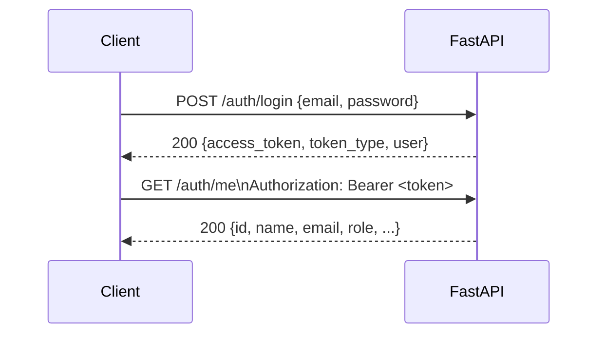

# API Specification — Waste-IQ

> **Base URL (Development):** `http://localhost:8000`  
> **Base URL (Production):** `https://api.waste-iq.dev`  
> **API Version:** 1.0.0  
> **Format:** JSON (application/json), unless noted as multipart/form-data  
> **Interactive Docs:** [http://localhost:8000/docs](http://localhost:8000/docs) (Swagger UI)

---

## Table of Contents

1. [Authentication](#1-authentication)
2. [Data Types & Common Schemas](#2-data-types--common-schemas)
3. [Authentication Endpoints](#3-authentication-endpoints)
4. [Pickup Request Endpoints](#4-pickup-request-endpoints)
5. [Collector Endpoints](#5-collector-endpoints)
6. [Dealer Profile Endpoints](#6-dealer-profile-endpoints)
7. [Dealer Inventory Marketplace](#7-dealer-inventory-marketplace)
8. [Admin Endpoints](#8-admin-endpoints)
9. [Admin Inventory Management](#9-admin-inventory-management)
10. [Health Endpoints](#10-health-endpoints)
11. [Error Responses](#11-error-responses)

---

## 1. Authentication

All protected endpoints require a **Bearer token** in the `Authorization` header:

```
Authorization: Bearer <access_token>
```

Tokens are obtained from `POST /auth/login` or `POST /auth/register`. The default expiry is **1440 minutes (24 hours)**, configurable via `ACCESS_TOKEN_EXPIRE_MINUTES`.

### Authentication Flow



---

## 2. Data Types & Common Schemas

### UserRead

```json
{
  "id": 1,
  "name": "Riya Sharma",
  "email": "riya@example.com",
  "phone": "+919876543210",
  "role": "citizen",
  "created_at": "2026-05-01T10:30:00Z"
}
```

### PickupRequestRead

```json
{
  "id": 42,
  "user_id": 1,
  "waste_type": "Old newspapers and cardboard",
  "image_url": "https://res.cloudinary.com/waste-iq/image/upload/v1/uploads/abc123.jpg",
  "category": "PAPER",
  "confidence": 0.92,
  "address": "123 Green Avenue, Andheri West, Mumbai",
  "latitude": 19.1363,
  "longitude": 72.8265,
  "status": "pending",
  "created_at": "2026-06-01T08:00:00Z"
}
```

### Common Status Codes

| Code | Meaning |
|------|---------|
| `200` | OK — request succeeded |
| `201` | Created — resource created successfully |
| `400` | Bad Request — validation failed or business rule violation |
| `401` | Unauthorized — missing or invalid JWT |
| `403` | Forbidden — authenticated but insufficient role/permissions |
| `404` | Not Found — resource does not exist |
| `409` | Conflict — state conflict (e.g., duplicate profile, already reserved) |
| `422` | Unprocessable Entity — Pydantic validation error |
| `500` | Internal Server Error — unexpected server failure |
| `502` | Bad Gateway — upstream service error (e.g., Cloudinary unavailable) |
| `503` | Service Unavailable — configuration error (e.g., Cloudinary not configured) |

---

## 3. Authentication Endpoints

### `POST /auth/register`

Register a new user account.

| Field | Value |
|-------|-------|
| **Auth Required** | No (public) |
| **Content-Type** | `application/json` |

**Request Body:**

```json
{
  "name": "Riya Sharma",
  "email": "riya@example.com",
  "phone": "+919876543210",
  "password": "SecurePassword123!",
  "role": "citizen"
}
```

| Field | Type | Required | Constraints |
|-------|------|----------|-------------|
| `name` | string | ✅ | 1–120 characters |
| `email` | string | ✅ | Valid email format, unique |
| `phone` | string | ✅ | Unique |
| `password` | string | ✅ | Min 8 characters |
| `role` | string | ✅ | `citizen` \| `collector` \| `dealer` \| `admin` |

**Response `201 Created`:**

```json
{
  "access_token": "eyJhbGciOiJIUzI1NiIsInR5cCI6IkpXVCJ9...",
  "token_type": "bearer",
  "user": {
    "id": 1,
    "name": "Riya Sharma",
    "email": "riya@example.com",
    "phone": "+919876543210",
    "role": "citizen",
    "created_at": "2026-06-01T08:00:00Z"
  }
}
```

| Status | Scenario |
|--------|----------|
| `201` | User created and token issued |
| `400` | Email or phone already registered |
| `422` | Invalid request body (missing fields, bad email format) |

---

### `POST /auth/login`

Authenticate an existing user and receive a JWT.

| Field | Value |
|-------|-------|
| **Auth Required** | No (public) |
| **Content-Type** | `application/json` |

**Request Body:**

```json
{
  "email": "riya@example.com",
  "password": "SecurePassword123!"
}
```

**Response `200 OK`:**

```json
{
  "access_token": "eyJhbGciOiJIUzI1NiIsInR5cCI6IkpXVCJ9...",
  "token_type": "bearer",
  "user": {
    "id": 1,
    "name": "Riya Sharma",
    "email": "riya@example.com",
    "phone": "+919876543210",
    "role": "citizen",
    "created_at": "2026-06-01T08:00:00Z"
  }
}
```

| Status | Scenario |
|--------|----------|
| `200` | Login successful |
| `401` | Invalid email or password |
| `422` | Malformed request body |

---

### `GET /auth/me`

Get the currently authenticated user's profile.

| Field | Value |
|-------|-------|
| **Auth Required** | Yes (any role) |

**Response `200 OK`:**

```json
{
  "id": 1,
  "name": "Riya Sharma",
  "email": "riya@example.com",
  "phone": "+919876543210",
  "role": "citizen",
  "created_at": "2026-06-01T08:00:00Z"
}
```

| Status | Scenario |
|--------|----------|
| `200` | Token valid, user returned |
| `401` | Missing or expired token |

---

### `POST /auth/forgot-password`

Request a password reset email. If the email exists, a reset link is generated and sent to the user.

| Field | Value |
|-------|-------|
| **Auth Required** | No (public) |
| **Content-Type** | `application/json` |

**Request Body:**

```json
{
  "email": "riya@example.com"
}
```

| Status | Scenario |
|--------|----------|
| `200` | Request processed successfully |
| `422` | Malformed request body |

---

### `POST /auth/reset-password`

Reset a password using a valid token received via email.

| Field | Value |
|-------|-------|
| **Auth Required** | No (public) |
| **Content-Type** | `application/json` |

**Request Body:**

```json
{
  "token": "jwt_reset_token_string",
  "new_password": "NewSecurePassword123!"
}
```

| Status | Scenario |
|--------|----------|
| `200` | Password updated successfully |
| `400` | Invalid or expired token |
| `422` | Malformed request body |

---

## 4. Pickup Request Endpoints

### `POST /pickup-requests`

Submit a new pickup request. Accepts multipart/form-data to allow optional image upload.

| Field | Value |
|-------|-------|
| **Auth Required** | Yes — `citizen` role |
| **Content-Type** | `multipart/form-data` |

**Form Fields:**

| Field | Type | Required | Constraints |
|-------|------|----------|-------------|
| `waste_type` | string | ✅ | 2–100 characters |
| `address` | string | ✅ | 8–500 characters |
| `latitude` | float | ✅ | −90 to 90 |
| `longitude` | float | ✅ | −180 to 180 |
| `image` | file | ❌ | Any image format; uploaded to Cloudinary |

**Response `201 Created`:**

```json
{
  "id": 42,
  "user_id": 1,
  "waste_type": "Old newspapers and cardboard",
  "image_url": "https://res.cloudinary.com/waste-iq/image/upload/v1/uploads/abc123.jpg",
  "category": null,
  "confidence": null,
  "address": "123 Green Avenue, Andheri West, Mumbai",
  "latitude": 19.1363,
  "longitude": 72.8265,
  "status": "pending",
  "created_at": "2026-06-01T08:00:00Z"
}
```

| Status | Scenario |
|--------|----------|
| `201` | Request created |
| `403` | User is not a citizen |
| `422` | Missing required fields or out-of-range coordinates |
| `502` | Cloudinary upload failed (image provided but service unavailable) |
| `503` | Cloudinary not configured in production |

---

### `GET /pickup-requests`

List pickup requests. Citizens see only their own; collectors and admins see all.

| Field | Value |
|-------|-------|
| **Auth Required** | Yes (any role) |

**Response `200 OK`:**

```json
[
  {
    "id": 42,
    "user_id": 1,
    "waste_type": "Old newspapers",
    "image_url": null,
    "category": null,
    "confidence": null,
    "address": "123 Green Avenue, Mumbai",
    "latitude": 19.1363,
    "longitude": 72.8265,
    "status": "pending",
    "created_at": "2026-06-01T08:00:00Z"
  }
]
```

---

### `GET /pickup-requests/citizen/summary`

Retrieve aggregate statistics for the authenticated citizen's dashboard.

| Field | Value |
|-------|-------|
| **Auth Required** | Yes — `citizen` role |

**Response `200 OK`:**

```json
{
  "total_requests": 15,
  "pending": 2,
  "accepted": 1,
  "on_the_way": 0,
  "collected": 0,
  "completed": 11,
  "cancelled": 1
}
```

| Status | Scenario |
|--------|----------|
| `200` | Summary returned |
| `403` | Non-citizen user |

---

### `GET /pickup-requests/{request_id}`

Get full details of a specific pickup request, including its event history.

| Field | Value |
|-------|-------|
| **Auth Required** | Yes (any role) |
| **Path Param** | `request_id` — integer ID |

**Response `200 OK`:**

```json
{
  "id": 42,
  "user_id": 1,
  "waste_type": "Old newspapers",
  "image_url": "https://res.cloudinary.com/waste-iq/...",
  "category": "PAPER",
  "confidence": 0.91,
  "address": "123 Green Avenue, Mumbai",
  "latitude": 19.1363,
  "longitude": 72.8265,
  "status": "accepted",
  "created_at": "2026-06-01T08:00:00Z",
  "events": [
    {
      "id": 1,
      "event_type": "status_changed_to_accepted",
      "actor_id": 7,
      "notes": null,
      "created_at": "2026-06-01T09:05:00Z"
    }
  ]
}
```

| Status | Scenario |
|--------|----------|
| `200` | Request found and authorized |
| `404` | Request not found or not accessible to this user |

---

### `PATCH /pickup-requests/{request_id}`

Update editable fields on a pickup request. Only applies to requests in `pending` status.

| Field | Value |
|-------|-------|
| **Auth Required** | Yes — request owner |
| **Content-Type** | `application/json` |

**Request Body (all fields optional):**

```json
{
  "waste_type": "Mixed plastics",
  "address": "456 Lake Road, Powai, Mumbai",
  "latitude": 19.1176,
  "longitude": 72.9060
}
```

**Response `200 OK`:** Updated `PickupRequestRead` object.

| Status | Scenario |
|--------|----------|
| `200` | Updated successfully |
| `404` | Request not found |

---

### `POST /pickup-requests/{request_id}/cancel`

Cancel a pending pickup request.

| Field | Value |
|-------|-------|
| **Auth Required** | Yes — `citizen` role, request owner |

**Response `200 OK`:** Updated `PickupRequestRead` with `status: "cancelled"`.

| Status | Scenario |
|--------|----------|
| `200` | Cancelled |
| `403` | Non-citizen or not the owner |
| `404` | Request not found |

---

## 5. Collector Endpoints

All collector endpoints require `Authorization: Bearer <token>` with `role = collector`.

### `GET /collector/summary`

Get the authenticated collector's performance dashboard stats.

**Response `200 OK`:**

```json
{
  "total_assigned": 45,
  "pending_acceptance": 0,
  "in_progress": 2,
  "completed": 43,
  "total_weight_kg": 312.5
}
```

---

### `GET /collector/available`

List all pickup requests with `status = pending` available for acceptance.

**Response `200 OK`:** Array of `PickupRequestRead`.

---

### `GET /collector/nearby`

List pending pickup requests within a given radius, sorted by distance.

| Query Param | Type | Required | Default | Description |
|-------------|------|----------|---------|-------------|
| `latitude` | float | ✅ | — | Collector's current latitude |
| `longitude` | float | ✅ | — | Collector's current longitude |
| `radius_km` | float | ❌ | `5.0` | Search radius in kilometres |

**Response `200 OK`:**

```json
[
  {
    "id": 42,
    "waste_type": "Old newspapers",
    "address": "123 Green Avenue, Mumbai",
    "latitude": 19.1363,
    "longitude": 72.8265,
    "status": "pending",
    "distance_km": 1.23,
    "created_at": "2026-06-01T08:00:00Z"
  }
]
```

---

### `GET /collector/assigned`

List pickup requests currently assigned to the authenticated collector.

**Response `200 OK`:** Array of `PickupRequestRead`.

---

### `POST /collector/accept/{request_id}`

Accept a pending pickup request. Creates a `CollectorAssignment` and transitions status to `accepted`.

| Path Param | Type | Description |
|------------|------|-------------|
| `request_id` | integer | ID of the pickup request to accept |

**Response `200 OK`:** Updated `PickupRequestRead` with `status: "accepted"`.

| Status | Scenario |
|--------|----------|
| `200` | Accepted |
| `400` | Request already accepted by another collector |
| `404` | Request not found |

---

### `POST /collector/start/{request_id}`

Mark a request as "on the way" — the collector is en route.

**Response `200 OK`:** Updated `PickupRequestRead` with `status: "on_the_way"`.

---

### `POST /collector/collect/{request_id}`

Mark a request as physically "collected" — waste has been picked up.

**Response `200 OK`:** Updated `PickupRequestRead` with `status: "collected"`.

---

### `POST /collector/complete/{request_id}`

Complete a pickup by recording the waste weight. Transitions status to `completed`.

| Field | Value |
|-------|-------|
| **Content-Type** | `application/json` |

**Request Body:**

```json
{
  "weight_kg": 12.5
}
```

| Field | Type | Required | Constraints |
|-------|------|----------|-------------|
| `weight_kg` | float | ✅ | Must be > 0 |

**Response `200 OK`:** Updated `PickupRequestRead` with `status: "completed"`.

| Status | Scenario |
|--------|----------|
| `200` | Completed, weight recorded |
| `400` | Weight not provided or not positive |
| `403` | Not the assigned collector |
| `404` | Request not found |

---

## 6. Dealer Profile Endpoints

All dealer profile endpoints require `Authorization: Bearer <token>` with `role = dealer`.

### `POST /dealer/profile`

Create the dealer's business profile. Each dealer can have only one profile.

**Request Body:**

```json
{
  "business_name": "GreenCycle Scrap Pvt. Ltd.",
  "owner_name": "Priya Menon",
  "phone": "+912234567890",
  "address": "Plot 45, MIDC Industrial Area, Thane",
  "city": "Thane",
  "pincode": "400604",
  "gst_number": "27AABCG1234M1ZX",
  "license_number": "MH-SCR-2024-00456",
  "materials_accepted": ["PAPER", "PET_PLASTIC", "ALUMINIUM"]
}
```

**Response `201 Created`:** `DealerProfileRead` object.

| Status | Scenario |
|--------|----------|
| `201` | Profile created (status: pending) |
| `409` | Profile already exists for this user |
| `422` | Missing required fields |

---

### `GET /dealer/profile`

Retrieve the authenticated dealer's own profile.

**Response `200 OK`:**

```json
{
  "id": 3,
  "user_id": 12,
  "business_name": "GreenCycle Scrap Pvt. Ltd.",
  "owner_name": "Priya Menon",
  "phone": "+912234567890",
  "address": "Plot 45, MIDC Industrial Area, Thane",
  "city": "Thane",
  "pincode": "400604",
  "gst_number": "27AABCG1234M1ZX",
  "license_number": "MH-SCR-2024-00456",
  "materials_accepted": ["PAPER", "PET_PLASTIC", "ALUMINIUM"],
  "verification_status": "pending",
  "approved_at": null,
  "created_at": "2026-05-15T12:00:00Z",
  "updated_at": "2026-05-15T12:00:00Z"
}
```

| Status | Scenario |
|--------|----------|
| `200` | Profile returned |
| `404` | Profile does not exist yet |

---

### `PATCH /dealer/profile`

Update the dealer's profile. All fields are optional.

**Request Body (all optional):**

```json
{
  "phone": "+919876500001",
  "materials_accepted": ["PAPER", "GLASS", "ALUMINIUM"]
}
```

**Response `200 OK`:** Updated `DealerProfileRead`.

---

## 7. Dealer Inventory Marketplace

> 🔒 All marketplace endpoints require `role = dealer` AND `verification_status = approved`.

### `GET /dealer/inventory/lots`

Browse available inventory lots on the marketplace.

| Query Param | Type | Required | Description |
|-------------|------|----------|-------------|
| `city` | string | ❌ | Filter by source city |
| `material_category_id` | integer | ❌ | Filter by material category |
| `quality_grade` | string | ❌ | Filter by quality grade (e.g., `Grade A`) |
| `min_weight_kg` | float | ❌ | Minimum lot weight |
| `max_weight_kg` | float | ❌ | Maximum lot weight |

**Response `200 OK`:**

```json
[
  {
    "id": 5,
    "lot_number": "WIQ-202606-00005",
    "material_category": {"id": 2, "code": "PAPER", "name": "Newspaper & Cardboard"},
    "weight_kg": 45.2,
    "unit_price_per_kg_snapshot": "3.50",
    "total_listed_amount": "158.20",
    "source_city": "Mumbai",
    "quality_grade": "Grade A",
    "status": "available",
    "created_at": "2026-06-10T14:00:00Z"
  }
]
```

---

### `GET /dealer/inventory/lots/{lot_id}`

Get full details of a specific inventory lot.

**Response `200 OK`:** Full `InventoryLotRead` including `material_description`, `source_address_snapshot`, reservation info.

---

### `POST /dealer/inventory/lots/{lot_id}/reserve`

Reserve a lot for 24 hours. Only available lots can be reserved.

**Response `200 OK`:**

```json
{
  "id": 5,
  "lot_number": "WIQ-202606-00005",
  "status": "reserved",
  "reserved_at": "2026-06-15T10:00:00Z",
  "reservation_expires_at": "2026-06-16T10:00:00Z"
}
```

| Status | Scenario |
|--------|----------|
| `200` | Reserved successfully |
| `404` | Lot not found |
| `409` | Lot already reserved or sold |

---

### `POST /dealer/inventory/lots/{lot_id}/purchase`

Confirm purchase of a reserved lot. Must be the dealer who holds the reservation.

**Response `200 OK`:**

```json
{
  "id": 5,
  "lot_number": "WIQ-202606-00005",
  "status": "sold",
  "total_listed_amount": "158.20"
}
```

| Status | Scenario |
|--------|----------|
| `200` | Purchase confirmed |
| `404` | Lot not found |
| `409` | Reservation expired or held by another dealer |

---

## 8. Admin Endpoints

All admin endpoints require `Authorization: Bearer <token>` with `role = admin`.

### `GET /admin/users`

List all platform users.

**Response `200 OK`:** Array of `UserRead`.

---

### `GET /admin/analytics`

Retrieve platform-wide analytics.

**Response `200 OK`:**

```json
{
  "total_users": 342,
  "total_pickups": 1204,
  "pickups_by_status": {
    "pending": 45,
    "accepted": 12,
    "on_the_way": 8,
    "collected": 3,
    "completed": 1128,
    "cancelled": 8
  },
  "total_weight_kg": 8743.5,
  "total_revenue_inr": 43717.50
}
```

---

### `GET /admin/dealers`

List all dealer profiles with verification status.

**Response `200 OK`:**

```json
[
  {
    "user_id": 12,
    "business_name": "GreenCycle Scrap Pvt. Ltd.",
    "city": "Thane",
    "verification_status": "pending",
    "created_at": "2026-05-15T12:00:00Z"
  }
]
```

---

### `POST /admin/dealers/{dealer_user_id}/approve`

Approve a dealer's profile, granting marketplace access.

**Response `200 OK`:**

```json
{
  "dealer_user_id": 12,
  "status": "approved",
  "approved_at": "2026-06-01T11:00:00Z"
}
```

---

### `POST /admin/dealers/{dealer_user_id}/reject`

Reject a dealer's profile.

**Response `200 OK`:**

```json
{
  "dealer_user_id": 12,
  "status": "rejected"
}
```

---

## 9. Admin Inventory Management

### `GET /admin/inventory/lots`

List all inventory lots with optional filters.

| Query Param | Type | Description |
|-------------|------|-------------|
| `status` | string | `available` \| `reserved` \| `sold` |
| `visibility` | string | `visible` \| `hidden` |
| `city` | string | Filter by source city |

**Response `200 OK`:** Array of `InventoryLotRead`.

---

### `POST /admin/inventory/lots`

Create an inventory lot from a completed pickup request.

**Request Body:**

```json
{
  "pickup_request_id": 42,
  "material_category_id": 2,
  "weight_kg": 45.2,
  "quality_grade": "Grade A",
  "admin_notes": "Clean and dry newspapers",
  "visibility": "visible"
}
```

**Response `201 Created`:** Full `InventoryLotRead` with auto-generated `lot_number` and computed `total_listed_amount`.

| Status | Scenario |
|--------|----------|
| `201` | Lot created |
| `400` | Pickup not completed or lot already exists for this pickup |
| `404` | Pickup request or material category not found |

---

### `PATCH /admin/inventory/lots/{lot_id}`

Update lot details (weight, quality grade, visibility, notes).

**Request Body (all optional):**

```json
{
  "quality_grade": "Grade B",
  "admin_notes": "Some moisture damage noted",
  "visibility": "hidden"
}
```

---

### `POST /admin/inventory/lots/{lot_id}/archive`

Soft-archive a lot (removes from marketplace without deletion).

**Request Body:**

```json
{
  "reason": "Material quality below minimum threshold"
}
```

**Response `200 OK`:** Updated lot with `archived_at` populated.

---

### `GET /admin/inventory/pricing-rules`

List all pricing rules.

**Response `200 OK`:**

```json
[
  {
    "id": 1,
    "material_category_id": 2,
    "city": "Mumbai",
    "unit_price_per_kg": "3.50",
    "currency_code": "INR",
    "is_active": true,
    "effective_from": "2026-01-01T00:00:00Z",
    "effective_to": null
  }
]
```

---

### `POST /admin/inventory/pricing-rules`

Create a new pricing rule.

**Request Body:**

```json
{
  "material_category_id": 2,
  "city": "Mumbai",
  "unit_price_per_kg": 3.50,
  "currency_code": "INR",
  "effective_from": "2026-07-01T00:00:00Z",
  "effective_to": null
}
```

---

### `GET /admin/inventory/categories`

List all material categories.

**Response `200 OK`:**

```json
[
  {
    "id": 2,
    "code": "PAPER",
    "name": "Newspaper & Cardboard",
    "description": "Includes newspapers, magazines, cardboard boxes, and office paper.",
    "is_active": true,
    "display_order": 1
  }
]
```

---

### `POST /admin/inventory/categories`

Create a material category.

**Request Body:**

```json
{
  "code": "EWASTE",
  "name": "Electronic Waste",
  "description": "Includes mobile phones, circuit boards, cables, and small appliances.",
  "display_order": 10
}
```

---

## 10. Health Endpoints

### `GET /health`

Application health check. Returns `200 OK` if the application is running.

**Auth Required:** No (public)

**Response `200 OK`:**

```json
{
  "status": "ok",
  "app": "Waste-IQ",
  "cors_origins": ["https://waste-iq.dev", "http://localhost:5173"]
}
```

---

## 11. Error Responses

### Standard Error Format

All errors return a JSON body with a `detail` field:

```json
{
  "detail": "Human-readable error message"
}
```

### Pydantic Validation Error (422)

```json
{
  "detail": [
    {
      "type": "missing",
      "loc": ["body", "email"],
      "msg": "Field required",
      "input": {},
      "url": "https://errors.pydantic.dev/2.11/v/missing"
    }
  ]
}
```

### Common Error Examples

| Scenario | Status | `detail` |
|----------|--------|---------|
| Invalid email/password | 401 | `"Invalid email or password"` |
| Expired/invalid JWT | 401 | `"Could not validate credentials"` |
| Wrong role | 403 | `"Only citizens can create requests"` |
| Resource not found | 404 | `"Pickup request not found"` |
| Email already registered | 400 | `"Email already registered"` |
| Lot already reserved | 409 | `"This lot is already reserved"` |
| Cloudinary not configured | 503 | `"Image upload service is not configured"` |
| Cloudinary service down | 502 | `"Image upload service is temporarily unavailable"` |
