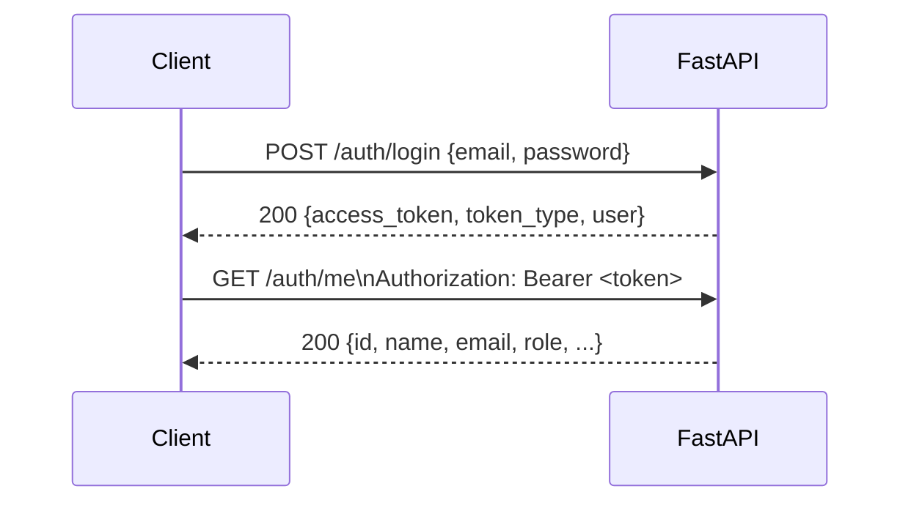

# API Specification — Waste-IQ

> **Base URL (Development):** `http://localhost:8000`  
> **Base URL (Production):** `https://api.waste-iq.dev`  
> **API Version:** 1.0.0  
> **Format:** JSON (application/json), unless noted as multipart/form-data  
> **Interactive Docs:** [http://localhost:8000/docs](http://localhost:8000/docs) (Swagger UI)

---

## Table of Contents

1. [Authentication](#1-authentication)
2. [Data Types & Common Schemas](#2-data-types--common-schemas)
3. [Authentication Endpoints](#3-authentication-endpoints)
4. [Pickup Request Endpoints](#4-pickup-request-endpoints)
5. [Collector Endpoints](#5-collector-endpoints)
6. [Dealer Profile Endpoints](#6-dealer-profile-endpoints)
7. [Dealer Inventory Marketplace](#7-dealer-inventory-marketplace)
7a. [Notification Endpoints](#7a-notification-endpoints)
8. [Admin Endpoints](#8-admin-endpoints)
9. [Admin Inventory Management](#9-admin-inventory-management)
10. [Health Endpoints](#10-health-endpoints)
11. [Error Responses](#11-error-responses)

---

## 1. Authentication

All protected endpoints require a **Bearer token** in the `Authorization` header:

```
Authorization: Bearer <access_token>
```

Tokens are obtained from `POST /auth/login` or `POST /auth/register`. The default expiry is **1440 minutes (24 hours)**, configurable via `ACCESS_TOKEN_EXPIRE_MINUTES`.

### Authentication Flow



---

## 2. Data Types & Common Schemas

### UserRead

```json
{
  "id": 1,
  "name": "Riya Sharma",
  "email": "riya@example.com",
  "phone": "+919876543210",
  "role": "citizen",
  "created_at": "2026-05-01T10:30:00Z"
}
```

### PickupRequestRead

```json
{
  "id": 42,
  "user_id": 1,
  "waste_type": "Old newspapers and cardboard",
  "image_url": "https://res.cloudinary.com/waste-iq/image/upload/v1/uploads/abc123.jpg",
  "category": "PAPER",
  "confidence": 0.92,
  "address": "123 Green Avenue, Andheri West, Mumbai",
  "latitude": 19.1363,
  "longitude": 72.8265,
  "status": "pending",
  "created_at": "2026-06-01T08:00:00Z"
}
```

### Common Status Codes

| Code | Meaning |
|------|---------|
| `200` | OK — request succeeded |
| `201` | Created — resource created successfully |
| `400` | Bad Request — validation failed or business rule violation |
| `401` | Unauthorized — missing or invalid JWT |
| `403` | Forbidden — authenticated but insufficient role/permissions |
| `404` | Not Found — resource does not exist |
| `409` | Conflict — state conflict (e.g., duplicate profile, already reserved) |
| `422` | Unprocessable Entity — Pydantic validation error |
| `500` | Internal Server Error — unexpected server failure |
| `502` | Bad Gateway — upstream service error (e.g., Cloudinary unavailable) |
| `503` | Service Unavailable — configuration error (e.g., Cloudinary not configured) |

---

## 3. Authentication Endpoints

### `POST /auth/register`

Register a new user account.

| Field | Value |
|-------|-------|
| **Auth Required** | No (public) |
| **Content-Type** | `application/json` |

**Request Body:**

```json
{
  "name": "Riya Sharma",
  "email": "riya@example.com",
  "phone": "+919876543210",
  "password": "SecurePassword123!",
  "role": "citizen"
}
```

| Field | Type | Required | Constraints |
|-------|------|----------|-------------|
| `name` | string | ✅ | 1–120 characters |
| `email` | string | ✅ | Valid email format, unique |
| `phone` | string | ✅ | Unique |
| `password` | string | ✅ | Min 8 characters |
| `role` | string | ✅ | `citizen` \| `collector` \| `dealer` \| `admin` |

**Response `201 Created`:**

```json
{
  "access_token": "eyJhbGciOiJIUzI1NiIsInR5cCI6IkpXVCJ9...",
  "token_type": "bearer",
  "user": {
    "id": 1,
    "name": "Riya Sharma",
    "email": "riya@example.com",
    "phone": "+919876543210",
    "role": "citizen",
    "created_at": "2026-06-01T08:00:00Z"
  }
}
```

| Status | Scenario |
|--------|----------|
| `201` | User created and token issued |
| `400` | Email or phone already registered |
| `422` | Invalid request body (missing fields, bad email format) |

---

### `POST /auth/login`

Authenticate an existing user and receive a JWT.

| Field | Value |
|-------|-------|
| **Auth Required** | No (public) |
| **Content-Type** | `application/json` |

**Request Body:**

```json
{
  "email": "riya@example.com",
  "password": "SecurePassword123!"
}
```

**Response `200 OK`:**

```json
{
  "access_token": "eyJhbGciOiJIUzI1NiIsInR5cCI6IkpXVCJ9...",
  "token_type": "bearer",
  "user": {
    "id": 1,
    "name": "Riya Sharma",
    "email": "riya@example.com",
    "phone": "+919876543210",
    "role": "citizen",
    "created_at": "2026-06-01T08:00:00Z"
  }
}
```

| Status | Scenario |
|--------|----------|
| `200` | Login successful |
| `401` | Invalid email or password |
| `422` | Malformed request body |

---

### `GET /auth/me`

Get the currently authenticated user's profile.

| Field | Value |
|-------|-------|
| **Auth Required** | Yes (any role) |

**Response `200 OK`:**

```json
{
  "id": 1,
  "name": "Riya Sharma",
  "email": "riya@example.com",
  "phone": "+919876543210",
  "role": "citizen",
  "created_at": "2026-06-01T08:00:00Z"
}
```

| Status | Scenario |
|--------|----------|
| `200` | Token valid, user returned |
| `401` | Missing or expired token |

---

### `POST /auth/change-password`

Change the authenticated user's password. Verifies the current password and
persists a new bcrypt hash. Existing tokens remain valid.

| Field | Value |
|-------|-------|
| **Auth Required** | Yes (any role) |
| **Content-Type** | `application/json` |

**Request Body:**

```json
{
  "current_password": "SecurePassword123!",
  "new_password": "NewSecurePassword456!"
}
```

| Field | Type | Required | Constraints |
|-------|------|----------|-------------|
| `current_password` | string | Yes | 8–64 characters |
| `new_password` | string | Yes | 8–64 characters, must differ from the current password |

**Response `200 OK`:**

```json
{
  "message": "Password changed successfully"
}
```

| Status | Scenario |
|--------|----------|
| `200` | Password changed |
| `400` | Incorrect current password, or new password equals the current password |
| `401` | Missing or invalid token |
| `422` | Invalid request body (missing fields, password out of 8–64 range) |

---

## 4. Pickup Request Endpoints

### `POST /pickup-requests`

Submit a new pickup request. Accepts multipart/form-data to allow optional image upload.

| Field | Value |
|-------|-------|
| **Auth Required** | Yes — `citizen` role |
| **Content-Type** | `multipart/form-data` |

**Form Fields:**

| Field | Type | Required | Constraints |
|-------|------|----------|-------------|
| `waste_type` | string | ✅ | 2–100 characters |
| `address` | string | ✅ | 8–500 characters |
| `latitude` | float | ✅ | −90 to 90 |
| `longitude` | float | ✅ | −180 to 180 |
| `image` | file | ❌ | Any image format; uploaded to Cloudinary |

**Response `201 Created`:**

```json
{
  "id": 42,
  "user_id": 1,
  "waste_type": "Old newspapers and cardboard",
  "image_url": "https://res.cloudinary.com/waste-iq/image/upload/v1/uploads/abc123.jpg",
  "category": null,
  "confidence": null,
  "address": "123 Green Avenue, Andheri West, Mumbai",
  "latitude": 19.1363,
  "longitude": 72.8265,
  "status": "pending",
  "created_at": "2026-06-01T08:00:00Z"
}
```

| Status | Scenario |
|--------|----------|
| `201` | Request created |
| `403` | User is not a citizen |
| `422` | Missing required fields or out-of-range coordinates |
| `502` | Cloudinary upload failed (image provided but service unavailable) |
| `503` | Cloudinary not configured in production |

---

### `GET /pickup-requests`

List pickup requests. Citizens see only their own; collectors and admins see all.

| Field | Value |
|-------|-------|
| **Auth Required** | Yes (any role) |

**Response `200 OK`:**

```json
[
  {
    "id": 42,
    "user_id": 1,
    "waste_type": "Old newspapers",
    "image_url": null,
    "category": null,
    "confidence": null,
    "address": "123 Green Avenue, Mumbai",
    "latitude": 19.1363,
    "longitude": 72.8265,
    "status": "pending",
    "created_at": "2026-06-01T08:00:00Z"
  }
]
```

---

### `GET /pickup-requests/citizen/summary`

Retrieve aggregate statistics for the authenticated citizen's dashboard.

| Field | Value |
|-------|-------|
| **Auth Required** | Yes — `citizen` role |

**Response `200 OK`:**

```json
{
  "total_requests": 15,
  "pending": 2,
  "accepted": 1,
  "on_the_way": 0,
  "collected": 0,
  "completed": 11,
  "cancelled": 1
}
```

| Status | Scenario |
|--------|----------|
| `200` | Summary returned |
| `403` | Non-citizen user |

---

### `GET /pickup-requests/{request_id}`

Get full details of a specific pickup request, including its event history.

| Field | Value |
|-------|-------|
| **Auth Required** | Yes (any role) |
| **Path Param** | `request_id` — integer ID |

**Response `200 OK`:**

```json
{
  "id": 42,
  "user_id": 1,
  "waste_type": "Old newspapers",
  "image_url": "https://res.cloudinary.com/waste-iq/...",
  "category": "PAPER",
  "confidence": 0.91,
  "address": "123 Green Avenue, Mumbai",
  "latitude": 19.1363,
  "longitude": 72.8265,
  "status": "accepted",
  "created_at": "2026-06-01T08:00:00Z",
  "events": [
    {
      "id": 1,
      "event_type": "status_changed_to_accepted",
      "actor_id": 7,
      "notes": null,
      "created_at": "2026-06-01T09:05:00Z"
    }
  ]
}
```

| Status | Scenario |
|--------|----------|
| `200` | Request found and authorized |
| `404` | Request not found or not accessible to this user |

---

### `PATCH /pickup-requests/{request_id}`

Update editable fields on a pickup request. Only applies to requests in `pending` status.

| Field | Value |
|-------|-------|
| **Auth Required** | Yes — request owner |
| **Content-Type** | `application/json` |

**Request Body (all fields optional):**

```json
{
  "waste_type": "Mixed plastics",
  "address": "456 Lake Road, Powai, Mumbai",
  "latitude": 19.1176,
  "longitude": 72.9060
}
```

**Response `200 OK`:** Updated `PickupRequestRead` object.

| Status | Scenario |
|--------|----------|
| `200` | Updated successfully |
| `404` | Request not found |

---

### `POST /pickup-requests/{request_id}/cancel`

Cancel a pending pickup request.

| Field | Value |
|-------|-------|
| **Auth Required** | Yes — `citizen` role, request owner |

**Response `200 OK`:** Updated `PickupRequestRead` with `status: "cancelled"`.

| Status | Scenario |
|--------|----------|
| `200` | Cancelled |
| `403` | Non-citizen or not the owner |
| `404` | Request not found |

---

## 5. Collector Endpoints

All collector endpoints require `Authorization: Bearer <token>` with `role = collector`.

### `GET /collector/summary`

Get the authenticated collector's performance dashboard stats.

**Response `200 OK`:**

```json
{
  "total_assigned": 45,
  "pending_acceptance": 0,
  "in_progress": 2,
  "completed": 43,
  "total_weight_kg": 312.5
}
```

---

### `GET /collector/available`

List all pickup requests with `status = pending` available for acceptance.

**Response `200 OK`:** Array of `PickupRequestRead`.

---

### `GET /collector/nearby`

List pending pickup requests within a given radius, sorted by distance.

| Query Param | Type | Required | Default | Description |
|-------------|------|----------|---------|-------------|
| `latitude` | float | ✅ | — | Collector's current latitude |
| `longitude` | float | ✅ | — | Collector's current longitude |
| `radius_km` | float | ❌ | `5.0` | Search radius in kilometres |

**Response `200 OK`:**

```json
[
  {
    "id": 42,
    "waste_type": "Old newspapers",
    "address": "123 Green Avenue, Mumbai",
    "latitude": 19.1363,
    "longitude": 72.8265,
    "status": "pending",
    "distance_km": 1.23,
    "created_at": "2026-06-01T08:00:00Z"
  }
]
```

---

### `GET /collector/assigned`

List pickup requests currently assigned to the authenticated collector.

**Response `200 OK`:** Array of `PickupRequestRead`.

---

### `POST /collector/accept/{request_id}`

Accept a pending pickup request. Creates a `CollectorAssignment` and transitions status to `accepted`.

| Path Param | Type | Description |
|------------|------|-------------|
| `request_id` | integer | ID of the pickup request to accept |

**Response `200 OK`:** Updated `PickupRequestRead` with `status: "accepted"`.

| Status | Scenario |
|--------|----------|
| `200` | Accepted |
| `400` | Request already accepted by another collector |
| `404` | Request not found |

---

### `POST /collector/start/{request_id}`

Mark a request as "on the way" — the collector is en route.

**Response `200 OK`:** Updated `PickupRequestRead` with `status: "on_the_way"`.

---

### `POST /collector/collect/{request_id}`

Mark a request as physically "collected" — waste has been picked up.

**Response `200 OK`:** Updated `PickupRequestRead` with `status: "collected"`.

---

### `POST /collector/complete/{request_id}`

Complete a pickup by recording the waste weight. Transitions status to `completed`.

| Field | Value |
|-------|-------|
| **Content-Type** | `application/json` |

**Request Body:**

```json
{
  "weight_kg": 12.5
}
```

| Field | Type | Required | Constraints |
|-------|------|----------|-------------|
| `weight_kg` | float | ✅ | Must be > 0 |

**Response `200 OK`:** Updated `PickupRequestRead` with `status: "completed"`.

| Status | Scenario |
|--------|----------|
| `200` | Completed, weight recorded |
| `400` | Weight not provided or not positive |
| `403` | Not the assigned collector |
| `404` | Request not found |

---

### Collector Live Map & Route Tracking (Issue #13)

All map endpoints require `Authorization: Bearer <token>` with `role = collector`.

The collector's position is stored in a dedicated `collector_locations` table (latest position per collector) and every report is appended to `collector_location_history`. When a collector has not reported a position yet, `GET /collector/location` returns `404`.

#### `GET /collector/map`

Returns a single combined payload for the live-map page: the collector's current position, in-range pickup markers, the ordered route over the collector's accepted/assigned pickups, and nearby pickup request summaries.

**Query Parameters:**

| Field | Type | Default | Constraints |
|-------|------|---------|-------------|
| `latitude` | float | collector's stored value | `-90` – `90` |
| `longitude` | float | collector's stored value | `-180` – `180` |
| `radius_km` | float | `5` | `0` – `200` |

**Response `200 OK`:**

```json
{
  "collector": { "latitude": 22.5726, "longitude": 88.3639, "accuracy": 12.0, "updated_at": "2026-08-01T10:00:00Z" },
  "pickups": [
    { "id": 3, "status": "pending", "waste_type": "Cardboard", "address": "12 Green Street, Kolkata", "latitude": 22.5738, "longitude": 88.3651, "distance_km": 1.2, "eta_minutes": 6 }
  ],
  "route": {
    "stops": [
      { "pickup_id": 3, "order": 1, "status": "pending", "address": "12 Green Street, Kolkata", "waste_type": "Cardboard", "latitude": 22.5738, "longitude": 88.3651, "distance_from_previous_km": 1.2, "eta_minutes": 6 }
    ],
    "total_distance_km": 1.2,
    "total_duration_minutes": 6,
    "origin_latitude": 22.5726,
    "origin_longitude": 88.3639
  },
  "nearby_pickups": [],
  "radius_km": 5
}
```

| Status | Scenario |
|--------|----------|
| `200` | Live-map payload returned |
| `403` | Not a collector |

#### `GET /collector/location`

Returns the collector's most recently reported position.

| Status | Scenario |
|--------|----------|
| `200` | Position returned as `CollectorLocationRead` |
| `403` | Not a collector |
| `404` | Collector has not reported a location yet |

#### `POST /collector/location`

Upserts the collector's current position. Every call also appends a row to `collector_location_history`.

**Request Body:**

```json
{ "latitude": 22.5212, "longitude": 88.3513, "accuracy": 9 }
```

| Field | Type | Required | Constraints |
|-------|------|----------|-------------|
| `latitude` | float | ✅ | `-90` – `90` |
| `longitude` | float | ✅ | `-180` – `180` |
| `accuracy` | float | ❌ | `>= 0`, meters |

**Response `200 OK`:** Updated `CollectorLocationRead` with a fresh `updated_at`.

| Status | Scenario |
|--------|----------|
| `200` | Location recorded |
| `403` | Not a collector |
| `422` | Coordinates outside valid ranges |

#### `GET /collector/route`

Returns the ordered, distance/travel-time-weighted route over the collector's assigned pickups (nearest-neighbour heuristic), starting from the collector's current position.

| Field | Type | Default |
|-------|------|---------|
| `latitude` / `longitude` | float | collector's stored position |

**Response `200 OK`:** `RouteSummaryRead` — `stops[]`, `total_distance_km`, `total_duration_minutes`, `origin_latitude`, `origin_longitude`. When the collector has no assigned pickups, `stops` is empty.

#### `GET /collector/nearby-pickups`

Pending pickup requests within the search radius of the collector, ordered by distance (ascending).

| Field | Type | Default | Constraints |
|-------|------|---------|-------------|
| `latitude`/`longitude` | float | collector's position | valid lat/lon ranges |
| `radius_km` | float | `5` | `0` – `200` |

**Response `200 OK`:** `NearbyPickupRequestRead[]` with computed `distance_km`.

#### `GET /collector/navigation/{pickup_id}`

Step-by-step navigation between the collector's position and a specific pickup. Returns a route geometry line together with the pickup record.

**Response `200 OK`:**

```json
{
  "pickup": { },
  "distance_km": 2.1,
  "duration_minutes": 11,
  "origin_latitude": 22.5726,
  "origin_longitude": 88.3639,
  "geometry": [ { "latitude": 22.5726, "longitude": 88.3639 }, { "latitude": 22.5738, "longitude": 88.3651 } ]
}
```

| Status | Scenario |
|--------|----------|
| `200` | Navigation route returned |
| `403` | Not a collector |
| `404` | Pickup not found |

---

## 6. Dealer Profile Endpoints

All dealer profile endpoints require `Authorization: Bearer <token>` with `role = dealer`.

Profiles follow the approval workflow enum `approval_status`:
`draft → submitted → approved | rejected`. Only `approved` dealers can access
the inventory marketplace.

Allowed transitions:

| From | To |
|------|----|
| `draft` | `submitted` |
| `submitted` | `draft`, `approved`, `rejected` |
| `approved` | `draft` (via profile edit) |
| `rejected` | `draft`, `submitted` |

Invalid transitions return `400`.

### `POST /dealer/profile`

Create the dealer's business profile. Each dealer can have only one profile.

**Request Body:**

```json
{
  "business_name": "GreenCycle Scrap Pvt. Ltd.",
  "owner_name": "Priya Menon",
  "phone": "+912234567890",
  "address": "Plot 45, MIDC Industrial Area, Thane",
  "city": "Thane",
  "state": "Maharashtra",
  "postal_code": "400604",
  "gst_number": "27AABCG1234M1ZX",
  "license_number": "MH-SCR-2024-00456",
  "materials_accepted": ["PAPER", "PET_PLASTIC", "ALUMINIUM"]
}
```

**Response `201 Created`:** `DealerProfileRead` object.

| Status | Scenario |
|--------|----------|
| `201` | Profile created (status: draft) |
| `400` | Profile already exists for this user |
| `409` | GST or license number already registered to another dealer |
| `422` | Missing required fields |

---

### `GET /dealer/profile`

Retrieve the authenticated dealer's own profile.

**Response `200 OK`:**

```json
{
  "id": 3,
  "user_id": 12,
  "business_name": "GreenCycle Scrap Pvt. Ltd.",
  "owner_name": "Priya Menon",
  "phone": "+912234567890",
  "email": "priya@greencycle.in",
  "address": "Plot 45, MIDC Industrial Area, Thane",
  "city": "Thane",
  "state": "Maharashtra",
  "postal_code": "400604",
  "gst_number": "27AABCG1234M1ZX",
  "license_number": "MH-SCR-2024-00456",
  "business_type": "Scrap dealer",
  "description": "Buying paper, plastic, and aluminium.",
  "materials_accepted": ["PAPER", "PET_PLASTIC", "ALUMINIUM"],
  "approval_status": "submitted",
  "rejection_reason": null,
  "is_verified": false,
  "approved_at": null,
  "created_at": "2026-05-15T12:00:00Z",
  "updated_at": "2026-05-15T12:00:00Z",
  "profile_completion": 85
}
```

| Status | Scenario |
|--------|----------|
| `200` | Profile returned |
| `404` | Profile does not exist yet |

---

### `PUT /dealer/profile` · `PATCH /dealer/profile`

Update the dealer's profile. All fields are optional. Editing a profile that is
not in `draft` resets it to `draft`, clears `rejection_reason`/`approved_at`,
and records a `draft` timeline event for re-review.

**Request Body (all optional):**

```json
{
  "phone": "+919876500001",
  "materials_accepted": ["PAPER", "GLASS", "ALUMINIUM"]
}
```

**Response `200 OK`:** Updated `DealerProfileRead`.

| Status | Scenario |
|--------|----------|
| `200` | Profile updated (reset to draft if it was not draft) |
| `404` | Profile does not exist yet |
| `409` | GST or license number already registered to another dealer |

<<<<<<< HEAD
=======
---

### `POST /dealer/profile/submit`

Move the profile from `draft` (or `rejected`) to `submitted` for admin review.

**Response `200 OK`:** Updated `DealerProfileRead`.

| Status | Scenario |
|--------|----------|
| `200` | Profile submitted for review |
| `400` | Invalid transition from current status |
| `404` | Profile does not exist yet |

---

### `GET /dealer/profile/timeline`

Retrieve the approval timeline for the authenticated dealer's profile
(newest first).

**Response `200 OK`:**

```json
[
  {
    "id": 4,
    "status": "submitted",
    "note": "Profile submitted for review.",
    "actor_name": "Priya Menon",
    "actor_role": "dealer",
    "created_at": "2026-05-16T09:00:00Z"
  },
  {
    "id": 3,
    "status": "draft",
    "note": "Profile created.",
    "actor_name": "Priya Menon",
    "actor_role": "dealer",
    "created_at": "2026-05-15T12:00:00Z"
  }
]
```

| Status | Scenario |
|--------|----------|
| `200` | Timeline returned |
| `404` | Profile does not exist yet |

>>>>>>> origin/main
---

### `POST /dealer/profile/submit`

Move the profile from `draft` (or `rejected`) to `submitted` for admin review.
> 🔒 All marketplace endpoints require `role = dealer` AND `approval_status = approved`.

**Response `200 OK`:** Updated `DealerProfileRead`.

| Status | Scenario |
|--------|----------|
| `200` | Profile submitted for review |
| `400` | Invalid transition from current status |
| `404` | Profile does not exist yet |

---

### `GET /dealer/profile/timeline`

Retrieve the approval timeline for the authenticated dealer's profile
(newest first).

**Response `200 OK`:**

```json
[
  {
    "id": 4,
    "status": "submitted",
    "note": "Profile submitted for review.",
    "actor_name": "Priya Menon",
    "actor_role": "dealer",
    "created_at": "2026-05-16T09:00:00Z"
  },
  {
    "id": 3,
    "status": "draft",
    "note": "Profile created.",
    "actor_name": "Priya Menon",
    "actor_role": "dealer",
    "created_at": "2026-05-15T12:00:00Z"
  }
]
```

| Status | Scenario |
|--------|----------|
| `200` | Timeline returned |
| `404` | Profile does not exist yet |

---

## 7. Dealer Inventory Marketplace

> 🔒 All marketplace endpoints require `role = dealer` AND `approval_status = approved`.

### `GET /marketplace/inventory`

Browse available inventory lots on the marketplace with pagination, filtering, and search.

| Query Param | Type | Required | Description |
|-------------|------|----------|-------------|
| `page` | integer | ❌ | Page number (default `1`) |
| `page_size` | integer | ❌ | Items per page (default `20`, max `50`) |
| `sort_by` | string | ❌ | Sort field (default `created_at`) |
| `sort_order` | string | ❌ | `asc` \| `desc` (default `desc`) |
| `material_category_id` | integer | ❌ | Filter by material category |
| `city` | string | ❌ | Filter by source city |
| `search` | string | ❌ | Free-text search on lot number, material description/category, seller, city |

**Response `200 OK`:**

```json
{
  "items": [
    {
      "id": 5,
      "lot_number": "WIQ-202606-00005",
      "material_category_id": 2,
      "material_category_name": "Newspaper & Cardboard",
      "material_description": null,
      "weight_kg": 45.2,
      "unit_price_per_kg_snapshot": 3.5,
      "total_listed_amount": 158.2,
      "currency_code": "INR",
      "source_city": "Mumbai",
      "quality_grade": "Grade A",
      "status": "available",
      "seller_name": "Green Scrap Co",
      "reserved_at": null,
      "reservation_expires_at": null,
      "is_reserved_by_me": false,
      "created_at": "2026-06-10T14:00:00Z"
    }
  ],
  "page": 1,
  "page_size": 20,
  "total_items": 1,
  "total_pages": 1
}
```

Sold lots and lots reserved by other dealers are hidden. Lots reserved by the caller are shown with `status = "reserved"` and `is_reserved_by_me = true`.

---

### `GET /marketplace/inventory/{lot_id}`

Get full details of a specific inventory lot.

**Response `200 OK`:** A `MarketplaceInventoryRead` (same shape as the list items above).

| Status | Scenario |
|--------|----------|
| `200` | Lot found |
| `404` | Lot not found, sold, or reserved by another dealer |

---

### `POST /marketplace/inventory/{lot_id}/reserve`

Reserve a lot for 24 hours. Only available lots can be reserved.

**Response `200 OK`:** `MarketplaceInventoryRead` with `status = "reserved"`, `reserved_at`, `reservation_expires_at`, and `is_reserved_by_me = true`.

| Status | Scenario |
|--------|----------|
| `200` | Reserved successfully |
| `404` | Lot not found |
| `409` | Lot already reserved or sold |

---

### `POST /marketplace/inventory/{lot_id}/cancel-reservation`

Release a reservation held by the calling dealer.

**Response `200 OK`:** `MarketplaceInventoryRead` with `status = "available"` again.

| Status | Scenario |
|--------|----------|
| `200` | Reservation cancelled |
| `404` | Lot not found |
| `409` | Lot is not reserved, or is reserved by another dealer |

---

### `POST /marketplace/inventory/{lot_id}/purchase`

Confirm purchase of a reserved lot. Must be the dealer who holds the reservation.

**Response `201 Created`:** `MarketplaceOrderDetailRead` — the order with an auto-generated `order_number`, the lot now `sold`, and its `transactions` (the original `reservation` transaction plus the new `purchase` transaction).

| Status | Scenario |
|--------|----------|
| `201` | Purchase confirmed |
| `404` | Lot not found |
| `409` | Reservation expired or held by another dealer |

---

### `GET /marketplace/orders`

List the calling dealer's purchase orders.

| Query Param | Type | Required | Description |
|-------------|------|----------|-------------|
| `page` | integer | ❌ | Page number (default `1`) |
| `page_size` | integer | ❌ | Items per page (default `20`, max `50`) |

**Response `200 OK`:** `MarketplaceOrderPageRead` — `{ items: [MarketplaceOrderRead], page, page_size, total_items, total_pages }`, ordered newest-first.

---

### `GET /marketplace/orders/{order_id}`

Get a single order with its full transaction history.

**Response `200 OK`:** `MarketplaceOrderDetailRead`.

| Status | Scenario |
|--------|----------|
| `200` | Order found |
| `404` | Order not found or belongs to another dealer |

---

### `GET /marketplace/transactions`

List the calling dealer's marketplace transactions (reservations, cancellations, expiries, purchases).

| Query Param | Type | Required | Description |
|-------------|------|----------|-------------|
| `page` | integer | ❌ | Page number (default `1`) |
| `page_size` | integer | ❌ | Items per page (default `20`, max `50`) |
| `transaction_type` | string | ❌ | `reservation` \| `cancellation` \| `reservation_expired` \| `purchase` |

**Response `200 OK`:** `MarketplaceTransactionPageRead` — `{ items: [MarketplaceTransactionRead], page, page_size, total_items, total_pages }`, ordered newest-first.

---

> ℹ️ Legacy browse/reserve endpoints remain available for backward compatibility at `GET /dealer/inventory-lots`, `GET /dealer/inventory-lots/{lot_id}`, and `POST /dealer/inventory-lots/{lot_id}/reserve`.

---

## 7a. Notification Endpoints

Central in-app notification inbox (Issue #14). All notification endpoints accept any authenticated role (`citizen`, `collector`, `dealer`, `admin`); every response is **scoped to the calling user** — a user can never read, mark, or delete another user's notifications (404 on ownership mismatch). Notifications are also auto-generated by the platform: pickup lifecycle events, dealer profile submit/approve/reject, inventory create/reserve/cancel/purchase/expire, plus `system` and `admin_announcement` types.

### `GET /notifications`

List the calling user's notifications, newest-first.

| Query Param | Type | Required | Description |
|-------------|------|----------|-------------|
| `page` | integer | ❌ | Page number (default `1`) |
| `page_size` | integer | ❌ | Items per page (default `20`, max `50`) |
| `status` | string | ❌ | `unread` \| `read`; omitting returns all |

**Response `200 OK`:** `NotificationPageRead` — `{ items: [NotificationRead], page, page_size, total_items, total_pages }`.

**Errors:** `400` invalid `status` value.

### `GET /notifications/unread/count`

Unread count for the calling user (used by the header bell badge).

**Response `200 OK`:** `NotificationUnreadCountRead` — `{ unread_count: number }`.

### `GET /notifications/unread`

List the calling user's unread notifications, newest-first.

| Query Param | Type | Required | Description |
|-------------|------|----------|-------------|
| `limit` | integer | ❌ | Max items (default `50`, max `100`) |

**Response `200 OK`:** array of `NotificationRead`.

### `GET /notifications/{notification_id}`

Fetch a single notification (ownership-scoped).

**Response `200 OK`:** `NotificationRead`. **Errors:** `404` not found / not owned by the caller.

### `POST /notifications/{notification_id}/read`

Mark one notification as read. Idempotent — marking an already-read notification is a no-op.

**Response `200 OK`:** the updated `NotificationRead` (now `status: "read"` with `read_at` set).

**Errors:** `404` not found / not owned by the caller.

### `POST /notifications/read-all`

Mark **all** of the calling user's notifications as read.

**Response `200 OK`:** `NotificationBulkActionRead` — `{ affected: number }`.

### `DELETE /notifications/{notification_id}`

Delete a single notification (ownership-scoped).

**Response `204 No Content`.** **Errors:** `404` not found / not owned by the caller.

### `DELETE /notifications/read`

Delete all of the calling user's read notifications ("clear read").

**Response `200 OK`:** `NotificationBulkActionRead` — `{ affected: number }`.

### `NotificationRead` schema

| Field | Type | Description |
|-------|------|-------------|
| `id` | integer | Notification ID |
| `user_id` | integer | Recipient user ID |
| `type` | string | One of: `pickup_created`, `pickup_accepted`, `pickup_started`, `pickup_collected`, `pickup_completed`, `dealer_profile_submitted`, `dealer_profile_approved`, `dealer_profile_rejected`, `inventory_created`, `inventory_reserved`, `reservation_cancelled`, `reservation_expired`, `inventory_purchased`, `admin_announcement`, `system` |
| `title` | string | Short title (e.g., "Pickup request created") |
| `message` | string | Full message copy |
| `link` | string \| null | Deep link (frontend route, e.g., `/dashboard/pickups/3`) |
| `metadata_json` | object \| null | Structured metadata (e.g., `{ "pickup_request_id": 3 }`) |
| `status` | string | `unread` \| `read` |
| `read_at` | string \| null | ISO timestamp when read |
| `created_at` | string | ISO timestamp |

### Admin broadcast

### `POST /admin/notifications/broadcast`

Broadcast an announcement to one or more roles. Admin-only.

**Request body:** `NotificationBroadcastRequest`

| Field | Type | Required | Description |
|-------|------|----------|-------------|
| `title` | string | ✅ | Announcement title |
| `message` | string | ✅ | Announcement body |
| `link` | string \| null | ❌ | Optional deep link |
| `type` | string | ❌ | `admin_announcement` (default) or any `system`-class value |
| `recipient_roles` | string[] | ❌ | `citizen` \| `collector` \| `dealer` \| `admin`; omitting targets **all** users |

**Response `200 OK`:** `NotificationBroadcastRead` — `{ type, title, message, link, recipients_count }` where `recipients_count` is the number of users notified.

**Errors:** `400` invalid role in `recipient_roles`; `403` non-admin caller.

---

## 8. Admin Endpoints

All admin endpoints require `Authorization: Bearer <token>` with `role = admin`.

### `GET /admin/users`

List all platform users.

**Response `200 OK`:** Array of `UserRead`.

---

### `GET /admin/analytics`

Retrieve platform-wide analytics.

**Response `200 OK`:**

```json
{
  "total_users": 342,
  "total_pickups": 1204,
  "pickups_by_status": {
    "pending": 45,
    "accepted": 12,
    "on_the_way": 8,
    "collected": 3,
    "completed": 1128,
    "cancelled": 8
  },
  "total_weight_kg": 8743.5,
  "total_revenue_inr": 43717.50
}
```

---

### AI Analytics Dashboard Endpoints

All AI analytics endpoints require `Authorization: Bearer <token>` with `role = admin`. They expose aggregated platform statistics and deterministic, rule-based insights (no LLM). Business logic lives in `app/services/analytics.py`; all responses are typed Pydantic v2 models from `app/schemas/analytics.py`.

#### `GET /admin/analytics/overview`

Platform-wide headcount and pickup lifecycle KPIs.

**Response `200 OK`:**

```json
{
  "total_users": 1248,
  "citizens": 1020,
  "collectors": 168,
  "dealers": 42,
  "total_pickups": 3560,
  "completed_pickups": 3104,
  "pending_pickups": 220,
  "cancelled_pickups": 236,
  "total_weight_kg": 18920.5,
  "completed_rate": 87.19
}
```

| Field | Type | Description |
|-------|------|-------------|
| `total_users` | integer | Registered accounts across all roles |
| `citizens` / `collectors` / `dealers` | integer | Registered accounts per role |
| `total_pickups` | integer | All pickup requests created |
| `completed_pickups` / `pending_pickups` / `cancelled_pickups` | integer | Pickups per lifecycle status |
| `total_weight_kg` | float | Total collected weight reported by collectors |
| `completed_rate` | float | Completed / total pickups, percent (0–100) |

#### `GET /admin/analytics/materials`

Completed pickups grouped by material bucket. Buckets are derived deterministically from the AI `category` code, falling back to `waste_type` keyword matching.

**Response `200 OK`:**

```json
{
  "plastic": 640,
  "paper": 410,
  "metal": 280,
  "glass": 190,
  "e_waste": 130,
  "organic": 60,
  "other": 25
}
```

#### `GET /admin/analytics/monthly`

Monthly pickup statistics for the last 12 months, oldest first. Every month in the window is returned, zero-filled when there is no activity.

**Response `200 OK`:**

```json
[
  { "month": "2025-09", "pickup_count": 210, "completed": 180, "weight": 840.5 },
  { "month": "2025-10", "pickup_count": 235, "completed": 201, "weight": 940.2 }
]
```

| Field | Type | Description |
|-------|------|-------------|
| `month` | string | `YYYY-MM` label |
| `pickup_count` | integer | Pickups created in the month |
| `completed` | integer | Pickups completed in the month |
| `weight` | float | Collected weight reported in the month |

#### `GET /admin/analytics/collectors`

Collector performance ranked by completed jobs, then completion rate.

**Response `200 OK`:**

```json
[
  {
    "collector_id": 7,
    "collector_name": "Priya Sharma",
    "completed_jobs": 156,
    "completion_rate": 92.3,
    "average_response_time": 1.8
  }
]
```

| Field | Type | Description |
|-------|------|-------------|
| `collector_id` | integer | User ID of the collector |
| `collector_name` | string | Display name |
| `completed_jobs` | integer | Completed assignments |
| `completion_rate` | float | Completed / assigned, percent (0–100) |
| `average_response_time` | float | Average hours between request creation and assignment acceptance |

#### `GET /admin/analytics/dealers`

Dealer material processing ranked by total weight. Only dealers with at least one sold lot are returned.

**Response `200 OK`:**

```json
[
  {
    "dealer_id": 12,
    "dealer_name": "GreenCycle Scrap Pvt. Ltd.",
    "materials_processed": 48,
    "total_weight": 2140.5
  }
]
```

| Field | Type | Description |
|-------|------|-------------|
| `dealer_id` | integer | User ID of the dealer |
| `dealer_name` | string | Business name (falls back to account name) |
| `materials_processed` | integer | Sold inventory lots |
| `total_weight` | float | Total sold weight in kg |

#### `GET /admin/analytics/carbon`

Estimated environmental impact of collected weight (~0.42 kg CO₂e per kg recycled; ~21 kg CO₂ absorbed per tree per year).

**Response `200 OK`:**

```json
{
  "estimated_co2_saved": 7946.6,
  "trees_equivalent": 378.4,
  "plastic_recycled": 11240.2,
  "paper_recycled": 7680.3
}
```

#### `GET /admin/analytics/insights`

Deterministic, rule-based insights computed server-side from the analytics above: most recycled material, highest performing collector and dealer, estimated carbon savings, and the 6-month completion trend. Returns an empty array when there is no platform activity.

**Response `200 OK`:**

```json
[
  {
    "key": "most_recycled_material",
    "title": "Most Recycled Material",
    "message": "Plastic is the most recycled material with 640 completed pickups."
  }
]
```

---

### `GET /admin/dealers`

List all dealer profiles with approval status. Admin-only.

| Query Param | Type | Required | Description |
|-------------|------|----------|-------------|
| `page` | integer | ❌ | Page number (default `1`) |
| `page_size` | integer | ❌ | Items per page, 1–100 (default `20`) |
| `status` | string | ❌ | Filter by `draft` \| `submitted` \| `approved` \| `rejected` |
| `search` | string | ❌ | Case-insensitive match on business name, owner name, city |
| `sort_by` | string | ❌ | `created_at` (default) \| `updated_at` \| `business_name` \| `city` |
| `sort_order` | string | ❌ | `asc` \| `desc` (default `desc`) |

**Response `200 OK`:**

```json
{
  "items": [
    {
      "user_id": 12,
      "user_name": "Priya Menon",
      "user_email": "priya@greencycle.in",
      "account_phone": "+912234567890",
      "has_profile": true,
      "business_name": "GreenCycle Scrap Pvt. Ltd.",
      "owner_name": "Priya Menon",
      "city": "Thane",
      "postal_code": "400604",
      "materials_accepted": ["PAPER", "ALUMINIUM"],
      "approval_status": "submitted",
      "rejected_reason": null,
      "approved_at": null,
      "profile_completion": 85,
      "created_at": "2026-05-15T12:00:00Z"
    }
  ],
  "page": 1,
  "page_size": 20,
  "total_items": 1,
  "total_pages": 1
}
```

---

### `GET /admin/dealers/pending`

List dealer profiles awaiting review (`approval_status = submitted`). Same
query parameters and paginated envelope as `GET /admin/dealers`.

---

### `GET /admin/dealers/{dealer_user_id}`

Retrieve a single dealer's profile plus its full approval timeline.

**Response `200 OK`:**

```json
{
  "user_id": 12,
  "user_name": "Priya Menon",
  "user_email": "priya@greencycle.in",
  "account_phone": "+912234567890",
  "profile": { "...": "DealerProfileRead object" },
  "timeline": [
    {
      "id": 2,
      "status": "submitted",
      "note": "Profile submitted for review.",
      "actor_name": "Priya Menon",
      "actor_role": "dealer",
      "created_at": "2026-05-16T09:00:00Z"
    }
  ]
}
```

---

### `POST /admin/dealers/{dealer_user_id}/approve`

Approve a dealer's profile, granting marketplace access. Only valid from
`submitted`.

**Response `200 OK`:** `DealerApprovalActionRead`.

```json
{
  "profile_id": 4,
  "user_id": 12,
  "approval_status": "approved",
  "rejection_reason": null,
  "is_verified": true,
  "approved_at": "2026-06-01T11:00:00Z",
  "updated_at": "2026-06-01T11:00:00Z"
}
```

| Status | Scenario |
|--------|----------|
| `200` | Profile approved |
| `400` | Invalid transition from current status |
| `404` | Dealer or profile not found |

---

### `POST /admin/dealers/{dealer_user_id}/reject`

Reject a dealer's profile with a required reason. Only valid from `submitted`.

**Request Body:**

```json
{
  "reason": "GST number could not be verified"
}
```

**Response `200 OK`:** `DealerApprovalActionRead` with `approval_status: "rejected"` and `rejection_reason` set.

| Status | Scenario |
|--------|----------|
| `200` | Profile rejected |
| `400` | Invalid transition or empty reason |
| `404` | Dealer or profile not found |

---

## 9. Admin Inventory Management

### `GET /admin/inventory/lots`

List all inventory lots with optional filters.

| Query Param | Type | Description |
|-------------|------|-------------|
| `status` | string | `available` \| `reserved` \| `sold` |
| `visibility` | string | `visible` \| `hidden` |
| `city` | string | Filter by source city |

**Response `200 OK`:** Array of `InventoryLotRead`.

---

### `POST /admin/inventory/lots`

Create an inventory lot from a completed pickup request.

**Request Body:**

```json
{
  "pickup_request_id": 42,
  "material_category_id": 2,
  "weight_kg": 45.2,
  "quality_grade": "Grade A",
  "admin_notes": "Clean and dry newspapers",
  "visibility": "visible"
}
```

**Response `201 Created`:** Full `InventoryLotRead` with auto-generated `lot_number` and computed `total_listed_amount`.

| Status | Scenario |
|--------|----------|
| `201` | Lot created |
| `400` | Pickup not completed or lot already exists for this pickup |
| `404` | Pickup request or material category not found |

---

### `PATCH /admin/inventory/lots/{lot_id}`

Update lot details (weight, quality grade, visibility, notes).

**Request Body (all optional):**

```json
{
  "quality_grade": "Grade B",
  "admin_notes": "Some moisture damage noted",
  "visibility": "hidden"
}
```

---

### `POST /admin/inventory/lots/{lot_id}/archive`

Soft-archive a lot (removes from marketplace without deletion).

**Request Body:**

```json
{
  "reason": "Material quality below minimum threshold"
}
```

**Response `200 OK`:** Updated lot with `archived_at` populated.

---

### `GET /admin/inventory/pricing-rules`

List all pricing rules.

**Response `200 OK`:**

```json
[
  {
    "id": 1,
    "material_category_id": 2,
    "city": "Mumbai",
    "unit_price_per_kg": "3.50",
    "currency_code": "INR",
    "is_active": true,
    "effective_from": "2026-01-01T00:00:00Z",
    "effective_to": null
  }
]
```

---

### `POST /admin/inventory/pricing-rules`

Create a new pricing rule.

**Request Body:**

```json
{
  "material_category_id": 2,
  "city": "Mumbai",
  "unit_price_per_kg": 3.50,
  "currency_code": "INR",
  "effective_from": "2026-07-01T00:00:00Z",
  "effective_to": null
}
```

---

### `GET /admin/inventory/categories`

List all material categories.

**Response `200 OK`:**

```json
[
  {
    "id": 2,
    "code": "PAPER",
    "name": "Newspaper & Cardboard",
    "description": "Includes newspapers, magazines, cardboard boxes, and office paper.",
    "is_active": true,
    "display_order": 1
  }
]
```

---

### `POST /admin/inventory/categories`

Create a material category.

**Request Body:**

```json
{
  "code": "EWASTE",
  "name": "Electronic Waste",
  "description": "Includes mobile phones, circuit boards, cables, and small appliances.",
  "display_order": 10
}
```

---

## 10. Health Endpoints

### `GET /health`

Application health check. Returns `200 OK` if the application is running.

**Auth Required:** No (public)

**Response `200 OK`:**

```json
{
  "status": "ok",
  "app": "Waste-IQ",
  "cors_origins": ["https://waste-iq.dev", "http://localhost:5173"]
}
```

---

## 11. Error Responses

### Standard Error Format

All errors return a JSON body with a `detail` field:

```json
{
  "detail": "Human-readable error message"
}
```

### Pydantic Validation Error (422)

```json
{
  "detail": [
    {
      "type": "missing",
      "loc": ["body", "email"],
      "msg": "Field required",
      "input": {},
      "url": "https://errors.pydantic.dev/2.11/v/missing"
    }
  ]
}
```

### Common Error Examples

| Scenario | Status | `detail` |
|----------|--------|---------|
| Invalid email/password | 401 | `"Invalid email or password"` |
| Expired/invalid JWT | 401 | `"Could not validate credentials"` |
| Wrong role | 403 | `"Only citizens can create requests"` |
| Resource not found | 404 | `"Pickup request not found"` |
| Email already registered | 400 | `"Email already registered"` |
| Lot already reserved | 409 | `"This lot is already reserved"` |
| Cloudinary not configured | 503 | `"Image upload service is not configured"` |
| Cloudinary service down | 502 | `"Image upload service is temporarily unavailable"` |
