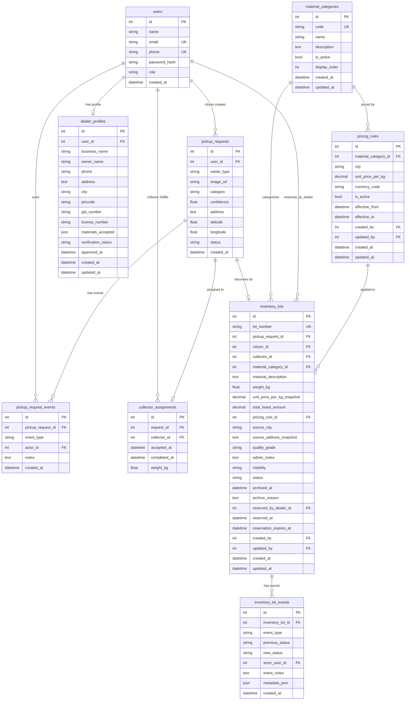

# Database Schema — Waste-IQ

> This document describes the complete database schema for Waste-IQ, including all tables, columns, relationships, indexes, and constraints. The production database is **PostgreSQL 16**; local development defaults to **SQLite**.
>
> All schema changes are managed through [Alembic](https://alembic.sqlalchemy.org/) migrations located in `backend/alembic/`.

---

## Table of Contents

1. [Entity Relationship Diagram](#1-entity-relationship-diagram)
2. [Table: users](#2-table-users)
3. [Table: pickup\_requests](#3-table-pickup_requests)
4. [Table: pickup\_request\_events](#4-table-pickup_request_events)
5. [Table: collector\_assignments](#5-table-collector_assignments)
6. [Table: dealer\_profiles](#6-table-dealer_profiles)
7. [Table: material\_categories](#7-table-material_categories)
8. [Table: pricing\_rules](#8-table-pricing_rules)
9. [Table: inventory\_lots](#9-table-inventory_lots)
10. [Table: inventory\_lot\_events](#10-table-inventory_lot_events)
11. [Indexes](#11-indexes)
12. [Key Constraints](#12-key-constraints)
13. [Enum Types](#13-enum-types)
14. [Running Migrations](#14-running-migrations)

---

## 1. Entity Relationship Diagram



---

## 2. Table: `users`

Stores all platform users regardless of role.

| Column | Type | Nullable | Default | Constraints | Description |
|--------|------|----------|---------|-------------|-------------|
| `id` | `INTEGER` | No | auto | PK, INDEX | Surrogate primary key |
| `name` | `VARCHAR(120)` | No | — | NOT NULL | Full display name |
| `email` | `VARCHAR(255)` | No | — | NOT NULL, UNIQUE, INDEX | Login email address |
| `phone` | `VARCHAR(20)` | No | — | NOT NULL, UNIQUE, INDEX | Mobile phone number |
| `password_hash` | `VARCHAR(255)` | No | — | NOT NULL | bcrypt hash of the password |
| `role` | `VARCHAR` (Enum) | No | — | NOT NULL, INDEX | One of: `citizen`, `collector`, `dealer`, `admin` |
| `created_at` | `TIMESTAMPTZ` | No | `now()` | NOT NULL | Account creation timestamp |

**Relationships:**
- One user (role=citizen) → many `pickup_requests`
- One user (role=collector) → many `collector_assignments`
- One user (role=dealer) → one `dealer_profiles`
- One user → many `pickup_request_events` (as actor)
- One user → many `inventory_lots` (as citizen, collector, dealer, created_by, updated_by)

---

## 3. Table: `pickup_requests`

The central entity of the platform. Tracks a single recyclable waste pickup from submission to completion.

| Column | Type | Nullable | Default | Constraints | Description |
|--------|------|----------|---------|-------------|-------------|
| `id` | `INTEGER` | No | auto | PK, INDEX | Surrogate primary key |
| `user_id` | `INTEGER` | No | — | FK → `users.id` (CASCADE), INDEX | Citizen who submitted the request |
| `waste_type` | `VARCHAR(100)` | No | — | NOT NULL | Free-text waste description (e.g., "Old newspapers") |
| `image_url` | `TEXT` | Yes | NULL | — | Cloudinary CDN URL of the uploaded waste photo |
| `category` | `VARCHAR(50)` | Yes | NULL | — | AI-detected material category code |
| `confidence` | `FLOAT` | Yes | NULL | — | AI classification confidence score (0.0–1.0) |
| `address` | `TEXT` | No | — | NOT NULL | Human-readable pickup address |
| `latitude` | `FLOAT` | No | — | NOT NULL | GPS latitude (−90 to 90) |
| `longitude` | `FLOAT` | No | — | NOT NULL | GPS longitude (−180 to 180) |
| `status` | `VARCHAR` (Enum) | No | `pending` | NOT NULL, INDEX | Lifecycle status (see enum) |
| `created_at` | `TIMESTAMPTZ` | No | `now()` | NOT NULL | Submission timestamp |

**Pickup Status Enum:** `pending` → `accepted` → `on_the_way` → `collected` → `completed` / `cancelled`

**Relationships:**
- One `pickup_request` → one `collector_assignments` (uselist=False)
- One `pickup_request` → many `pickup_request_events`
- One `pickup_request` → one `inventory_lots` (uselist=False)

---

## 4. Table: `pickup_request_events`

Immutable audit log for every state transition on a pickup request.

| Column | Type | Nullable | Default | Constraints | Description |
|--------|------|----------|---------|-------------|-------------|
| `id` | `INTEGER` | No | auto | PK, INDEX | Surrogate primary key |
| `pickup_request_id` | `INTEGER` | No | — | FK → `pickup_requests.id` (CASCADE), INDEX | Parent pickup request |
| `event_type` | `VARCHAR` | No | — | NOT NULL, INDEX | Type of event (status transition label) |
| `actor_id` | `INTEGER` | Yes | NULL | FK → `users.id` (SET NULL) | User who triggered the event |
| `notes` | `TEXT` | Yes | NULL | — | Optional event notes |
| `created_at` | `TIMESTAMPTZ` | No | `now()` | NOT NULL, INDEX | Event timestamp |

---

## 5. Table: `collector_assignments`

Records which collector accepted a specific pickup request and tracks completion.

| Column | Type | Nullable | Default | Constraints | Description |
|--------|------|----------|---------|-------------|-------------|
| `id` | `INTEGER` | No | auto | PK, INDEX | Surrogate primary key |
| `request_id` | `INTEGER` | No | — | FK → `pickup_requests.id` (CASCADE), UNIQUE | The pickup request (one assignment per request) |
| `collector_id` | `INTEGER` | No | — | FK → `users.id` (CASCADE), INDEX | The collector user |
| `accepted_at` | `TIMESTAMPTZ` | No | `now()` | NOT NULL | Timestamp when the collector accepted |
| `completed_at` | `TIMESTAMPTZ` | Yes | NULL | — | Timestamp of physical pickup completion |
| `weight_kg` | `FLOAT` | Yes | NULL | — | Recorded weight of collected waste (required to complete) |

---

## 6. Table: `dealer_profiles`

Business profile for users with the `dealer` role. Requires admin verification before marketplace access is granted.

| Column | Type | Nullable | Default | Constraints | Description |
|--------|------|----------|---------|-------------|-------------|
| `id` | `INTEGER` | No | auto | PK, INDEX | Surrogate primary key |
| `user_id` | `INTEGER` | No | — | FK → `users.id` (CASCADE), UNIQUE, INDEX | Owning user |
| `business_name` | `VARCHAR(160)` | No | — | NOT NULL | Registered business name |
| `owner_name` | `VARCHAR(120)` | No | — | NOT NULL | Full name of the business owner |
| `phone` | `VARCHAR(20)` | No | — | NOT NULL | Business contact phone |
| `address` | `TEXT` | No | — | NOT NULL | Business address |
| `city` | `VARCHAR(100)` | No | — | NOT NULL, INDEX | City of operation |
| `pincode` | `VARCHAR(12)` | No | — | NOT NULL, INDEX | Postal code |
| `gst_number` | `VARCHAR(30)` | Yes | NULL | — | GST registration number (optional) |
| `license_number` | `VARCHAR(50)` | Yes | NULL | — | Scrap dealer license number (optional) |
| `materials_accepted` | `JSON` | No | — | NOT NULL | Array of material category codes accepted |
| `verification_status` | `VARCHAR` (Enum) | No | `pending` | NOT NULL, INDEX | `pending` / `approved` / `rejected` |
| `approved_at` | `TIMESTAMPTZ` | Yes | NULL | — | Timestamp of admin approval |
| `created_at` | `TIMESTAMPTZ` | No | `now()` | NOT NULL | Profile creation timestamp |
| `updated_at` | `TIMESTAMPTZ` | No | `now()` | NOT NULL | Last update timestamp (auto-updates) |

---

## 7. Table: `material_categories`

Master list of recyclable material types. Used to classify inventory lots and scope pricing rules.

| Column | Type | Nullable | Default | Constraints | Description |
|--------|------|----------|---------|-------------|-------------|
| `id` | `INTEGER` | No | auto | PK, INDEX | Surrogate primary key |
| `code` | `VARCHAR(80)` | No | — | NOT NULL, UNIQUE, INDEX | Machine-readable code (e.g., `PAPER`, `PET_PLASTIC`) |
| `name` | `VARCHAR(120)` | No | — | NOT NULL, INDEX | Human-readable name (e.g., "Newspaper & Cardboard") |
| `description` | `TEXT` | Yes | NULL | — | Extended description of accepted materials |
| `is_active` | `BOOLEAN` | No | `true` | NOT NULL, INDEX | Whether this category is currently available |
| `display_order` | `INTEGER` | No | `0` | NOT NULL, INDEX | Ordering for UI display |
| `created_at` | `TIMESTAMPTZ` | No | `now()` | NOT NULL | Creation timestamp |
| `updated_at` | `TIMESTAMPTZ` | No | `now()` | NOT NULL | Last update timestamp |

---

## 8. Table: `pricing_rules`

Admin-configured per-kg pricing for each material category and city. The active rule at lot-creation time is snapshotted onto the lot.

| Column | Type | Nullable | Default | Constraints | Description |
|--------|------|----------|---------|-------------|-------------|
| `id` | `INTEGER` | No | auto | PK, INDEX | Surrogate primary key |
| `material_category_id` | `INTEGER` | No | — | FK → `material_categories.id` (RESTRICT), INDEX | Target material category |
| `city` | `VARCHAR(100)` | No | — | NOT NULL, INDEX | City this rule applies to |
| `unit_price_per_kg` | `NUMERIC(10,2)` | No | — | NOT NULL | Price in `currency_code` per kilogram |
| `currency_code` | `VARCHAR(3)` | No | `INR` | NOT NULL | ISO 4217 currency code |
| `is_active` | `BOOLEAN` | No | `true` | NOT NULL, INDEX | Whether this rule is currently in effect |
| `effective_from` | `TIMESTAMPTZ` | No | — | NOT NULL, INDEX | Start of this rule's validity window |
| `effective_to` | `TIMESTAMPTZ` | Yes | NULL | — | End of validity window (NULL = open-ended) |
| `created_by` | `INTEGER` | Yes | NULL | FK → `users.id` (SET NULL), INDEX | Admin who created the rule |
| `updated_by` | `INTEGER` | Yes | NULL | FK → `users.id` (SET NULL), INDEX | Admin who last modified the rule |
| `created_at` | `TIMESTAMPTZ` | No | `now()` | NOT NULL | Creation timestamp |
| `updated_at` | `TIMESTAMPTZ` | No | `now()` | NOT NULL | Last update timestamp |

---

## 9. Table: `inventory_lots`

Represents a batch of recyclable material (sourced from a completed pickup) listed on the dealer marketplace.

| Column | Type | Nullable | Default | Constraints | Description |
|--------|------|----------|---------|-------------|-------------|
| `id` | `INTEGER` | No | auto | PK, INDEX | Surrogate primary key |
| `lot_number` | `VARCHAR(40)` | No | — | NOT NULL, UNIQUE, INDEX | Human-readable identifier (e.g., `WIQ-202606-00123`) |
| `pickup_request_id` | `INTEGER` | No | — | FK → `pickup_requests.id` (CASCADE), UNIQUE, INDEX | Source pickup (one lot per pickup) |
| `citizen_id` | `INTEGER` | No | — | FK → `users.id` (RESTRICT), INDEX | Citizen who submitted the original pickup |
| `collector_id` | `INTEGER` | No | — | FK → `users.id` (RESTRICT), INDEX | Collector who completed the pickup |
| `material_category_id` | `INTEGER` | No | — | FK → `material_categories.id` (RESTRICT), INDEX | Material type of this lot |
| `material_description` | `TEXT` | Yes | NULL | — | Free-text description of the material |
| `weight_kg` | `FLOAT` | No | — | NOT NULL, CHECK > 0 | Verified weight in kilograms |
| `unit_price_per_kg_snapshot` | `NUMERIC(10,2)` | No | — | NOT NULL, CHECK ≥ 0 | Price per kg at the time of lot creation |
| `total_listed_amount` | `NUMERIC(12,2)` | No | — | NOT NULL, CHECK ≥ 0 | `weight_kg × unit_price_per_kg_snapshot` |
| `pricing_rule_id` | `INTEGER` | Yes | NULL | FK → `pricing_rules.id` (SET NULL), INDEX | Pricing rule used to derive the snapshot |
| `source_city` | `VARCHAR(100)` | No | — | NOT NULL, INDEX | City where waste was collected |
| `source_address_snapshot` | `TEXT` | Yes | NULL | — | Snapshot of the citizen's pickup address |
| `quality_grade` | `VARCHAR(30)` | Yes | NULL | INDEX | Optional grade (e.g., Grade A / B / C) |
| `admin_notes` | `TEXT` | Yes | NULL | — | Internal notes visible only to admin |
| `visibility` | `VARCHAR` (Enum) | No | `visible` | NOT NULL, INDEX | `visible` or `hidden` (admin can hide from marketplace) |
| `status` | `VARCHAR` (Enum) | No | `available` | NOT NULL, INDEX | `available`, `reserved`, or `sold` |
| `archived_at` | `TIMESTAMPTZ` | Yes | NULL | INDEX | Timestamp when archived (soft delete) |
| `archive_reason` | `TEXT` | Yes | NULL | — | Reason for archiving |
| `reserved_by_dealer_id` | `INTEGER` | Yes | NULL | FK → `users.id` (SET NULL), INDEX | Dealer who has reserved the lot |
| `reserved_at` | `TIMESTAMPTZ` | Yes | NULL | — | When the reservation was placed |
| `reservation_expires_at` | `TIMESTAMPTZ` | Yes | NULL | INDEX | Reservation expiry (T+24h from `reserved_at`) |
| `created_by` | `INTEGER` | Yes | NULL | FK → `users.id` (SET NULL), INDEX | Admin who created the lot |
| `updated_by` | `INTEGER` | Yes | NULL | FK → `users.id` (SET NULL), INDEX | Admin who last modified the lot |
| `created_at` | `TIMESTAMPTZ` | No | `now()` | NOT NULL, INDEX | Lot creation timestamp |
| `updated_at` | `TIMESTAMPTZ` | No | `now()` | NOT NULL | Last update timestamp (auto-updates) |

**Check Constraints:**
- `ck_inventory_lots_weight_positive`: `weight_kg > 0`
- `ck_inventory_lots_unit_price_non_negative`: `unit_price_per_kg_snapshot >= 0`
- `ck_inventory_lots_total_amount_non_negative`: `total_listed_amount >= 0`

---

## 10. Table: `inventory_lot_events`

Immutable event log for every state change on an inventory lot.

| Column | Type | Nullable | Default | Constraints | Description |
|--------|------|----------|---------|-------------|-------------|
| `id` | `INTEGER` | No | auto | PK, INDEX | Surrogate primary key |
| `inventory_lot_id` | `INTEGER` | No | — | FK → `inventory_lots.id` (CASCADE), INDEX | Parent lot |
| `event_type` | `VARCHAR` (Enum) | No | — | NOT NULL, INDEX | See enum values below |
| `previous_status` | `VARCHAR` (Enum) | Yes | NULL | — | Lot status before this event |
| `new_status` | `VARCHAR` (Enum) | Yes | NULL | — | Lot status after this event |
| `actor_user_id` | `INTEGER` | Yes | NULL | FK → `users.id` (SET NULL), INDEX | User who triggered the event |
| `event_notes` | `TEXT` | Yes | NULL | — | Human-readable notes |
| `metadata_json` | `JSON` | Yes | NULL | — | Structured metadata (e.g., changed fields) |
| `created_at` | `TIMESTAMPTZ` | No | `now()` | NOT NULL | Event timestamp |

**Event Type Enum:** `created`, `updated`, `status_changed`, `archived`, `restored`, `reserved`, `reservation_expired`

---

## 11. Indexes

| Table | Index Name | Columns | Type | Purpose |
|-------|-----------|---------|------|---------|
| `users` | `ix_users_id` | `id` | B-Tree (PK) | Primary key lookup |
| `users` | `ix_users_email` | `email` | B-Tree (UNIQUE) | Login by email |
| `users` | `ix_users_phone` | `phone` | B-Tree (UNIQUE) | Registration uniqueness check |
| `users` | `ix_users_role` | `role` | B-Tree | Filter users by role |
| `pickup_requests` | `ix_pickup_requests_id` | `id` | B-Tree (PK) | Primary key lookup |
| `pickup_requests` | `ix_pickup_requests_user_id` | `user_id` | B-Tree | Citizen's own request list |
| `pickup_requests` | `ix_pickup_requests_status` | `status` | B-Tree | Filter by lifecycle status |
| `collector_assignments` | `ix_collector_assignments_request_id` | `request_id` | B-Tree (UNIQUE) | One assignment per request |
| `collector_assignments` | `ix_collector_assignments_collector_id` | `collector_id` | B-Tree | Collector's assignment list |
| `dealer_profiles` | `ix_dealer_profiles_user_id` | `user_id` | B-Tree (UNIQUE) | One profile per user |
| `dealer_profiles` | `ix_dealer_profiles_city` | `city` | B-Tree | Filter dealers by city |
| `dealer_profiles` | `ix_dealer_profiles_verification_status` | `verification_status` | B-Tree | Admin: list pending dealers |
| `material_categories` | `ix_material_categories_code` | `code` | B-Tree (UNIQUE) | Lookup by code |
| `material_categories` | `ix_material_categories_is_active` | `is_active` | B-Tree | Active category filter |
| `pricing_rules` | `ix_pricing_rules_material_category_id` | `material_category_id` | B-Tree | Rules per category |
| `pricing_rules` | `ix_pricing_rules_city` | `city` | B-Tree | Rules per city |
| `pricing_rules` | `ix_pricing_rules_effective_from` | `effective_from` | B-Tree | Validity window lookup |
| `inventory_lots` | `ix_inventory_lots_lot_number` | `lot_number` | B-Tree (UNIQUE) | Lookup by lot number |
| `inventory_lots` | `ix_inventory_lots_status` | `status` | B-Tree | Marketplace status filter |
| `inventory_lots` | `ix_inventory_lots_visibility` | `visibility` | B-Tree | Marketplace visibility filter |
| `inventory_lots` | `ix_inventory_lots_source_city` | `source_city` | B-Tree | City-based filtering |
| `inventory_lots` | `ix_inventory_lots_reservation_expires_at` | `reservation_expires_at` | B-Tree | Expiry enforcement queries |
| `inventory_lots` | `ix_inventory_lots_created_at` | `created_at` | B-Tree | Chronological ordering |
| `inventory_lot_events` | `ix_inventory_lot_events_inventory_lot_id` | `inventory_lot_id` | B-Tree | Events per lot |
| `inventory_lot_events` | `ix_inventory_lot_events_event_type` | `event_type` | B-Tree | Filter by event type |

---

## 12. Key Constraints

### Foreign Keys

| Table | Column | References | On Delete |
|-------|--------|-----------|-----------|
| `pickup_requests` | `user_id` | `users.id` | CASCADE |
| `pickup_request_events` | `pickup_request_id` | `pickup_requests.id` | CASCADE |
| `pickup_request_events` | `actor_id` | `users.id` | SET NULL |
| `collector_assignments` | `request_id` | `pickup_requests.id` | CASCADE |
| `collector_assignments` | `collector_id` | `users.id` | CASCADE |
| `dealer_profiles` | `user_id` | `users.id` | CASCADE |
| `pricing_rules` | `material_category_id` | `material_categories.id` | RESTRICT |
| `pricing_rules` | `created_by` | `users.id` | SET NULL |
| `pricing_rules` | `updated_by` | `users.id` | SET NULL |
| `inventory_lots` | `pickup_request_id` | `pickup_requests.id` | CASCADE |
| `inventory_lots` | `citizen_id` | `users.id` | RESTRICT |
| `inventory_lots` | `collector_id` | `users.id` | RESTRICT |
| `inventory_lots` | `material_category_id` | `material_categories.id` | RESTRICT |
| `inventory_lots` | `pricing_rule_id` | `pricing_rules.id` | SET NULL |
| `inventory_lots` | `reserved_by_dealer_id` | `users.id` | SET NULL |
| `inventory_lots` | `created_by` | `users.id` | SET NULL |
| `inventory_lots` | `updated_by` | `users.id` | SET NULL |
| `inventory_lot_events` | `inventory_lot_id` | `inventory_lots.id` | CASCADE |
| `inventory_lot_events` | `actor_user_id` | `users.id` | SET NULL |

### Unique Constraints

| Table | Columns | Meaning |
|-------|---------|---------|
| `users` | `email` | No two users share an email |
| `users` | `phone` | No two users share a phone number |
| `dealer_profiles` | `user_id` | One profile per dealer user |
| `collector_assignments` | `request_id` | One assignment per pickup request |
| `inventory_lots` | `lot_number` | Globally unique lot identifier |
| `inventory_lots` | `pickup_request_id` | One inventory lot per pickup |
| `material_categories` | `code` | Unique category codes |

### Check Constraints

| Table | Constraint Name | Expression |
|-------|----------------|------------|
| `inventory_lots` | `ck_inventory_lots_weight_positive` | `weight_kg > 0` |
| `inventory_lots` | `ck_inventory_lots_unit_price_non_negative` | `unit_price_per_kg_snapshot >= 0` |
| `inventory_lots` | `ck_inventory_lots_total_amount_non_negative` | `total_listed_amount >= 0` |

---

## 13. Enum Types

Waste-IQ uses **string enums** (stored as `VARCHAR` with `native_enum=False` in SQLAlchemy) to ensure portability across PostgreSQL and SQLite.

| Enum | Values | Used In |
|------|--------|---------|
| `UserRole` | `citizen`, `collector`, `dealer`, `admin` | `users.role` |
| `PickupStatus` | `pending`, `accepted`, `on_the_way`, `collected`, `completed`, `cancelled` | `pickup_requests.status` |
| `DealerVerificationStatus` | `pending`, `approved`, `rejected` | `dealer_profiles.verification_status` |
| `InventoryLotStatus` | `available`, `reserved`, `sold` | `inventory_lots.status` |
| `InventoryLotVisibility` | `visible`, `hidden` | `inventory_lots.visibility` |
| `InventoryLotEventType` | `created`, `updated`, `status_changed`, `archived`, `restored`, `reserved`, `reservation_expired` | `inventory_lot_events.event_type` |

---

## 14. Running Migrations

### Apply All Pending Migrations

```bash
cd backend
alembic upgrade head
```

### Create a New Migration

After modifying an SQLAlchemy model, auto-generate a migration:

```bash
alembic revision --autogenerate -m "add notifications table"
```

> ⚠️ Always **review the generated migration file** before applying. Alembic may miss some changes (e.g., check constraints, custom indexes).

### Downgrade by One Step

```bash
alembic downgrade -1
```

> ⚠️ Never run `alembic downgrade` in production without taking a database backup first.

### View Migration History

```bash
alembic history --verbose
```

### Check Current Revision

```bash
alembic current
```

### Migration in Docker

```bash
docker compose exec backend alembic upgrade head
```

### Migration on First Production Deploy

The backend `Dockerfile` runs `alembic upgrade head` automatically before starting Uvicorn:

```dockerfile
CMD ["sh", "-c", "alembic upgrade head && uvicorn app.main:app --host 0.0.0.0 --port ${PORT:-8000}"]
```

This ensures the database is always up-to-date when the container starts.
