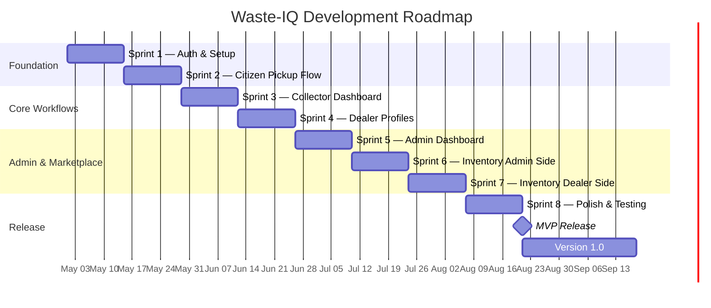

# Sprint Roadmap — Waste-IQ

> This document defines the development roadmap for Waste-IQ from initial setup through the MVP release and Version 1.0. Each sprint is two weeks in duration. The roadmap is a living document — it will be updated as priorities evolve.

---

## Overall Timeline

---

## Sprint 1 — Foundation & Authentication

**Duration:** 2 weeks (Weeks 1–2)  
**Owner:** Full Stack Team  
**Objective:** Establish the project skeleton, database foundation, and complete user authentication flow for all roles.

### Deliverables

| ID | Description | Type | Story Points | Status |
|----|-------------|------|-------------|--------|
| S1-001 | Monorepo structure setup (backend/, frontend/, docker-compose.yml) | Chore | 2 | ✅ Done |
| S1-002 | FastAPI app with Uvicorn, lifespan, and CORS middleware | Backend | 3 | ✅ Done |
| S1-003 | SQLAlchemy 2.0 setup with `Mapped[]` model style | Backend | 2 | ✅ Done |
| S1-004 | `User` model with roles enum (citizen/collector/dealer/admin) | Backend | 2 | ✅ Done |
| S1-005 | Alembic initial migration | Backend | 2 | ✅ Done |
| S1-006 | `POST /auth/register` with bcrypt password hashing | Backend | 3 | ✅ Done |
| S1-007 | `POST /auth/login` with JWT issuance | Backend | 3 | ✅ Done |
| S1-008 | `GET /auth/me` with token validation | Backend | 2 | ✅ Done |
| S1-009 | `require_roles()` FastAPI dependency for RBAC | Backend | 2 | ✅ Done |
| S1-010 | Admin bootstrap from environment variables | Backend | 2 | ✅ Done |
| S1-011 | Pydantic-settings config with `.env` support | Backend | 1 | ✅ Done |
| S1-012 | Vite + React 19 + TypeScript project setup | Frontend | 2 | ✅ Done |
| S1-013 | Tailwind CSS + shadcn/ui integration | Frontend | 2 | ✅ Done |
| S1-014 | AuthContext (login, logout, user state) | Frontend | 3 | ✅ Done |
| S1-015 | Login page with React Hook Form + Zod validation | Frontend | 3 | ✅ Done |
| S1-016 | Register page with role selection | Frontend | 3 | ✅ Done |
| S1-017 | Protected route guard (redirect to /login if unauthenticated) | Frontend | 2 | ✅ Done |
| S1-018 | Role-based redirect after login | Frontend | 2 | ✅ Done |
| S1-019 | Docker Compose with postgres:16, backend, frontend services | DevOps | 2 | ✅ Done |
| S1-020 | GitHub Actions backend-ci.yml (Ruff + Black + MyPy + Pytest) | CI/CD | 3 | ✅ Done |

### Exit Criteria

- [ ] Users can register with any valid role
- [ ] Users can log in and receive a JWT
- [ ] Protected routes redirect unauthenticated users to login
- [ ] All CI checks pass on GitHub Actions
- [ ] `docker compose up` starts all services successfully

---

## Sprint 2 — Citizen Pickup Flow

**Duration:** 2 weeks (Weeks 3–4)  
**Owner:** Full Stack Team  
**Objective:** Enable citizens to submit pickup requests with images, track status, and view their history.

### Deliverables

| ID | Description | Type | Story Points | Status |
|----|-------------|------|-------------|--------|
| S2-001 | `PickupRequest` model with `PickupStatus` enum | Backend | 3 | ✅ Done |
| S2-002 | `PickupRequestEvent` model for audit trail | Backend | 2 | ✅ Done |
| S2-003 | Alembic migration for pickup tables | Backend | 1 | ✅ Done |
| S2-004 | `POST /pickup-requests` (multipart form-data with optional image) | Backend | 5 | ✅ Done |
| S2-005 | Cloudinary integration for image upload | Backend | 4 | ✅ Done |
| S2-006 | `ImageUploadConfigurationError` + `ImageUploadUnavailableError` custom exceptions | Backend | 2 | ✅ Done |
| S2-007 | `GET /pickup-requests` (filtered by user for citizen role) | Backend | 2 | ✅ Done |
| S2-008 | `GET /pickup-requests/{id}` with events array | Backend | 3 | ✅ Done |
| S2-009 | `PATCH /pickup-requests/{id}` (update editable fields) | Backend | 2 | ✅ Done |
| S2-010 | `POST /pickup-requests/{id}/cancel` | Backend | 2 | ✅ Done |
| S2-011 | `GET /pickup-requests/citizen/summary` (dashboard stats) | Backend | 3 | ✅ Done |
| S2-012 | Citizen dashboard overview page with stats cards | Frontend | 4 | ✅ Done |
| S2-013 | NewPickupPage with multipart form (waste type, address, GPS, image) | Frontend | 5 | ✅ Done |
| S2-014 | CitizenPickupsPage — paginated list of own requests with status badges | Frontend | 3 | ✅ Done |
| S2-015 | PickupDetailsPage — full request detail with event timeline | Frontend | 4 | ✅ Done |
| S2-016 | Cancel request confirmation dialog | Frontend | 2 | ✅ Done |
| S2-017 | Image upload preview in NewPickupPage | Frontend | 2 | ✅ Done |
| S2-018 | Unit tests for pickup request service | Backend | 3 | ✅ Done |

### Exit Criteria

- [ ] Citizens can submit a pickup request with or without an image
- [ ] Citizens can view all their requests and individual request details
- [ ] Citizens can cancel requests in `pending` status
- [ ] Dashboard shows correct aggregate metrics
- [ ] Cloudinary images upload successfully; dev mode works without credentials

---

## Sprint 3 — Collector Dashboard

**Duration:** 2 weeks (Weeks 5–6)  
**Owner:** Full Stack Team  
**Objective:** Give collectors a full-featured dashboard to find, accept, and progress through pickup assignments.

### Deliverables

| ID | Description | Type | Story Points | Status |
|----|-------------|------|-------------|--------|
| S3-001 | `CollectorAssignment` model | Backend | 2 | ✅ Done |
| S3-002 | Alembic migration for collector_assignments | Backend | 1 | ✅ Done |
| S3-003 | `GET /collector/available` — all pending requests | Backend | 2 | ✅ Done |
| S3-004 | `GET /collector/nearby` — Haversine distance calculation with radius filter | Backend | 4 | ✅ Done |
| S3-005 | `GET /collector/assigned` — collector's own active assignments | Backend | 2 | ✅ Done |
| S3-006 | `POST /collector/accept/{id}` — create assignment, transition to accepted | Backend | 3 | ✅ Done |
| S3-007 | `POST /collector/start/{id}` — transition to on_the_way | Backend | 2 | ✅ Done |
| S3-008 | `POST /collector/collect/{id}` — transition to collected | Backend | 2 | ✅ Done |
| S3-009 | `POST /collector/complete/{id}` — require weight_kg, transition to completed | Backend | 3 | ✅ Done |
| S3-010 | `GET /collector/summary` — personal stats (total, in-progress, completed, weight) | Backend | 3 | ✅ Done |
| S3-011 | Collector dashboard overview page | Frontend | 4 | ✅ Done |
| S3-012 | Available requests page with accept button | Frontend | 3 | ✅ Done |
| S3-013 | Nearby requests page with distance display | Frontend | 3 | ✅ Done |
| S3-014 | Assigned requests page with status action buttons | Frontend | 4 | ✅ Done |
| S3-015 | Complete pickup modal with weight_kg input | Frontend | 3 | ✅ Done |
| S3-016 | Real-time status button states per pickup lifecycle stage | Frontend | 3 | ✅ Done |
| S3-017 | Unit tests for collector service | Backend | 3 | ✅ Done |

### Exit Criteria

- [ ] Collectors see all pending requests on the available page
- [ ] Collectors see nearby requests sorted by distance
- [ ] Full lifecycle (accept → start → collect → complete with weight) works end-to-end
- [ ] Collector summary stats reflect real data
- [ ] Accepting a request locks it to that collector (no double-accept)

---

## Sprint 4 — Dealer Profiles & Verification

**Duration:** 2 weeks (Weeks 7–8)  
**Owner:** Full Stack Team  
**Objective:** Allow dealers to register business profiles and give admins the tools to verify them.

### Deliverables

| ID | Description | Type | Story Points | Status |
|----|-------------|------|-------------|--------|
| S4-001 | `DealerProfile` model with `DealerVerificationStatus` enum | Backend | 3 | ✅ Done |
| S4-002 | Alembic migration for dealer_profiles | Backend | 1 | ✅ Done |
| S4-003 | `POST /dealer/profile` — create dealer profile | Backend | 3 | ✅ Done |
| S4-004 | `GET /dealer/profile` — get own profile | Backend | 1 | ✅ Done |
| S4-005 | `PATCH /dealer/profile` — update profile | Backend | 2 | ✅ Done |
| S4-006 | `GET /admin/dealers` — list all dealers with verification status | Backend | 2 | ✅ Done |
| S4-007 | `POST /admin/dealers/{id}/approve` — set status to approved | Backend | 2 | ✅ Done |
| S4-008 | `POST /admin/dealers/{id}/reject` — set status to rejected | Backend | 2 | ✅ Done |
| S4-009 | Dealer profile creation form page | Frontend | 4 | ✅ Done |
| S4-010 | Dealer profile view page with verification status badge | Frontend | 3 | ✅ Done |
| S4-011 | Dealer profile edit page | Frontend | 3 | ✅ Done |
| S4-012 | Admin: dealers management page with verification action buttons | Frontend | 4 | ✅ Done |
| S4-013 | Verification status banner (pending / approved / rejected) on dealer dashboard | Frontend | 2 | ✅ Done |
| S4-014 | Unit tests for dealer profile service | Backend | 2 | ✅ Done |

### Exit Criteria

- [ ] Dealers can create and update their business profile
- [ ] Admins can see all dealers and their verification status
- [ ] Admins can approve or reject dealers
- [ ] Approved dealers see a success banner; pending dealers see a waiting message

---

## Sprint 5 — Admin Dashboard & Analytics

**Duration:** 2 weeks (Weeks 9–10)  
**Owner:** Full Stack Team  
**Objective:** Give admins complete visibility into platform health through a rich analytics dashboard and user management tools.

### Deliverables

| ID | Description | Type | Story Points | Status |
|----|-------------|------|-------------|--------|
| S5-001 | `GET /admin/analytics` — aggregate KPIs endpoint | Backend | 4 | ✅ Done |
| S5-002 | `GET /admin/users` — full user list | Backend | 2 | ✅ Done |
| S5-003 | Admin dashboard overview page with KPI cards | Frontend | 4 | ✅ Done |
| S5-004 | Platform stats: users, pickups by status, weight, revenue | Frontend | 3 | ✅ Done |
| S5-005 | User management table with role badges and timestamps | Frontend | 3 | ✅ Done |
| S5-006 | Admin sidebar navigation with all sections | Frontend | 2 | ✅ Done |
| S5-007 | DashboardOverviewPage (role-adaptive: citizen/collector/dealer/admin views) | Frontend | 4 | ✅ Done |
| S5-008 | PickupHistoryPage (admin sees all pickups, collector sees own) | Frontend | 3 | ✅ Done |
| S5-009 | Unit tests for admin analytics service | Backend | 2 | ✅ Done |

### Exit Criteria

- [ ] Admin analytics endpoint returns accurate counts
- [ ] Admin dashboard displays all KPIs in a clean, readable layout
- [ ] Admin can view the full user list with roles

---

## Sprint 6 — Inventory Marketplace (Admin Side)

**Duration:** 2 weeks (Weeks 11–12)  
**Owner:** Full Stack Team  
**Objective:** Give admins the tools to create and manage the inventory marketplace — material categories, pricing rules, and inventory lots.

### Deliverables

| ID | Description | Type | Story Points | Status |
|----|-------------|------|-------------|--------|
| S6-001 | `MaterialCategory` model | Backend | 2 | ✅ Done |
| S6-002 | `PricingRule` model | Backend | 3 | ✅ Done |
| S6-003 | `InventoryLot` model with check constraints | Backend | 4 | ✅ Done |
| S6-004 | Alembic migration for all three tables | Backend | 2 | ✅ Done |
| S6-005 | Admin: CRUD endpoints for material categories | Backend | 3 | ✅ Done |
| S6-006 | Admin: CRUD endpoints for pricing rules | Backend | 3 | ✅ Done |
| S6-007 | Admin: `POST /admin/inventory/lots` — create lot from completed pickup | Backend | 5 | ✅ Done |
| S6-008 | Auto-generate `lot_number` (format: `WIQ-YYYYMM-{id:05d}`) | Backend | 2 | ✅ Done |
| S6-009 | Snapshot `unit_price_per_kg` and compute `total_listed_amount` at creation | Backend | 3 | ✅ Done |
| S6-010 | Admin: `GET /admin/inventory/lots` with filters | Backend | 2 | ✅ Done |
| S6-011 | Admin: `PATCH /admin/inventory/lots/{id}` — update details | Backend | 2 | ✅ Done |
| S6-012 | Admin: `POST /admin/inventory/lots/{id}/archive` — soft archive | Backend | 3 | ✅ Done |
| S6-013 | Admin inventory management page (list + create lot form) | Frontend | 4 | ✅ Done |
| S6-014 | Admin pricing rules management page | Frontend | 3 | ✅ Done |
| S6-015 | Admin material categories page | Frontend | 3 | ✅ Done |
| S6-016 | Unit tests for inventory service (admin side) | Backend | 3 | ✅ Done |

### Exit Criteria

- [ ] Admin can create material categories and pricing rules
- [ ] Admin can create an InventoryLot from a completed pickup
- [ ] Lot number is auto-generated and globally unique
- [ ] Price snapshot is calculated correctly from the active pricing rule

---

## Sprint 7 — Inventory Marketplace (Dealer Side)

**Duration:** 2 weeks (Weeks 13–14)  
**Owner:** Full Stack Team  
**Objective:** Launch the dealer-facing inventory marketplace with browse, filter, reserve, and purchase flows — including the 24-hour reservation window.

### Deliverables

| ID | Description | Type | Story Points | Status |
|----|-------------|------|-------------|--------|
| S7-001 | `InventoryLotEvent` model with event type enum | Backend | 3 | ✅ Done |
| S7-002 | Alembic migration for inventory_lot_events | Backend | 1 | ✅ Done |
| S7-003 | `GET /dealer/inventory/lots` with filtering (city, category, grade, weight range) | Backend | 4 | ✅ Done |
| S7-004 | `GET /dealer/inventory/lots/{id}` — lot detail | Backend | 1 | ✅ Done |
| S7-005 | `POST /dealer/inventory/lots/{id}/reserve` — create 24h reservation | Backend | 4 | ✅ Done |
| S7-006 | Reservation expiry check on browse and reserve endpoints | Backend | 3 | ✅ Done |
| S7-007 | `reservation_expired` event auto-emitted on stale reservation detect | Backend | 2 | ✅ Done |
| S7-008 | `POST /dealer/inventory/lots/{id}/purchase` — confirm purchase | Backend | 3 | ✅ Done |
| S7-009 | `require_roles` guard: approved dealer only for marketplace endpoints | Backend | 2 | ✅ Done |
| S7-010 | InventoryLotEvent recorded for every state change | Backend | 2 | ✅ Done |
| S7-011 | Dealer marketplace browse page with filter panel | Frontend | 5 | ✅ Done |
| S7-012 | Lot detail page with reserve/purchase buttons | Frontend | 4 | ✅ Done |
| S7-013 | Reservation expiry countdown timer on reserved lots | Frontend | 3 | ✅ Done |
| S7-014 | "Not approved" wall for unverified dealers trying to access marketplace | Frontend | 2 | ✅ Done |
| S7-015 | Unit tests for dealer marketplace service | Backend | 3 | ✅ Done |

### Exit Criteria

- [ ] Approved dealers can browse, filter, reserve, and purchase inventory lots
- [ ] Unapproved dealers see the verification required message
- [ ] Reservations expire after exactly 24 hours
- [ ] Every state change produces a corresponding InventoryLotEvent record
- [ ] Only one dealer can hold a reservation at a time

---

## Sprint 8 — Polish, Testing & Documentation

**Duration:** 2 weeks (Weeks 15–16)  
**Owner:** Full Stack Team + Tech Lead  
**Objective:** Bring test coverage to target, fix all known bugs, polish UI/UX, finalize all documentation, and prepare for production deployment.

### Deliverables

| ID | Description | Type | Story Points | Status |
|----|-------------|------|-------------|--------|
| S8-001 | Backend Pytest coverage to ≥ 80% (`--cov-fail-under=80`) | Testing | 6 | ✅ Done |
| S8-002 | Frontend ESLint + TypeScript strict mode — zero errors | Testing | 2 | ✅ Done |
| S8-003 | Full end-to-end manual testing of all user flows | Testing | 4 | ✅ Done |
| S8-004 | Responsive design audit (360px to 1440px) | Frontend | 3 | ✅ Done |
| S8-005 | Accessibility audit (keyboard nav, ARIA labels, contrast ratios) | Frontend | 3 | ✅ Done |
| S8-006 | Loading states and skeleton loaders on all data-fetching views | Frontend | 3 | ✅ Done |
| S8-007 | Error boundaries on all major page sections | Frontend | 2 | ✅ Done |
| S8-008 | 404 and error pages | Frontend | 1 | ✅ Done |
| S8-009 | SettingsPage and ProfilePage complete | Frontend | 2 | ✅ Done |
| S8-010 | `README.md` — complete, with installation, architecture, and env docs | Docs | 3 | ✅ Done |
| S8-011 | `docs/API_SPECIFICATION.md` — every endpoint documented | Docs | 3 | ✅ Done |
| S8-012 | `docs/DATABASE_SCHEMA.md` — all tables and relationships | Docs | 2 | ✅ Done |
| S8-013 | `docs/SYSTEM_ARCHITECTURE.md` — with Mermaid diagrams | Docs | 2 | ✅ Done |
| S8-014 | `docs/DEPLOYMENT_GUIDE.md` — local, Docker, and Render steps | Docs | 2 | ✅ Done |
| S8-015 | `CONTRIBUTING.md`, `CODE_OF_CONDUCT.md`, `CHANGELOG.md` | Docs | 2 | ✅ Done |
| S8-016 | GitHub issue templates + PR template + CODEOWNERS | DevOps | 1 | ✅ Done |
| S8-017 | CI: frontend-ci.yml (ESLint + tsc + Vite build) | CI/CD | 2 | ✅ Done |
| S8-018 | Production deployment to Render.com (backend + static frontend) | DevOps | 4 | ✅ Done |
| S8-019 | `GET /health` verified in production | DevOps | 1 | ✅ Done |
| S8-020 | Database backup strategy configured on Render | DevOps | 2 | ✅ Done |

### Exit Criteria

- [ ] Backend test coverage ≥ 80%
- [ ] All CI checks pass on `main` and `develop` branches
- [ ] Zero lint or type errors in frontend
- [ ] All documentation files committed and reviewed
- [ ] Production deployment is live and healthy
- [ ] `/health` returns 200 in production
- [ ] CHANGELOG.md reflects v0.2.0 release

---

## MVP Release

**Target Date:** End of Week 16  
**Tag:** `v0.2.0`

### Release Checklist

- [ ] All Sprint 1–8 exit criteria satisfied
- [ ] `git tag v0.2.0` on `main`
- [ ] GitHub Release created with CHANGELOG.md content
- [ ] Production database migrated to latest Alembic revision
- [ ] Admin account bootstrapped in production
- [ ] Monitoring alerts configured (uptime, error rate)
- [ ] Team retrospective completed
- [ ] Sprint Roadmap updated with actual vs. planned velocity

---

## Version 1.0 (Weeks 17–20)

**Objective:** Polish, performance, and the first set of post-MVP features based on user feedback.

| Story | Description | Priority |
|-------|-------------|----------|
| V1-001 | Browser push notifications for pickup status changes | High |
| V1-002 | Enhanced admin analytics with trend charts (recharts) | High |
| V1-003 | Collector earnings calculation and history page | High |
| V1-004 | Citizen reward points (earn per kg collected) | Medium |
| V1-005 | API response pagination for large datasets | High |
| V1-006 | Rate limiting on auth endpoints (prevent brute force) | High |
| V1-007 | Soft-delete for users (deactivate vs. delete) | Medium |
| V1-008 | Admin audit log viewer (InventoryLotEvents browser) | Medium |
| V1-009 | Performance optimization: DB query analysis + indexes | High |
| V1-010 | Security hardening: OWASP checklist review | High |
| V1-011 | Mobile-responsive polish pass (all pages 360px+) | High |
| V1-012 | E2E test setup with Playwright (critical paths) | Medium |

**Exit Criteria for v1.0:**

- [ ] All `High` priority V1 stories complete
- [ ] Performance targets met: API p95 < 400ms, LCP < 2.5s
- [ ] Security review completed with no critical findings
- [ ] Tag `v1.0.0` on `main` with full release notes
