# System Architecture — Waste-IQ

> This document describes the high-level and detailed architecture of the Waste-IQ platform, covering the frontend, backend, authentication, data flow, and deployment topology.

---

## Table of Contents
1. [Overview](#1-overview)
2. [High-Level Architecture](#2-high-level-architecture)
3. [Frontend Architecture](#3-frontend-architecture)
4. [Backend Architecture](#4-backend-architecture)
5. [Authentication Flow](#5-authentication-flow)
6. [Pickup Request Lifecycle](#6-pickup-request-lifecycle)
7. [Inventory Marketplace Flow](#7-inventory-marketplace-flow)
8. [API Layer](#8-api-layer)
9. [Database Layer](#9-database-layer)
10. [Deployment Architecture](#10-deployment-architecture)
11. [Security](#11-security)
12. [Future AI Modules](#12-future-ai-modules)

---

## 1. Overview

Waste-IQ is a multi-role, API-driven platform that digitizes the recyclable waste supply chain. It connects four primary stakeholders:

| Actor | Role in the System |
|-------|--------------------|
| **Citizen** | Submits pickup requests for recyclable waste |
| **Collector** | Accepts and fulfills pickup requests in the field |
| **Scrap Dealer** | Creates a business profile, awaits approval, then purchases verified inventory lots through the marketplace |
| **Admin** | Manages the platform, reviews and approves/rejects dealer profiles, and creates inventory |

The system consists of a **React single-page application** communicating with a **FastAPI REST API**, backed by a **PostgreSQL relational database**, with **Cloudinary** for image storage.

---

## 2. High-Level Architecture

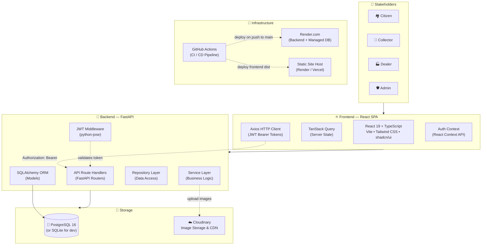

---

## 3. Frontend Architecture

### Technology Choices

| Layer | Technology | Rationale |
|-------|-----------|-----------|
| Framework | React 19 | Concurrent features, stable ecosystem |
| Language | TypeScript (strict) | Type safety, better DX |
| Build Tool | Vite | Fast HMR, optimized builds |
| Styling | Tailwind CSS + shadcn/ui | Utility-first, accessible components |
| Routing | React Router v6 | File-based, nested routes |
| Server State | TanStack Query v5 | Caching, refetching, mutations |
| HTTP | Axios | Interceptors for JWT injection |
| Forms | React Hook Form + Zod | Performant forms with schema validation |
| Animations | Framer Motion | Smooth transitions |
| Icons | Lucide React | Consistent icon set |

### Directory Structure

```
frontend/src/
├── api/           # Axios instance + typed API functions per domain
├── app/           # Root component, providers, global layout
├── assets/        # Static images and SVGs
├── components/    # Shared, reusable UI components (Button, Card, Badge…)
├── context/       # React Context providers (AuthContext, ThemeContext)
├── hooks/         # Custom React hooks (useAuth, usePickup, useCollector…)
├── layouts/       # Page layout shells (DashboardLayout, AuthLayout)
├── lib/           # Utility functions (cn(), formatDate(), formatCurrency()…)
├── pages/
│   ├── auth/      # Login, Register pages
│   ├── dashboard/ # Role-specific dashboard pages
│   └── public/    # Landing page, 404
├── routes/        # Route definitions with role-based guards
├── styles/        # Global CSS, Tailwind base layer overrides
├── types/         # TypeScript interfaces and type definitions
└── main.tsx       # App entry point
```

### State Management Strategy

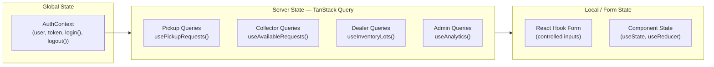

### Routing & Role Guards

```mermaid
flowchart TD
    START[Navigate to URL] --> CHECK{Token in\nlocalStorage?}
    CHECK -->|No| LOGIN[Redirect to /login]
    CHECK -->|Yes| ROLE{User Role?}
    ROLE -->|citizen| CDASH[/dashboard/citizen]
    ROLE -->|collector| COLDASH[/dashboard/collector]
    ROLE -->|dealer| DDASH[/dashboard/dealer]
    ROLE -->|admin| ADASH[/dashboard/admin]
    CDASH --> CGUARD{Role matches\nrequired role?}
    CGUARD -->|Yes| PAGE[Render Page]
    CGUARD -->|No| DENIED[403 Forbidden]
```

---

## 4. Backend Architecture

### Layered Architecture

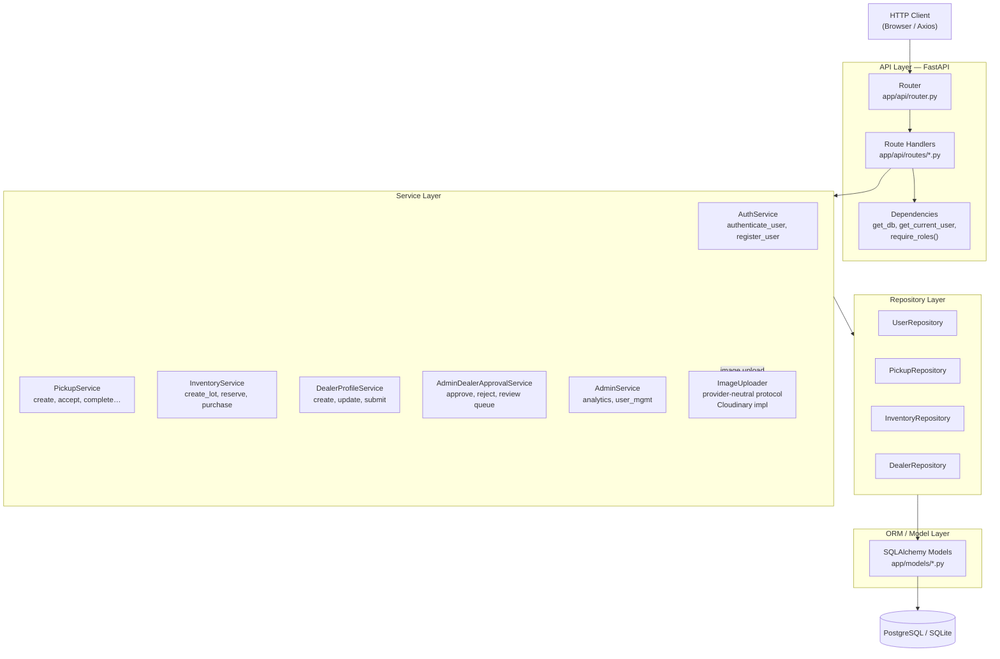

### Module Descriptions

| Module | Path | Responsibility |
|--------|------|----------------|
| `main.py` | `app/main.py` | FastAPI application factory, middleware registration, lifespan |
| `config.py` | `app/core/config.py` | Pydantic-settings `Settings` class; reads `.env` |
| `dependencies.py` | `app/core/dependencies.py` | `get_db`, `get_current_user`, `require_roles()` FastAPI deps |
| `security.py` | `app/core/security.py` | JWT encode/decode, bcrypt hashing |
| `router.py` | `app/api/router.py` | Mounts all sub-routers with prefixes and tags |
| `models/` | `app/models/` | SQLAlchemy ORM model classes |
| `schemas/` | `app/schemas/` | Pydantic v2 request/response schemas |
| `services/` | `app/services/` | Business logic; orchestrates repositories and external services |
| `repositories/` | `app/repositories/` | Raw data access queries; returns ORM objects |
| `db/session.py` | `app/db/session.py` | SQLAlchemy engine + `SessionLocal` factory |
| `routes/analytics.py` | `app/api/routes/analytics.py` | Admin AI analytics endpoints (overview, materials, monthly, collectors, dealers, carbon, insights) |
| `services/analytics.py` | `app/services/analytics.py` | Analytics aggregations (SQLAlchemy) and deterministic rule-based insight generation |
| `schemas/analytics.py` | `app/schemas/analytics.py` | Typed Pydantic v2 response models for every analytics endpoint |
| `services/dealer_profiles.py` | `app/services/dealer_profiles.py` | Dealer profile lifecycle: create, update, submit, approval timeline |
| `services/dealer_approval.py` | `app/services/dealer_approval.py` | Approval transition validation, `is_dealer_approved` guard, admin review/approve/reject |
| `repositories/dealer_profiles.py` | `app/repositories/dealer_profiles.py` | Dealer profile & event data access, paginated listing with search/sort/filter |
<<<<<<< HEAD
| `routes/marketplace.py` | `app/api/routes/marketplace.py` | Marketplace endpoints: inventory browse/detail, reserve, cancel-reservation, purchase, orders, transactions |
| `services/marketplace.py` | `app/services/marketplace.py` | Marketplace business logic: reservation TTL (24h), purchase under row lock, order + transaction creation, expiry release |
| `repositories/marketplace.py` | `app/repositories/marketplace.py` | Marketplace data access: paginated inventory/orders/transactions queries |
| `models/marketplace_order.py` | `app/models/marketplace_order.py` | `marketplace_orders` ORM model (one order per purchased lot) |
| `models/marketplace_transaction.py` | `app/models/marketplace_transaction.py` | `marketplace_transactions` financial ledger model |
| `routes/collector_map.py` | `app/api/routes/collector_map.py` | Live map & route endpoints: `/collector/map`, `/collector/location`, `/collector/route`, `/collector/nearby-pickups`, `/collector/navigation/{pickup_id}` |
| `services/collector_map.py` | `app/services/collector_map.py` | Live-map assembly, location upsert + history append, route ordering, nearby search, navigation geometry |
| `repositories/collector_locations.py` | `app/repositories/collector_locations.py` | Data access for `collector_locations` / `collector_location_history` |
| `models/collector_location.py` | `app/models/collector_location.py` | `collector_locations` (latest position) + `collector_location_history` (append-only) ORM models |
| `models/notification.py` | `app/models/notification.py` | `notifications` ORM model + `NotificationType` / `NotificationStatus` enums |
| `routes/notifications.py` | `app/api/routes/notifications.py` | Notification inbox endpoints (list, unread, count, read, read-all, delete) |
| `services/notifications.py` | `app/services/notifications.py` | `NotificationService` (CRUD), `NotificationDispatcher` (event hooks), `NotificationBroadcaster` (admin broadcast) |
| `services/notification_formatters.py` | `app/services/notification_formatters.py` | Pure title/message/link/metadata formatters per notification type |
| `repositories/notifications.py` | `app/repositories/notifications.py` | Notification data access: ownership-scoped queries, pagination, bulk read/delete |

---

## 5. Authentication Flow

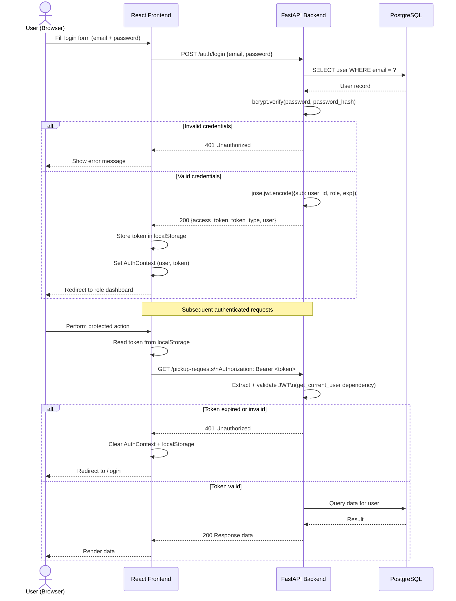

---

## 6. Pickup Request Lifecycle

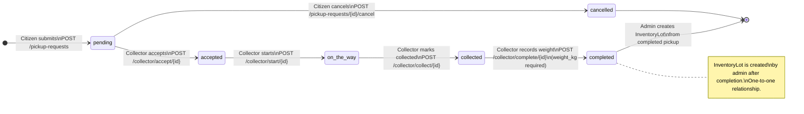

Each state transition is recorded as a `PickupRequestEvent` with the actor's user ID and timestamp.

---

## 6.5 Collector Live Map & Route Tracking (Issue #13)

The collector live map is a self-contained feature spanning both layers. The frontend renders an SVG-projected map (no external map/tile dependency) from data aggregated by a single backend endpoint.

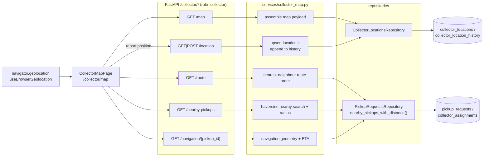

Key decisions:

- **Latest-position table (`collector_locations`)** — one row per collector (unique on `collector_id`); `POST /collector/location` upserts it and appends an immutable row to `collector_location_history` for route tracking.
- **Single-payload map endpoint** — `GET /collector/map` returns collector position, in-range pickup markers, the ordered route, and nearby pickups in one round trip so the page renders in a single query.
- **Deterministic travel estimates** — distance uses the existing Haversine service; ETAs use a default motor speed constant (`DEFAULT_ROUTE_SPEED_KMPH = 25.0`) so outputs stay reproducible without a mapping service.
- **SVG projection on the client** — `frontend/src/lib/map.ts` computes an equirectangular fit projection over the visible points, so the map auto-centers and auto-scales with no external tile/geocoding dependency.

---

## 6.6 Notification & Communication System (Issue #14)

A centralized, database-backed notification inbox shared by all four roles. The platform emits notifications automatically from business events; admins can additionally broadcast announcements; users consume them through a React inbox and a header bell.

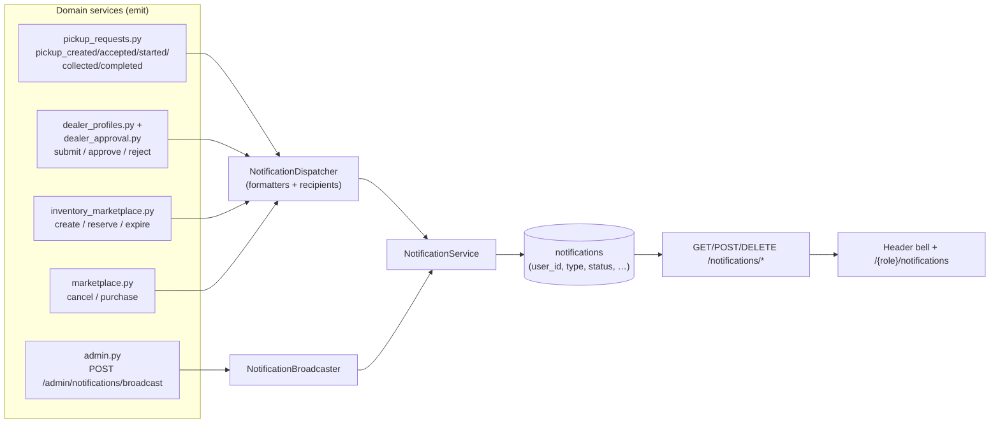

Key decisions:

- **Event-driven via an injected singleton** — `NotificationDispatcher()` (`_dispatcher`) is injected at module level into the pickup / dealer / marketplace services. Notifications flush inside the caller's transaction and ride the domain service's commit, so a failed business action never leaves orphaned notifications; only the inbox CRUD operations and `NotificationBroadcaster` commit their own transaction.
- **Ownership scoping at the repository** — every read/mark/delete query filters on `user_id`, so one user can never act on another's notification (404 on mismatch).
- **Recipient targeting by role** — admin-profile-submitted notifies all admins; reserve notifies both the citizen owner and the reserving dealer with type-specific copy; expired reservations notify the *previous* dealer via `notify_reservation_expired(db, lot, previous_dealer_id)`.
- **Broadcast is role-based** — `NotificationBroadcaster.broadcast` roots `recipient_roles` in `UserRole`, writes one row per recipient, and returns `recipients_count`.
- **Pure formatters** — `notification_formatters.py` returns `(title, message, link, metadata)` so dispatcher and broadcaster stay URL/UI-agnostic; links are frontend routes (`/dashboard/pickups/{id}`, `/dealer/marketplace/{lot_id}`).
- **Frontend straight reads the API** — `useNotifications` hooks expose paginated list, unread list/count (30 s auto-refresh for the bell), plus optimistic mark-read / mark-all-read / delete / delete-read mutations; the legacy localStorage citizen notifications UI is left untouched and coexists.

---

## 6.7 Audit Logging (Issue #61)

A centralized, append-only audit trail covering security-sensitive and administrative actions. Every audited event produces one row in `audit_logs`, written synchronously inside the same database transaction as the action it describes — there is no queue, no background job, and no way to edit or delete records through application code.

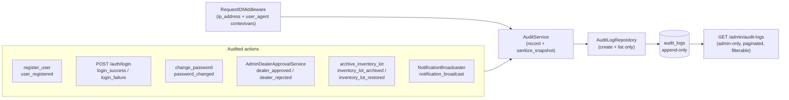

Key decisions:

- **Request metadata via the existing middleware** — `RequestIDMiddleware` already establishes per-request contextvars (request ID). It now also sets the client IP and user-agent the same way, so `AuditService` can capture them without threading `Request` through every service signature. Only the direct connection IP (`request.client.host`) is used; `X-Forwarded-For` is not trusted because the application has no proxy-aware IP handling.
- **Transactional by construction** — audit records are flushed into the caller's session and ride the triggering action's commit (e.g., inside `commit_or_rollback` in `inventory_marketplace.py`, before `DealerProfileRepository.save` in `dealer_approval.py`, before `NotificationBroadcaster`'s commit, inside `register_user`/`change_password`). A failed or rolled-back action never leaves an orphaned audit row. The login endpoints are the only exceptions and commit the record explicitly before responding.
- **Append-only repository** — `AuditLogRepository` exposes only `create` and `list`; there are no update/delete methods and no write endpoints. The admin API returns `405` for POST/PUT/PATCH/DELETE.
- **No credential material** — `sanitize_snapshot()` strips keys such as `password`, `password_hash`, `token`, and `secret` from `before`/`after` payloads; `password_changed` records no snapshot at all. Failed logins never store the attempted email (preventing enumeration via the audit trail); `actor_user_id` is set only when the email matches an existing account.
- **Admin-only read API** — `GET /admin/audit-logs` requires the `admin` role, supports `page`/`page_size` (max 100) plus filters (`actor_user_id`, `action`, `resource`, `created_after`, `created_before`), and returns newest-first with a deterministic `id` tiebreaker.

---

## 6.8 Email Verification (Issue #57)

Registration issues a signed, expiring verification token and delivers it by email; `POST /auth/verify-email` and `POST /auth/resend-verification` drive the lifecycle (see [API Specification — Email Verification](../docs/API_SPECIFICATION.md)).

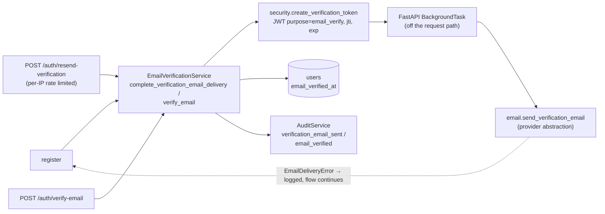

Key decisions:

- **Provider abstraction** — `app/services/email.py` defines an `EmailProvider` interface with two implementations: `ConsoleEmailProvider` (default, dev) appends messages to an in-process `email_outbox` and logs only a redacted summary; `SmtpEmailProvider` sends real mail via the configured SMTP host with STARTTLS. Selection happens once at startup from `EMAIL_BACKEND`; settings (`SMTP_HOST`, `SMTP_PORT`, `SMTP_USER`, `SMTP_PASSWORD`, `SMTP_USE_TLS`, `EMAIL_FROM`, `EMAIL_FROM_NAME`, `FRONTEND_URL`) are read from environment variables and never logged.
- **Stateless signed tokens** — verification tokens are JWTs (`purpose: "email_verify"`, random `jti`, `exp` = `VERIFICATION_TOKEN_EXPIRE_MINUTES`) signed with the same secret as access tokens. Nothing is stored server-side; single-use semantics come from the account state transition: after `email_verified_at` is set, replaying a token is idempotent and cannot change state. A `jti` makes every issuance unique material.
- **Delivery never blocks the flow** — registration and resend respond immediately; the verification email is dispatched by a FastAPI `BackgroundTask` (`complete_verification_email_delivery`) that owns a fresh DB session, issues the token, delivers via the provider, and records the `verification_email_sent` audit event only after the provider accepts the message. Delivery failure is logged (never raised) so registration and resend still succeed without a mail provider. Tokens are never recorded in logs, DB columns, or audit snapshots.
- **Enumeration-safe by construction** — invalid/expired/malformed/wrong-purpose/stale tokens all raise the same `EmailVerificationError` and surface as an identical `400` detail; resend always returns the same generic `200` message. Resend is rate-limited per IP only (never per account email) so it cannot be used to enumerate accounts or lock victims out.
- **Audit integration** — `verification_email_sent` (on successful delivery) and `email_verified` (with `after: {"email_verified": true}`) are recorded in the same transaction as the state change. Failed validation attempts are deliberately not audited (anti-log-flood).
- **Frontend** — unverified users see a resend banner on every dashboard page; `/verify-email?token=...` completes verification for both logged-out and logged-in users (registered without `GuestRoute`) and refreshes the cached profile so the banner disappears immediately.

## 6.9 Background Jobs (WIQ-V1-021)

Time-driven work runs in-process via **APScheduler** (`BackgroundScheduler`, UTC), started and stopped inside the FastAPI lifespan (`app/main.py` → `app/services/jobs.py`). Two jobs are registered under stable IDs:

| Job ID | Function | What it does |
|--------|----------|--------------|
| `reservation_sweep` | `reservation_sweep_job` | Calls `release_expired_reservations` (`app/services/inventory_marketplace.py`) to release lots whose 24-hour dealer reservation has lapsed: status → `available`, reservation fields cleared, `reservation_expired` lot event + expired marketplace transaction written, then `NotificationDispatcher.notify_reservation_expired` notifies the former deleter. |
| `aging_pickups` | `aging_pickup_alert_job` | Finds `pending`/`accepted` pickup requests older than `AGING_PICKUP_THRESHOLD_DAYS` and notifies all admins through `NotificationDispatcher.notify_admins`, de-duplicated by `pickup_id` in the notification metadata. |

Key properties:

- **Idempotent** — the sweep uses a guarded conditional `UPDATE` (`WHERE status = reserved AND reservation_expires_at <= now`) and skips any lot whose `rowcount` is 0, so a concurrent purchase or a re-run of the job can never double-release a lot or overwrite a newer state. The aging job consults `NotificationRepository.exists_by_metadata` before notifying, so repeated runs produce at most one alert per pickup.
- **Configurable** — `ENABLE_BACKGROUND_JOBS`, `RESERVATION_SWEEP_INTERVAL_MINUTES`, `AGING_PICKUP_INTERVAL_MINUTES`, `AGING_PICKUP_THRESHOLD_DAYS` (see `app/core/config.py`), all validated `> 0`.
- **Disabled during tests** — `start_scheduler` returns immediately when `ENVIRONMENT=test` or `ENABLE_BACKGROUND_JOBS=false`. Tests execute every job **synchronously** by calling the job functions directly with a `SessionLocal` monkey-patched to the test database (`tests/test_jobs.py`), so no test depends on a running scheduler.
- **Observable** — every run records `last_runs[...]` in-process, exposed to authenticated admins via `GET /admin/jobs/status`, and logs an INFO line with the release/expiry counts.
- **On-request email dispatch** — verification emails are delivered by FastAPI `BackgroundTasks` (see §6.8) so SMTP I/O never blocks request handlers; the jobs above remain DB-only.

### Celery + Redis upgrade path (multi-instance)

The current design is intentionally single-process: one APScheduler per uvicorn worker. When Waste-IQ is scaled to **multiple application instances** (or when a job must survive process restarts), migrate scheduled work to **Celery + Redis** without changing domain logic:

1. **The job bodies already are independent functions** (`reservation_sweep_job`, `aging_pickup_alert_job`, and the marketplace sweep `release_expired_reservations`) that take nothing but a DB session — move them (or the final `release_*`/`exists_by_metadata` primitives) into `@celery_app.task` wrappers verbatim.
2. **Replace the interval triggers with Celery Beat** schedules driven by the same settings (`RESERVATION_SWEEP_INTERVAL_MINUTES`, `AGING_PICKUP_INTERVAL_MINUTES`) so configuration stays in one place.
3. **Use Redis as the broker + result backend**; Redis also becomes a shared store later for the in-memory rate limiter (§8 API Layer) — one upgrade unlocks both scale limits.
4. **Idempotency transfers unchanged** — the guarded `UPDATE`/`exists` checks already make either APScheduler or Celery duplicate-delivery proof on a single shared PostgreSQL database.
5. **Email delivery** — background tasks are per-request; for multi-instance deployments, defer delivery to a Celery task or the mail provider's own queue (e.g. SES/SendGrid) so sends survive worker restarts.

Until then, keep `ENABLE_BACKGROUND_JOBS=false` and run the Celery worker/scheduler externally — no code change required beyond the wiring above.

---

## 7. Inventory Marketplace Flow

### Dealer Approval Workflow

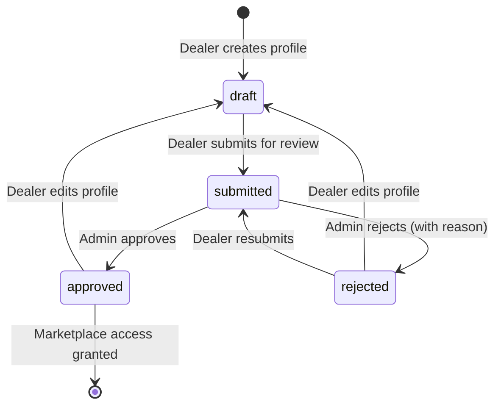

Every transition is persisted in `dealer_profile_events` (actor, status, note,
timestamp) and surfaced as an approval timeline to the dealer and admins.
Inventory browsing/reservation endpoints require `approval_status = approved`
(`403` with an explanatory detail otherwise).

```mermaid
sequenceDiagram
    actor A as Admin
    actor D as Dealer
    participant BE as FastAPI Backend
    participant DB as PostgreSQL

    Note over D,DB: Phase 1 — Lot Creation
    A->>BE: POST /admin/inventory/lots\n{pickup_request_id, material_category_id, weight_kg, quality_grade}
    BE->>DB: Create InventoryLot (status=available, visibility=visible)
    BE->>DB: Record InventoryLotEvent (type=created)
    BE-->>A: InventoryLot created (lot_number, total_listed_amount)

    Note over D,DB: Phase 2 — Dealer Browse & Reserve
<<<<<<< HEAD
    D->>BE: GET /marketplace/inventory?city=Mumbai&material_category_id=3
    BE->>DB: SELECT lots WHERE status=available AND visibility=visible\n(page/sort/search applied)
    DB-->>BE: Paginated list of available lots
    BE-->>D: [{items, page, total_items, total_pages}]
=======
    D->>BE: GET /dealer/inventory-lots?city=Mumbai&material_category_id=3
    BE->>DB: SELECT lots WHERE status=available AND visibility=visible
    DB-->>BE: List of available lots
    BE-->>D: [{lot_number, weight_kg, unit_price, source_city, quality_grade}]
>>>>>>> origin/main

    D->>BE: POST /marketplace/inventory/{lot_id}/reserve
    BE->>DB: UPDATE lot SET status=reserved,\nreserved_by_dealer_id=?,\nreservation_expires_at=NOW()+24h
    BE->>DB: Record InventoryLotEvent (type=reserved)
    BE->>DB: Insert MarketplaceTransaction (type=reservation, status=completed)
    BE-->>D: Lot reserved (expires_at, is_reserved_by_me=true)

    Note over D,DB: Phase 3 — Purchase Confirmation
    D->>BE: POST /marketplace/inventory/{lot_id}/purchase
    BE->>DB: SELECT lot FOR UPDATE — validate reserved by me + not expired
    alt Reservation expired or held by another dealer
        BE-->>D: 409 Conflict
    else Reservation valid
        BE->>DB: UPDATE lot SET status=sold
        BE->>DB: Record InventoryLotEvent (type=status_changed, new=sold)
        BE->>DB: Insert MarketplaceOrder + MarketplaceTransaction (type=purchase)
        BE-->>D: 201 Order created (order_number, transactions)
    end

    Note over D,DB: Phase 4 — History & Ledger
    D->>BE: GET /marketplace/orders
    BE-->>D: Paginated order history
    D->>BE: GET /marketplace/transactions?transaction_type=purchase
    BE-->>D: Paginated transaction ledger
```

---

## 8. API Layer

The API follows RESTful conventions with JSON request/response bodies (except multipart/form-data for file uploads).

### Router Structure

| Prefix | Tags | Auth Required | Description |
|--------|------|---------------|-------------|
| `/auth` | Authentication | No (register/login/refresh); Yes (me/logout/logout-all/change-password) | Registration, login, refresh-token exchange, profile, logout, password change |
| `/pickup-requests` | Pickup Requests | Yes | Full pickup lifecycle |
| `/collector` | Collector | Yes (collector role) | Collector-specific operations |
| `/dealer` | Dealer | Yes (dealer role) | Profile management, submit for approval, approval timeline |
<<<<<<< HEAD
| `/marketplace` | Marketplace | Yes (approved dealer) | Inventory browse/search/detail, reserve, cancel reservation, purchase, orders, transactions |
| `/dealer` | Dealer Inventory | Yes (approved dealer) | Legacy marketplace browse/reserve (`/dealer/inventory-lots*`) |
=======
| `/dealer` | Dealer Inventory | Yes (approved dealer) | Marketplace browse, reserve, purchase |
| `/admin` | Admin | Yes (admin role) | Users, analytics, dealer review queue (approve/reject) |
| `/admin/analytics` | Admin Analytics | Yes (admin role) | Overview KPIs, material distribution, monthly trend, collector/dealer performance, carbon savings, rule-based insights |
| `/admin` | Admin Inventory | Yes (admin role) | Lot management, pricing, categories |
| `/health` | health | No | Application health check |

### Dependency Injection Chain

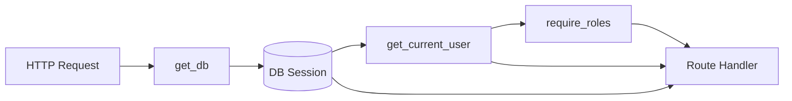

---

## 9. Database Layer

### Technology Stack

| Component | Technology |
|-----------|-----------|
| Production DB | PostgreSQL 16 |
| Local Dev DB | SQLite (default) |
| ORM | SQLAlchemy 2.0 (typed `Mapped[]` style) |
| Migrations | Alembic 1.16 |

### Key Design Decisions

- **Schema migrations** are exclusively managed by Alembic — `Base.metadata.create_all()` is never called in application code to prevent migration drift
- **All ORM models** use `from __future__ import annotations` and `Mapped[type]` for fully typed column declarations
- **Cascade deletes** are configured at the ORM level (`cascade="all, delete-orphan"`) matching foreign key `ondelete` actions
- **Audit events** for both pickup requests and inventory lots are stored in separate event tables for full audit trail without modifying the primary record
- **Security-sensitive and administrative actions** are additionally recorded in the append-only `audit_logs` table (WIQ-V1-018), written transactionally with the triggering action
- **Refresh-token sessions** (WIQ-V1-013) are server-side rows in `refresh_tokens`: opaque 384-bit secrets whose SHA-256 digest is stored, with rotation (single-use tokens linked by `family_id`) and family-wide revocation on reuse detection. Token material never reaches `audit_logs` or application logs, and changing a password revokes all refresh sessions except the presented one
- **Soft archiving** for inventory lots uses `archived_at` + `archive_reason` fields rather than hard deletion

---

## 10. Deployment Architecture

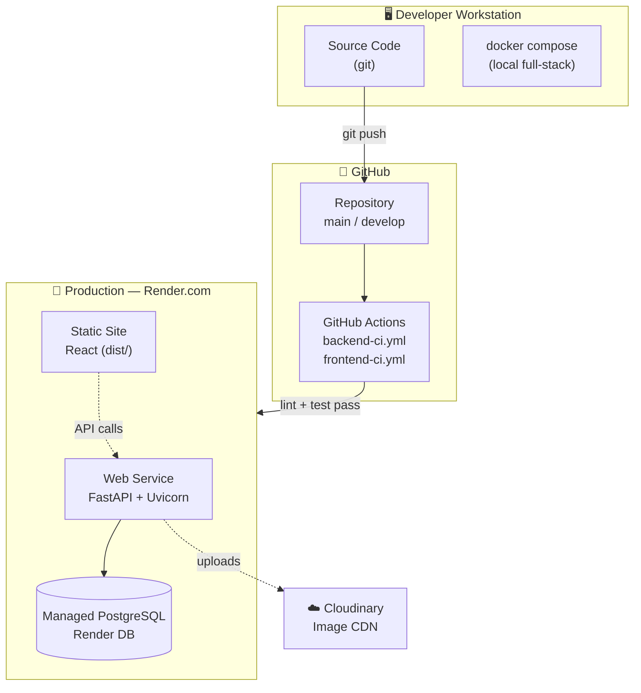

### Environment Summary

| Environment | Backend | Frontend | Database |
|-------------|---------|----------|----------|
| Local | Uvicorn (--reload) | Vite dev server | SQLite |
| Docker | Uvicorn (Docker) | Nginx (Docker) | PostgreSQL 16 (Docker) |
| CI/Testing | Pytest (GitHub Actions) | npm build | PostgreSQL 16 (Actions service) |
| Production | Uvicorn (Render Web Service) | Static files (Render/CDN) | Render Managed PostgreSQL |

---

## 11. Security

| Security Control | Implementation | Details |
|-----------------|----------------|---------|
| **Authentication** | JWT (HS256) access tokens + opaque rotating refresh tokens | Access tokens live 30 min (`ACCESS_TOKEN_EXPIRE_MINUTES`) and carry a `type: "access"` claim; refresh tokens live 30 days (`REFRESH_TOKEN_EXPIRE_DAYS`), are stored as SHA-256 digests only, rotate on every use, and revoke their whole family on reuse (WIQ-V1-013) |
| **Password Storage** | bcrypt (Passlib) | Cost factor 12; salted hashes |
| **Authorization** | RBAC via `require_roles()` | FastAPI dependency; checked per-endpoint |
| **Audit Trail** | Append-only `audit_logs` table | Transactional writes; sanitized snapshots; admin-only read API (WIQ-V1-018) |
| **Input Validation** | Pydantic v2 | All request bodies validated before handler executes |
| **CORS** | FastAPI CORSMiddleware | Allowlist of origins from `CORS_ORIGINS` env var |
| **HTTPS** | Enforced by Render.com | TLS termination at load balancer |
| **Secrets Management** | Environment variables | No secrets in source code; `.env` excluded via `.gitignore` |
| **Image Upload** | Provider-neutral `ImageUploader` protocol (Cloudinary impl) | Backend holds credentials; assets stored under `pickups/{user_id}/{uuid}`; `image_url` + `image_public_id` persisted (WIQ-V1-020) |
| **SQL Injection** | SQLAlchemy ORM + parameterized queries | No raw string interpolation in SQL |
| **Sensitive Logs** | Passwords never logged | FastAPI access logs exclude request bodies |

---

## 11.5 Image Storage (WIQ-V1-020)

### Storage Abstraction

Waste-IQ stores citizen waste photos through a small provider-neutral protocol (`app/services/upload.py`):

```python
class ImageUploader(Protocol):
    def upload_image(self, *, file_path: str, filename: str, user_id: int | None) -> UploadedImage | None: ...
    def delete_image(self, *, public_id: str) -> bool: ...
```

- **Upload** returns `UploadedImage(url, public_id)` — the public URL and the provider's stable identifier for the stored asset. Business code never sees Cloudinary objects or SDK types.
- **Delete** is idempotent: it returns `True` when the asset is confirmed gone (deleted, already deleted, or not found) and raises `ImageDeleteError` only on genuine provider failures. This keeps cancellation cleanup safe and repeatable.
- **Configuration** — `CloudinaryUploader` is the only place that touches the Cloudinary SDK. Uploads are stored under `pickups/{user_id}/{uuid4().hex}` (never emails/usernames) and the resulting `public_id` is persisted in `pickup_requests.image_public_id` (server-side only, never exposed in API responses).

### Cancellation Cleanup

When a citizen cancels a pending request (`POST /pickup-requests/{id}/cancel`), the service:

1. Marks the request `cancelled` and records the timeline event.
2. Reads the persisted `image_public_id` and asks the provider to delete the asset (best-effort, inside the same transaction).
3. On success (or when the asset is already gone) it clears `image_url`/`image_public_id` so the database never claims an asset exists after cleanup.
4. On a transient provider failure it keeps the references and still completes the cancellation — cleanup never fails a business cancellation.

### ADR-001 — Why Cloudinary, and the S3/R2 Migration Path

- **Why Cloudinary today:** the project ships with Cloudinary pre-integrated (`app/services/upload.py`), it provides an easy signed-upload API plus a global CDN, and it is already exercised by the existing pickup-upload flow and tests. There was no need to stand up additional object-storage infrastructure for the v1.0 scope.
- **Why the abstraction stays provider-agnostic:** pickup-request business logic depends only on the `ImageUploader` protocol (`upload`/`delete` + opaque public IDs). Nothing in `pickup_requests.py` or `pickup_request_images.py` imports the Cloudinary SDK, so a future S3/R2/boto3 implementation can be dropped in by:
  - adding a new implementation of `ImageUploader` (e.g. `S3ImageUploader`) that maps `public_id` to an S3 object key (`pickups/{user_id}/{uuid}`) and `delete_image` to `delete_object` (S3 treats deleting a missing key as success, matching the idempotent semantics),
  - wiring it via `get_image_uploader` in `app/core/dependencies.py` based on configuration,
  - without touching pickup-request creation, cancellation, or the persisted `image_public_id` schema.
- **Operational limitations:** the current `CloudinaryUploader` deletes assets synchronously during cancellation; if Cloudinary is unreachable at that moment the asset is orphaned until a future retry (the database reference is intentionally retained). A background sweep job could reclaim such orphans later; that is a deliberate trade-off of the synchronous, transaction-consistent design chosen here.

---

## 12. Future AI Modules

### Current AI Foundation

The database schema already has AI-ready fields:

| Model | Field | Purpose |
|-------|-------|---------|
| `PickupRequest` | `image_url` | Cloudinary URL of the uploaded waste image |
| `PickupRequest` | `category` | Detected material category (null until AI runs) |
| `PickupRequest` | `confidence` | Classification confidence score (0.0–1.0) |

### AI Analytics Dashboard (Implemented — Rule-Based)

The **AI Analytics Dashboard** (`/admin/analytics/*`) delivers dashboard insights without an LLM. All insights are deterministic, server-side rules computed from live aggregates in `app/services/analytics.py`:

| Insight | Rule |
|---------|------|
| Most recycled material | Highest material bucket count from completed pickups |
| Highest performing collector | Most completed jobs (tie-break: completion rate) |
| Highest performing dealer | Most total weight across sold lots |
| Estimated carbon savings | ~0.42 kg CO₂e saved per kg recycled; ~21 kg CO₂ per tree |
| Pickup completion trend | 6-month completion delta vs. the previous 6 months |

### Planned AI Integration

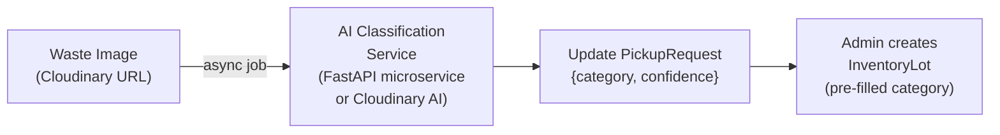

| Module | Status | Technology (Planned) |
|--------|--------|----------------------|
| Waste Image Classification | 🔜 Planned | Fine-tuned ResNet / Cloudinary AI |
| Collector Route Optimization | 🔜 Planned | Google OR-Tools / custom Haversine clustering |
| Pricing Demand Forecasting | 💡 Future | Time-series model on InventoryLot transaction data |
| Fraud Detection | 💡 Future | Anomaly detection on pickup patterns |
