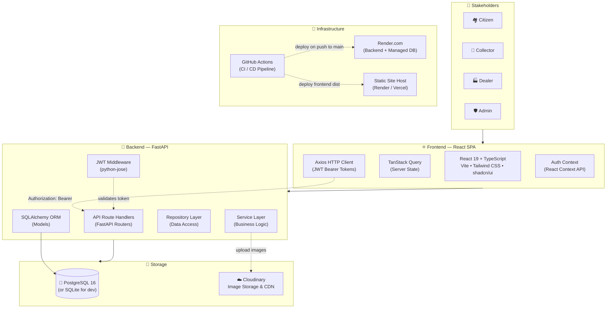
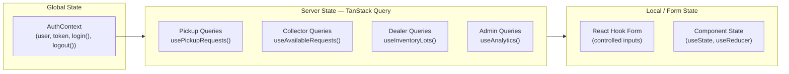
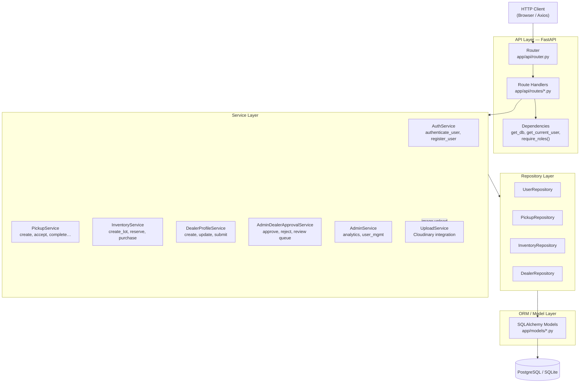
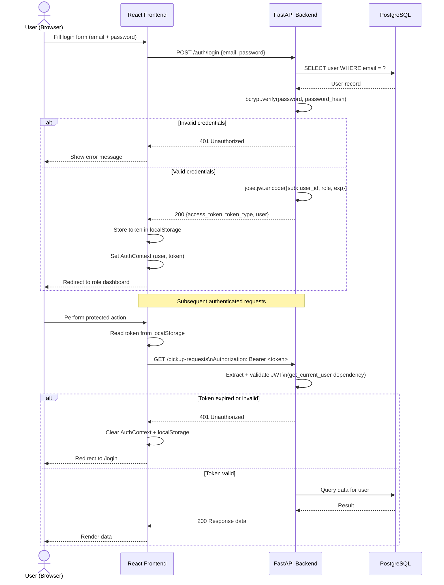
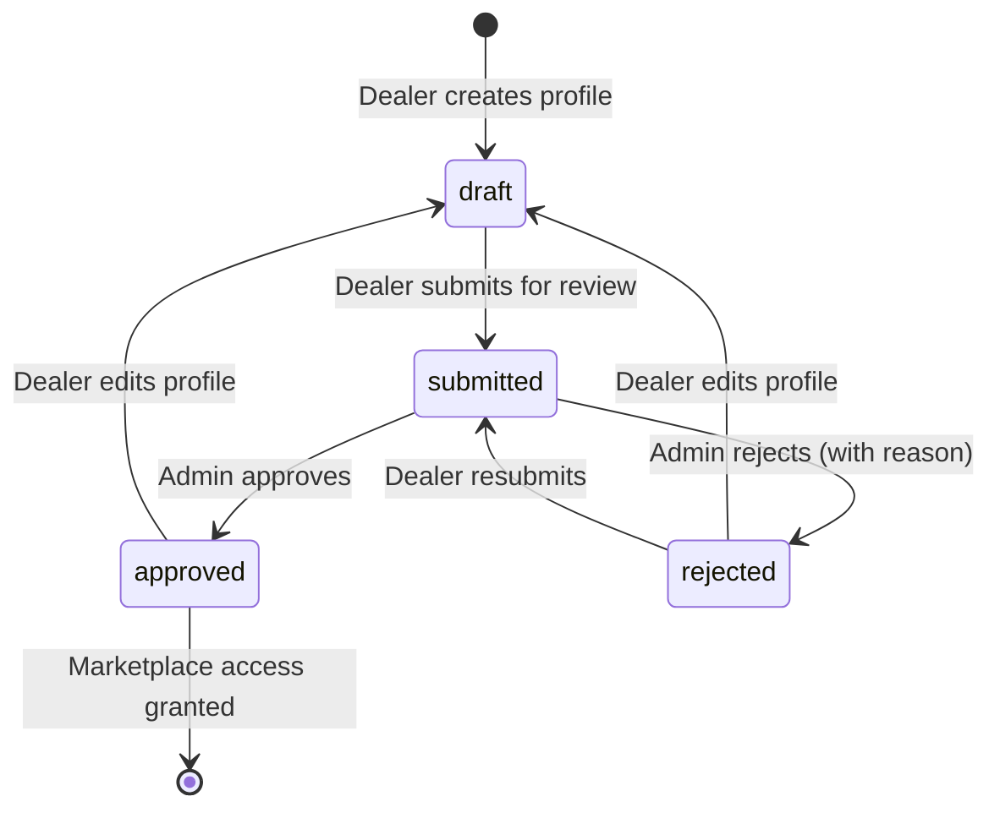
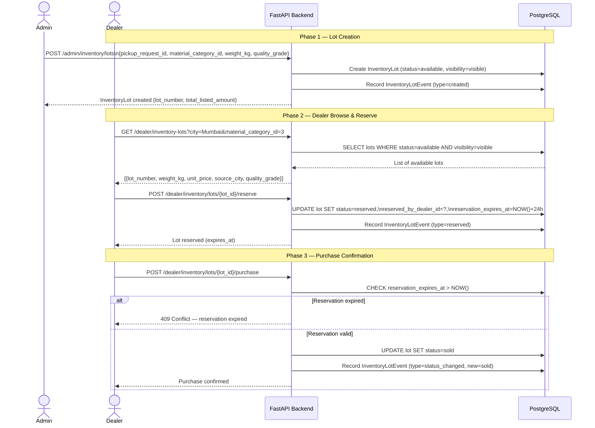
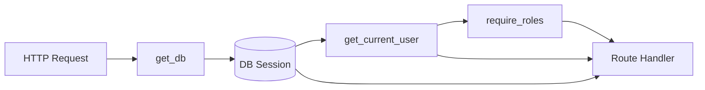
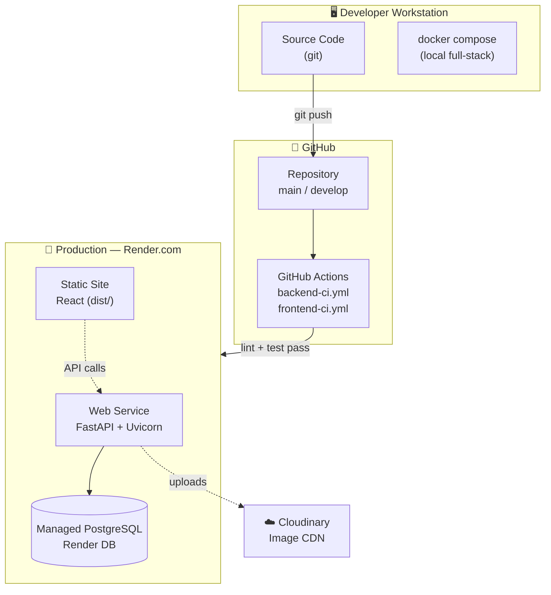
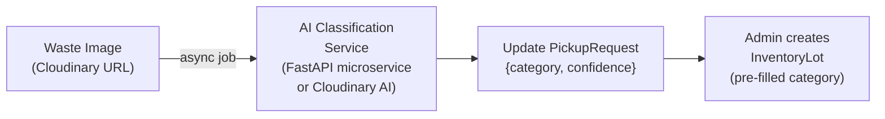

# System Architecture — Waste-IQ

> This document describes the high-level and detailed architecture of the Waste-IQ platform, covering the frontend, backend, authentication, data flow, and deployment topology.

---

## Table of Contents

1. [Overview](#1-overview)
2. [High-Level Architecture](#2-high-level-architecture)
3. [Frontend Architecture](#3-frontend-architecture)
4. [Backend Architecture](#4-backend-architecture)
5. [Authentication Flow](#5-authentication-flow)
6. [Pickup Request Lifecycle](#6-pickup-request-lifecycle)
7. [Inventory Marketplace Flow](#7-inventory-marketplace-flow)
8. [API Layer](#8-api-layer)
9. [Database Layer](#9-database-layer)
10. [Deployment Architecture](#10-deployment-architecture)
11. [Security](#11-security)
12. [Future AI Modules](#12-future-ai-modules)

---

## 1. Overview

Waste-IQ is a multi-role, API-driven platform that digitizes the recyclable waste supply chain. It connects four primary stakeholders:

| Actor | Role in the System |
|-------|--------------------|
| **Citizen** | Submits pickup requests for recyclable waste |
| **Collector** | Accepts and fulfills pickup requests in the field |
| **Scrap Dealer** | Creates a business profile, awaits approval, then purchases verified inventory lots through the marketplace |
| **Admin** | Manages the platform, reviews and approves/rejects dealer profiles, and creates inventory |

The system consists of a **React single-page application** communicating with a **FastAPI REST API**, backed by a **PostgreSQL relational database**, with **Cloudinary** for image storage.

---

## 2. High-Level Architecture



---

## 3. Frontend Architecture

### Technology Choices

| Layer | Technology | Rationale |
|-------|-----------|-----------|
| Framework | React 19 | Concurrent features, stable ecosystem |
| Language | TypeScript (strict) | Type safety, better DX |
| Build Tool | Vite | Fast HMR, optimized builds |
| Styling | Tailwind CSS + shadcn/ui | Utility-first, accessible components |
| Routing | React Router v6 | File-based, nested routes |
| Server State | TanStack Query v5 | Caching, refetching, mutations |
| HTTP | Axios | Interceptors for JWT injection |
| Forms | React Hook Form + Zod | Performant forms with schema validation |
| Animations | Framer Motion | Smooth transitions |
| Icons | Lucide React | Consistent icon set |

### Directory Structure

```
frontend/src/
├── api/           # Axios instance + typed API functions per domain
├── app/           # Root component, providers, global layout
├── assets/        # Static images and SVGs
├── components/    # Shared, reusable UI components (Button, Card, Badge…)
├── context/       # React Context providers (AuthContext, ThemeContext)
├── hooks/         # Custom React hooks (useAuth, usePickup, useCollector…)
├── layouts/       # Page layout shells (DashboardLayout, AuthLayout)
├── lib/           # Utility functions (cn(), formatDate(), formatCurrency()…)
├── pages/
│   ├── auth/      # Login, Register pages
│   ├── dashboard/ # Role-specific dashboard pages
│   └── public/    # Landing page, 404
├── routes/        # Route definitions with role-based guards
├── styles/        # Global CSS, Tailwind base layer overrides
├── types/         # TypeScript interfaces and type definitions
└── main.tsx       # App entry point
```

### State Management Strategy



### Routing & Role Guards

```mermaid
flowchart TD
    START[Navigate to URL] --> CHECK{Token in\nlocalStorage?}
    CHECK -->|No| LOGIN[Redirect to /login]
    CHECK -->|Yes| ROLE{User Role?}
    ROLE -->|citizen| CDASH[/dashboard/citizen]
    ROLE -->|collector| COLDASH[/dashboard/collector]
    ROLE -->|dealer| DDASH[/dashboard/dealer]
    ROLE -->|admin| ADASH[/dashboard/admin]
    CDASH --> CGUARD{Role matches\nrequired role?}
    CGUARD -->|Yes| PAGE[Render Page]
    CGUARD -->|No| DENIED[403 Forbidden]
```

---

## 4. Backend Architecture

### Layered Architecture



### Module Descriptions

| Module | Path | Responsibility |
|--------|------|----------------|
| `main.py` | `app/main.py` | FastAPI application factory, middleware registration, lifespan |
| `config.py` | `app/core/config.py` | Pydantic-settings `Settings` class; reads `.env` |
| `dependencies.py` | `app/core/dependencies.py` | `get_db`, `get_current_user`, `require_roles()` FastAPI deps |
| `security.py` | `app/core/security.py` | JWT encode/decode, bcrypt hashing |
| `router.py` | `app/api/router.py` | Mounts all sub-routers with prefixes and tags |
| `models/` | `app/models/` | SQLAlchemy ORM model classes |
| `schemas/` | `app/schemas/` | Pydantic v2 request/response schemas |
| `services/` | `app/services/` | Business logic; orchestrates repositories and external services |
| `repositories/` | `app/repositories/` | Raw data access queries; returns ORM objects |
| `db/session.py` | `app/db/session.py` | SQLAlchemy engine + `SessionLocal` factory |
| `routes/analytics.py` | `app/api/routes/analytics.py` | Admin AI analytics endpoints (overview, materials, monthly, collectors, dealers, carbon, insights) |
| `services/analytics.py` | `app/services/analytics.py` | Analytics aggregations (SQLAlchemy) and deterministic rule-based insight generation |
| `schemas/analytics.py` | `app/schemas/analytics.py` | Typed Pydantic v2 response models for every analytics endpoint |
| `services/dealer_profiles.py` | `app/services/dealer_profiles.py` | Dealer profile lifecycle: create, update, submit, approval timeline |
| `services/dealer_approval.py` | `app/services/dealer_approval.py` | Approval transition validation, `is_dealer_approved` guard, admin review/approve/reject |
| `repositories/dealer_profiles.py` | `app/repositories/dealer_profiles.py` | Dealer profile & event data access, paginated listing with search/sort/filter |

---

## 5. Authentication Flow



---

## 6. Pickup Request Lifecycle


Each state transition is recorded as a `PickupRequestEvent` with the actor's user ID and timestamp.

---

## 7. Inventory Marketplace Flow

### Dealer Approval Workflow



Every transition is persisted in `dealer_profile_events` (actor, status, note,
timestamp) and surfaced as an approval timeline to the dealer and admins.
Inventory browsing/reservation endpoints require `approval_status = approved`
(`403` with an explanatory detail otherwise).



---

## 8. API Layer

The API follows RESTful conventions with JSON request/response bodies (except multipart/form-data for file uploads).

### Router Structure

| Prefix | Tags | Auth Required | Description |
|--------|------|---------------|-------------|
| `/auth` | Authentication | No (register/login) | User registration, login, profile |
| `/pickup-requests` | Pickup Requests | Yes | Full pickup lifecycle |
| `/collector` | Collector | Yes (collector role) | Collector-specific operations |
| `/dealer` | Dealer | Yes (dealer role) | Profile management, submit for approval, approval timeline |
| `/dealer` | Dealer Inventory | Yes (approved dealer) | Marketplace browse, reserve, purchase |
| `/admin` | Admin | Yes (admin role) | Users, analytics, dealer review queue (approve/reject) |
| `/admin/analytics` | Admin Analytics | Yes (admin role) | Overview KPIs, material distribution, monthly trend, collector/dealer performance, carbon savings, rule-based insights |
| `/admin` | Admin Inventory | Yes (admin role) | Lot management, pricing, categories |
| `/health` | health | No | Application health check |

### Dependency Injection Chain



---

## 9. Database Layer

### Technology Stack

| Component | Technology |
|-----------|-----------|
| Production DB | PostgreSQL 16 |
| Local Dev DB | SQLite (default) |
| ORM | SQLAlchemy 2.0 (typed `Mapped[]` style) |
| Migrations | Alembic 1.16 |

### Key Design Decisions

- **Schema migrations** are exclusively managed by Alembic — `Base.metadata.create_all()` is never called in application code to prevent migration drift
- **All ORM models** use `from __future__ import annotations` and `Mapped[type]` for fully typed column declarations
- **Cascade deletes** are configured at the ORM level (`cascade="all, delete-orphan"`) matching foreign key `ondelete` actions
- **Audit events** for both pickup requests and inventory lots are stored in separate event tables for full audit trail without modifying the primary record
- **Soft archiving** for inventory lots uses `archived_at` + `archive_reason` fields rather than hard deletion

---

## 10. Deployment Architecture



### Environment Summary

| Environment | Backend | Frontend | Database |
|-------------|---------|----------|----------|
| Local | Uvicorn (--reload) | Vite dev server | SQLite |
| Docker | Uvicorn (Docker) | Nginx (Docker) | PostgreSQL 16 (Docker) |
| CI/Testing | Pytest (GitHub Actions) | npm build | PostgreSQL 16 (Actions service) |
| Production | Uvicorn (Render Web Service) | Static files (Render/CDN) | Render Managed PostgreSQL |

---

## 11. Security

| Security Control | Implementation | Details |
|-----------------|----------------|---------|
| **Authentication** | JWT (HS256) | Signed tokens; `ACCESS_TOKEN_EXPIRE_MINUTES` configurable |
| **Password Storage** | bcrypt (Passlib) | Cost factor 12; salted hashes |
| **Authorization** | RBAC via `require_roles()` | FastAPI dependency; checked per-endpoint |
| **Input Validation** | Pydantic v2 | All request bodies validated before handler executes |
| **CORS** | FastAPI CORSMiddleware | Allowlist of origins from `CORS_ORIGINS` env var |
| **HTTPS** | Enforced by Render.com | TLS termination at load balancer |
| **Secrets Management** | Environment variables | No secrets in source code; `.env` excluded via `.gitignore` |
| **Image Upload** | Cloudinary signed uploads | Backend handles credentials; URL stored in DB |
| **SQL Injection** | SQLAlchemy ORM + parameterized queries | No raw string interpolation in SQL |
| **Sensitive Logs** | Passwords never logged | FastAPI access logs exclude request bodies |

---

## 12. Future AI Modules

### Current AI Foundation

The database schema already has AI-ready fields:

| Model | Field | Purpose |
|-------|-------|---------|
| `PickupRequest` | `image_url` | Cloudinary URL of the uploaded waste image |
| `PickupRequest` | `category` | Detected material category (null until AI runs) |
| `PickupRequest` | `confidence` | Classification confidence score (0.0–1.0) |

### AI Analytics Dashboard (Implemented — Rule-Based)

The **AI Analytics Dashboard** (`/admin/analytics/*`) delivers dashboard insights without an LLM. All insights are deterministic, server-side rules computed from live aggregates in `app/services/analytics.py`:

| Insight | Rule |
|---------|------|
| Most recycled material | Highest material bucket count from completed pickups |
| Highest performing collector | Most completed jobs (tie-break: completion rate) |
| Highest performing dealer | Most total weight across sold lots |
| Estimated carbon savings | ~0.42 kg CO₂e saved per kg recycled; ~21 kg CO₂ per tree |
| Pickup completion trend | 6-month completion delta vs. the previous 6 months |

### Planned AI Integration



| Module | Status | Technology (Planned) |
|--------|--------|----------------------|
| Waste Image Classification | 🔜 Planned | Fine-tuned ResNet / Cloudinary AI |
| Collector Route Optimization | 🔜 Planned | Google OR-Tools / custom Haversine clustering |
| Pricing Demand Forecasting | 💡 Future | Time-series model on InventoryLot transaction data |
| Fraud Detection | 💡 Future | Anomaly detection on pickup patterns |
