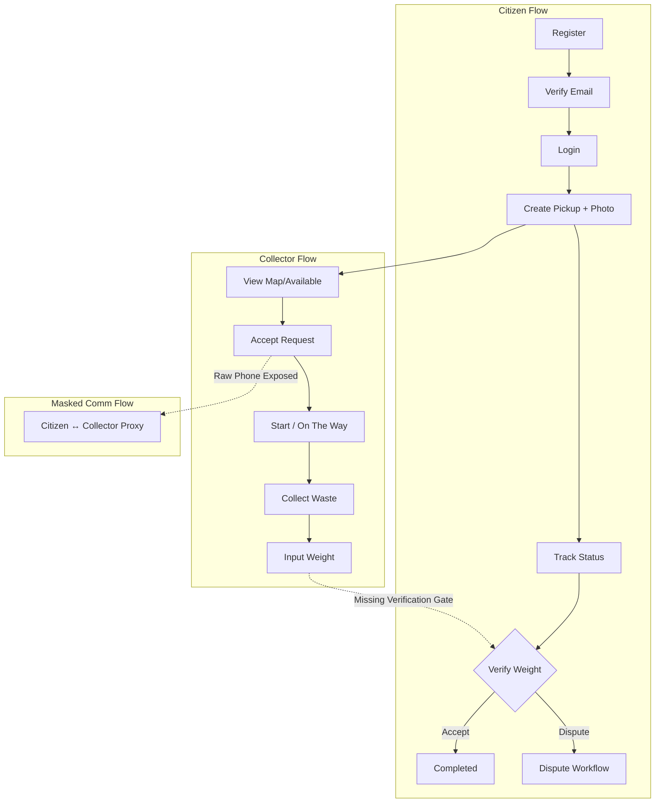
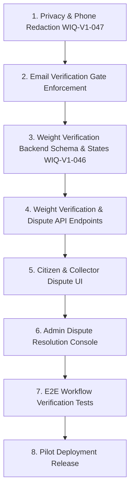

# Waste-IQ V1 Gap Analysis & Launch Readiness Audit (WIQ-V1-043)

**Document Version:** 1.0.0  
**Audit Date:** 2026-08-27  
**Auditor:** Lead Systems Engineer  
**Repository:** `Waste-IQ`  
**Baseline Commit:** `2ae1bd6` (`feat(auth): restore forgot and reset password (#100)`)  
**Target Branch:** `develop` (Clean, synchronized with `origin/develop`)  

---

## 1. Executive Summary

Waste-IQ has made significant engineering progress, establishing a robust infrastructure with authenticated role-based sessions, background asynchronous jobs, structured Sentry/log monitoring, rate-limiting, and comprehensive admin dealer approval workflows.

However, an evidence-based audit of the codebase reveals critical domain and privacy blockers that prevent immediate production MVP deployment:

1. **WIQ-V1-046 (Weight Verification & Dispute):** Completely unimplemented. When a collector completes a pickup and inputs a weight, it immediately marks the pickup `completed`. Citizens cannot verify, accept, or dispute recorded weights, nor is there an admin resolution workflow.
2. **WIQ-V1-047 (Masked Communication):** Completely unimplemented. Citizen raw phone numbers (`citizen_phone`) are directly leaked in pickup payloads (`PickupRequestRead` / `_to_schema`) and visible on collector dashboards, presenting severe privacy and PII exposure risks.
3. **Email Verification Gating:** While email verification infrastructure exists (signed tokens, background dispatch, rate-limited resend), verification is **not enforced** on core actions (submitting waste requests, accepting pickups, dealer reservations). Any unverified account can perform full lifecycle actions immediately upon registration.

**Final Launch Decision:** `NOT READY` (Blocking P0s must be resolved prior to MVP/pilot deployment).

---

## 2. Current System Inventory

### 2.1 Backend Architecture
- **Framework:** FastAPI 0.111+ running on Python 3.11+ / Uvicorn.
- **Database ORM & Migrations:** SQLAlchemy 2.0 (declarative mapped models) + Alembic migrations (`20260821_0019` head).
- **Authentication & Security:**
  - JWT access tokens (short-lived, default 30 min) + opaque 384-bit rotated refresh tokens stored as SHA-256 digests (`RefreshToken` family rotation & reuse detection).
  - Rate limiting via sliding-window limiter (per-IP and per-account for login, register, password reset, verification resend).
  - Account lockout with exponential failure counters and 15-minute cooldown.
  - Password hashing with Passlib / BCrypt.
  - Verification & reset tokens: JWTs with purpose-bound claims (`email_verify`, `password_reset`) and password hash fingerprinting.
- **Background Jobs:** In-process APScheduler lifespan scheduler for reservation sweeps (1 min) and aging-pickup monitoring (5 min). BackgroundTasks for async SMTP/console email dispatch.
- **File / Image Storage:** Cloudinary integration with configuration verification in production readiness probes. Clean deletion lifecycle on pickup cancellation.
- **Notifications System:** Database-backed notification engine (`Notification` model) with event formatters for pickups, inventory, dealer approval, and admin broadcasts.
- **Audit Logging:** Synchronous `AuditLog` records with sensitive key redaction (`password`, `token`, `secret`, etc.).

### 2.2 Frontend Architecture
- **Framework & Tooling:** React 18 with TypeScript, Vite, Tailwind CSS, Lucide icons, React Router v6.
- **State & Data Fetching:** TanStack React Query v5 with custom query invalidation and optimistic caching.
- **Forms & Validation:** React Hook Form + Zod resolvers.
- **Portals:**
  - Citizen Portal (`/dashboard/*`)
  - Collector Portal (`/collector/*`)
  - Dealer Portal (`/dealer/*`)
  - Admin Portal (`/admin/*`)
  - Public / Marketing (`/*`, `/login`, `/register`, `/forgot-password`, `/reset-password`, `/verify-email`)

### 2.3 Deployment & Infrastructure
- **Containerization:** Multi-stage `Dockerfile` (runtime & build targets) with non-root security context.
- **Orchestration:** `docker-compose.yml` (development) and `docker-compose.prod.yml` (hardened production override).
- **CI/CD & Branch Gates:** GitHub Actions (`pr-gate.yml`, `backend-ci.yml`, `frontend-ci.yml`, `docker-ci.yml`, `agent-ci.yml`).
- **Health Checks:** `/health` (liveness + CORS allowlist) and `/health/ready` (database connectivity + Cloudinary configuration probe).

---

## 3. Critical MVP Workflows Deep-Dive



### Flow A: Citizen Registration & Authentication
- **Status:** `FUNCTIONAL`
- **Trace:** Citizen registers (`/auth/register`), receives verification email dispatch via BackgroundTasks, can log in (`/auth/login`), refresh tokens (`/auth/refresh`), request password reset (`/auth/forgot-password`), reset password (`/auth/reset-password`), update profile, and view security login history (`/auth/login-history`).
- **Gap:** Account is immediately usable without verifying email.

### Flow B: Citizen Waste Submission
- **Status:** `FUNCTIONAL`
- **Trace:** Citizen submits waste type, address, GPS coordinates, estimated weight, preferred pickup time, notes, and optional photo attachment (`/pickup-requests` multipart form). Image uploaded to Cloudinary, classification placeholder stored, timeline event recorded, notifications triggered.

### Flow C: Collector Pickup Lifecycle
- **Status:** `PARTIAL`
- **Trace:** Collector views available queue (`/collector/pickups/available`) or nearby pickups (`/collector/pickups/nearby`), accepts (`/collector/pickups/{id}/accept`), starts travel (`/collector/pickups/{id}/start` -> `on_the_way`), marks collected (`/collector/pickups/{id}/collect`), and completes with final weight (`/collector/pickups/{id}/complete`).
- **Gap:** `complete_pickup_request` directly transitions status from `collected` to `completed` and sets `assignment.weight_kg` without citizen review or verification.

### Flow D & E: Masked Communication (WIQ-V1-047)
- **Status:** `MISSING / UNIMPLEMENTED`
- **Trace:** Schema `PickupRequestRead` directly exposes `citizen_phone: pickup_request.citizen.phone` to any assigned collector or endpoint consumer.
- **Risk:** High PII leakage; lack of in-app or proxy relay creates direct off-platform harassment/safety risks for citizens and collectors.

### Flow F: Weight Verification & Dispute (WIQ-V1-046)
- **Status:** `MISSING / UNIMPLEMENTED`
- **Trace:** Database model `PickupRequest` has only statuses: `pending`, `accepted`, `on_the_way`, `collected`, `completed`, `cancelled`. No intermediate `weight_entered`, `weight_disputed`, `resolved` states exist.
- **Consequence:** Collector unilateral input is final and non-auditable by the citizen.

### Flow G: Dealer & Marketplace
- **Status:** `FUNCTIONAL` (Can serve as post-pilot extension or enabled for approved pilot dealers)
- **Trace:** Dealer registration, business profile submission (`/dealer/profile`), admin review/approval (`/admin/dealers/{id}/approve|reject`), marketplace inventory listing (`/dealer/marketplace`), reservation with 24-hour expiration TTL and background sweep, and order completion.

### Flow H: Admin Governance
- **Status:** `FUNCTIONAL`
- **Trace:** User management, dealer approval queue, system analytics, audit logging review, and system-wide broadcast notifications.
- **Gap:** Lacks dispute resolution console due to missing dispute subsystem.

---

## 4. Feature Gap Matrix

| Feature Area | Issue ID | Specification Expectation | Current Implementation Status | Severity |
| :--- | :--- | :--- | :--- | :--- |
| **Weight Verification** | WIQ-V1-046 | Citizen reviews reported weight, can accept or trigger dispute | **Not Implemented** (direct transition to `completed`) | **P0 (Blocker)** |
| **Dispute Resolution** | WIQ-V1-046 | Admin/collector dispute review, photo evidence, weight adjustment | **Not Implemented** (no models/routes/UI) | **P0 (Blocker)** |
| **Masked Communication** | WIQ-V1-047 | In-app/masked relay between citizen and collector | **Not Implemented** (raw phone numbers exposed in API & UI) | **P0 (Blocker)** |
| **Email Verification Gate**| WIQ-V1-014 | Unverified users restricted from critical domain actions | **Partial** (service exists, but routes do not block unverified users) | **P1 (Critical)** |
| **Collector Verification** | WIQ-V1-048 | Collector vetting/approval status before accepting jobs | **Partial** (any registered collector can immediately claim jobs) | **P1 (Critical)** |
| **Dispute UI & Notifications** | WIQ-V1-046 | Citizen & collector push/inbox alerts for weight disputes | **Not Implemented** | **P1 (Critical)** |
| **Collector Location TTL**| WIQ-V1-012 | Collector live location staleness expiration | **Partial** (persisted, but no auto-expire for stale GPS pins) | **P2 (High)** |
| **AI Classifier Inference**| WIQ-V1-008 | Real ML inference service for waste categorization | **Mock/Standby** (returns `Unknown` / `0.0` gracefully) | **P3 (Nice to Have)** |

---

## 5. Security & Privacy Findings

### 5.1 Privacy & Sensitive Data Exposure (CRITICAL)
- **Finding SEC-01:** Direct phone number exposure in pickup requests.
  - *Evidence:* `backend/app/schemas/pickup_request.py:48` (`citizen_phone: str | None`) and `backend/app/services/pickup_requests.py:51`.
  - *Impact:* Collectors receive citizen personal phone numbers in plain text.
  - *Remediation:* Redact `citizen_phone` from standard schemas; implement masked call/SMS proxy or in-app messaging channel.

### 5.2 Authorization & Role Boundary Review (PASS WITH FINDING)
- **Finding SEC-02:** Role-based access control (`require_roles`, `get_current_user`) is strictly implemented on all protected routes.
- **Finding SEC-03:** IDOR / BOLA protections are present: `_enforce_request_access` and `_get_request_for_assigned_collector` ensure users can only view/modify their own requests.
- **Finding SEC-04:** Unverified accounts can perform stateful writes. Missing dependency check `require_verified_email`.

### 5.3 Injection & Input Sanitization (PASS)
- All SQL access is routed via SQLAlchemy ORM queries with parameterized statements.
- Input validation enforced via Pydantic schemas and Zod client schemas.
- Uploads restricted to valid image MIME types and 10MB size limits.

### 5.4 Token Security & Credential Protection (PASS)
- Passwords hashed with BCrypt.
- Refresh tokens hashed with SHA-256; rotation and reuse family revoking implemented.
- Sliding window rate limiting guards `/auth/login`, `/auth/register`, `/auth/forgot-password`, and `/auth/resend-verification`.

---

## 6. Data & Migration Audit

- **Current Migration Head:** `20260821_0019_cloud_image_public_id.py` (Single unambiguous head confirmed).
- **Total Migrations:** 20 sequential migration scripts.
- **Clean DB Upgrade:** Verified; creates all relations, indexes, foreign keys, cascades, and enum types without drift.
- **Downgrade Compatibility:** Downgrades are implemented across all migration scripts.

---

## 7. Deployment Readiness

- **Container Configuration:** Production Dockerfile uses multi-stage builds, non-root user (`appuser`), and lean distroless/slim Debian images.
- **Secrets Management:** `docker-compose.prod.yml` uses `${VARIABLE:?must be set}` interpolation to prevent container boot with missing secrets.
- **Health & Probes:**
  - Liveness: `GET /health` returns application name and CORS origins.
  - Readiness: `GET /health/ready` executes `SELECT 1` on PostgreSQL and validates Cloudinary credentials when `ENVIRONMENT=production`.
- **CI PR Gate:** `pr-gate.yml` executes path-based dependency evaluation and validates all sub-workflows.

---

## 8. Test Coverage & Testing Gaps

| Area | Automated Tests | Integration Coverage | Status |
| :--- | :--- | :--- | :--- |
| **Authentication & Tokens** | 30+ unit & integration tests (`test_auth.py`, `test_refresh_tokens.py`, `test_password_reset.py`, `test_email_verification.py`) | High | ✅ Complete |
| **Rate Limiting & Lockout** | Comprehensive sliding-window tests (`test_rate_limiting.py`, `test_login_history.py`) | High | ✅ Complete |
| **Citizen Pickup Submission**| Form validation, upload handling, cancellation (`test_citizen.py`, `test_pickup_request_uploads.py`) | High | ✅ Complete |
| **Collector Lifecycle** | Available, nearby, accept, start, collect, complete (`test_collector.py`, `test_collector_map.py`) | High | ✅ Complete |
| **Dealer & Marketplace** | Profiles, approval, lot creation, reservations, orders (`test_dealer.py`, `test_marketplace.py`, `test_inventory.py`) | High | ✅ Complete |
| **Weight Verification** | None | None | ❌ No Coverage |
| **Weight Dispute Flow** | None | None | ❌ No Coverage |
| **Masked Communication** | None | None | ❌ No Coverage |

---

## 9. MVP Classification (P0 / P1 / P2 / P3)

### P0 — Launch Blockers (Cannot launch MVP without these)
1. **WIQ-V1-046: Weight Verification Workflow**
   - *Status:* Missing.
   - *Risk:* Collectors can enter fraudulent/inaccurate weights without citizen confirmation.
   - *Action:* Add `weight_recorded` status, citizen verification endpoints (`/verify-weight`), and dispute status transition.
2. **WIQ-V1-046: Dispute Resolution System**
   - *Status:* Missing.
   - *Risk:* Unresolved customer disputes halt transaction finality and damage trust.
   - *Action:* Add dispute reason/evidence upload and admin resolution endpoints.
3. **WIQ-V1-047: Masked Communication & Phone Redaction**
   - *Status:* Missing.
   - *Risk:* Direct citizen PII exposure and safety vulnerability.
   - *Action:* Remove plain text `citizen_phone` from collector payload; add masked proxy / internal relay.

### P1 — Critical (Must complete before pilot onboarding)
1. **Email Verification Enforcement on Sensitive Actions**
   - *Action:* Add `require_verified_user` dependency on pickup creation, collector acceptance, and dealer reservations.
2. **Collector Onboarding / Verification Gate**
   - *Action:* Add background/admin verification flag for collector accounts before they can accept public pickups.
3. **Dispute Notification Events**
   - *Action:* Wire dispute raised / dispute resolved events to NotificationDispatcher.

### P2 — High (Pilot polish & operational hardening)
1. **Collector Location Stale Expiration**
   - *Action:* Filter out collector locations updated > 30 minutes ago from active dispatch map.
2. **In-App Dispute Chat / Evidence Upload**
   - *Action:* Allow citizens and collectors to upload scale photos during disputes.

### P3 — Nice To Have (Post-pilot / V1.1)
1. **Real-time AI Material Inference**
   - *Action:* Deploy live computer vision model for automated recyclability scoring.
2. **Automated Dynamic Pricing Matrix**
   - *Action:* Adjust waste payout rates dynamically based on market commodity indices.

---

## 10. Launch Gate Evaluation

| Gate Question | Result | Evidence / Justification |
| :--- | :---: | :--- |
| 1. Can a citizen register and use Waste-IQ? | **YES** | Verified via `test_auth.py`, `RegisterPage.tsx`, and `/auth/register`. |
| 2. Can a citizen submit waste? | **YES** | Multipart form with address, coordinates, and photo upload verified in `test_citizen.py`. |
| 3. Can a collector receive and complete a pickup? | **YES** | Lifecycle transitions tested and working in `test_collector.py`. |
| 4. Can the collector record weight? | **YES** | Supported in `/collector/pickups/{id}/complete` (`weight_kg` payload). |
| 5. Can the citizen verify that weight? | **NO** | Collector completion bypasses citizen review and immediately marks pickup `completed`. |
| 6. Can the citizen dispute an incorrect weight? | **NO** | No dispute model, routes, event handlers, or UI exist in the repository. |
| 7. Can citizen and collector communicate without exposing phone numbers? | **NO** | `PickupRequestRead` exposes raw `citizen_phone`; no masking proxy exists. |
| 8. Are citizen photos/data appropriately protected? | **PARTIAL**| Photos are protected in Cloudinary; phone numbers and raw PII are exposed in API schemas. |
| 9. Can admins resolve operational problems? | **PARTIAL**| Dealer approvals and user listings exist, but no dispute resolution tools exist. |
| 10. Can the system notify users of important events? | **YES** | Database notification engine and broadcast subsystem fully functional. |
| 11. Can the application survive basic authentication/security abuse? | **YES** | Sliding-window rate limiters, lockout cooldown, and refresh rotation active. |
| 12. Can we deploy a clean production environment? | **YES** | Docker Compose prod configs, Alembic migrations, and readiness probes pass. |
| 13. Can we observe production failures? | **YES** | Sentry SDK initialized and structured logging active. |
| 14. Can we measure pilot success? | **YES** | Analytics aggregator tracks volume, material breakdown, and carbon savings. |

---

## 11. Recommended Implementation Sequence



1. **Sprint Step 1 (Security & Privacy):**
   - Redact `citizen_phone` from `PickupRequestRead`.
   - Implement masked relay endpoint or temporary privacy placeholder for citizen-collector contact.
2. **Sprint Step 2 (Auth Gating):**
   - Add `require_verified_user` dependency to mutation endpoints.
3. **Sprint Step 3 (Domain Core - Weight & Dispute):**
   - Update `PickupStatus` enum: add `weight_submitted`, `disputed`.
   - Create Alembic migration for pickup dispute fields (`disputed_weight_kg`, `dispute_reason`, `dispute_resolved_at`).
   - Implement `/pickup-requests/{id}/verify-weight` (Accept / Dispute).
4. **Sprint Step 4 (UI Integration):**
   - Update `PickupDetailsPage.tsx` with weight verification banner, Accept button, and Dispute dialog.
   - Update `CollectorPickupDetailsPage.tsx` to display verification status.
   - Add Dispute Queue to `AdminOverviewPage.tsx`.
5. **Sprint Step 5 (Verification & Pilot Gate):**
   - Full automated test suite for weight dispute and resolution.
   - Deploy to staging and run Pilot Readiness Checklist.

---

## 12. Pilot Readiness Checklist

- [ ] All P0 blockers implemented and verified by automated tests.
- [ ] Database migrations cleanly upgrade existing staging/production databases.
- [ ] PII audit confirms zero raw phone numbers exposed in unauthenticated or unauthorized responses.
- [ ] Rate limits tuned for pilot traffic volumes.
- [ ] SMTP email delivery confirmed working on production domain.
- [ ] Cloudinary production bucket access and auto-cleanup verified.
- [ ] Sentry alert rules configured for unhandled 5xx exceptions.

---

## 13. Final Launch Decision

```
============================================================
                   FINAL LAUNCH DECISION
                        NOT READY
============================================================
```

**Justification:** While infrastructure, authentication, database migrations, CI/CD, and basic CRUD features are engineered to high quality, Waste-IQ cannot launch to real citizens and collectors until **Weight Verification (WIQ-V1-046)** and **Privacy / Masked Communication (WIQ-V1-047)** are implemented. Deploying without these features would create high financial dispute liability and violate user privacy standards.

---
*Report certified by Lead Systems Engineer — Waste-IQ Audit Team.*
