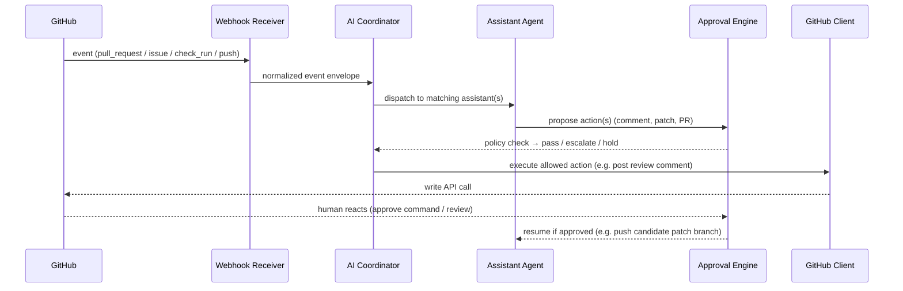
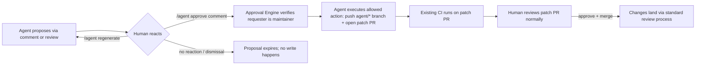

# Waste-IQ AI Engineering Agent — Architecture

> **Status:** ✅ Approved
> **Owner:** Lead AI Engineer
> **Related milestone:** M0 — Engineering Productivity (WIQ-V1-001 → WIQ-V1-012)
> **Scope:** Approved architecture. Phase 0 (Foundations) in progress.

---

## 1. Purpose

The **Waste-IQ AI Engineering Agent** is an autonomous assistant that performs engineering
work across the repository — issue triage, pull request review, architecture enforcement,
test generation, CI failure diagnosis, documentation, release notes, and code quality
analysis — while **always keeping a human in the approval loop**. The agent may propose,
patch, and open pull requests, but it **never merges code without explicit human approval**.

The agent is a first-class component of the repository's engineering system:

| System component | Status |
|---|---|
| GitHub Project (v2) + Roadmap + Milestones + Labels | ✅ Done |
| 23 roadmap issues (WIQ-V1-001 → WIQ-V1-023) | ✅ Done |
| CI/CD (backend-ci, frontend-ci) | ✅ Done |
| Tests (pytest ×64 files, Vitest) | ✅ Done |
| Documentation (docs/*.md) | ✅ Done |
| **AI Engineering Agent** | ⬜ **This design** |

### 1.1 Design constraints

- Do **not** modify existing GitHub issues or project configuration.
- Use supported GitHub REST/GraphQL APIs and documented GitHub App capabilities.
- Never merge, never force-push, never rewrite history.
- Extensible modular architecture: adding a new assistant must not touch existing agents.
- Reuse the repository's existing conventions (FastAPI, Pydantic v2 + `pydantic-settings`,
  SQLAlchemy, ruff, pytest) so the agent codebase looks native to the project.

---

## 2. System Architecture

### 2.1 Component diagram

```mermaid
flowchart TB
    subgraph GitHub[GitHub.com]
        REPO[(waste-iq repo)]
        PROJECT[(Project v2 / Roadmap)]
        ACTIONS[GitHub Actions workflows]
        APP[Waste-IQ Agent GitHub App]
    end

    subgraph AgentHost[Agent Service - FastAPI (Python 3.12)]
        WH[Webhook Receiver]
        COORD[AI Coordinator]
        CQ[Task Queue]
        subgraph Agents[Assistants]
            IA[Issue Agent]
            PRA[PR Review Agent]
            AA[Architecture Agent]
            TA[Test Agent]
            DA[Documentation Agent]
            RA[Release Agent]
            CIA[CI Agent]
            QA[Code Quality Agent]
        end
        CONTEXT[Repository Context Service]
        KB[(Repository Knowledge Base<br/>vector index - Qdrant / pgvector)]
        LLMC[LLM Client / Model Gateway]
        APPROVAL[Approval Engine]
        STATE[(Agent State DB)]
    end

    WH -->|events: issues, PRs, check runs| COORD
    COORD --> IA & PRA & AA & TA & DA & RA & CIA & QA
    IA & PRA & AA & TA & DA & RA & CIA & QA --> CONTEXT
    CONTEXT --> KB
    IA & PRA & AA & TA & DA & RA & CIA & QA --> LLMC
    Agents --> APPROVAL
    APPROVAL -->|proposed actions| COORD
    COORD -->|GitHub API calls| GHCLIENT[GitHub Client<br/>REST + GraphQL]
    GHCLIENT --> REPO
    GHCLIENT --> PROJECT
    REPO --> ACTIONS
    ACTIONS -->|webhook events| WH
    APP -->|installation token| GHCLIENT
    APPROVAL -->|human approval commands| WH
    COORD --> STATE
    CONTEXT -->|repo index + docs| COORD
```

### 2.2 Control flow (event-driven)



---

## 3. Component Responsibilities

### 3.1 AI Coordinator (`coordinator/`)

- Single entry point for all events; routing, deduplication, idempotency.
- Maintains the **task queue** (in-process + optional external queue) and per-event context.
- Orchestrates multi-step jobs via **LangGraph** graphs (review pipeline, issue pipeline).
- Enforces global policies: max LLM calls per event, timeouts, rate limits, cost budgets.
- Persists every run in the state DB (event id, outcome, tokens, latency, approval status).

### 3.2 GitHub Client (`clients/`)

- Thin typed wrapper over **GitHub REST** (comments, reviews, labels, PRs, files, patches)
  and **GraphQL** (project v2 fields, milestones, item status).
- Authenticates with a short-lived **GitHub App installation token** (never a PAT).
- Retry/backoff, idempotent writes (`update-or-create` comment anchors), structured errors.

### 3.3 Repository Context Service (`context/`)

- Builds and caches a **repository index**: source tree, module map (backend/app/services,
  api/routes, models; frontend/src/pages, components), key symbols, test coverage map.
- Parses structured knowledge: `docs/*.md` (API_SPECIFICATION, SYSTEM_ARCHITECTURE,
  DATABASE_SCHEMA), `docs/backlog/WASTE_IQ_V1_ROADMAP.md`, `docs/project-management/*`,
  and `docs/architecture/ARCHITECTURE_DECISIONS.md`.
- Backed by the **Repository Knowledge Base** — a vector index over code chunks, doc
  sections, and decision records (see §3.8).
- Provides **semantic search** so assistants answer with repository evidence; every
  assistant output must cite `path:line`.
- Tracks "roadmap snapshot": current milestones, open WIQ-V1 issues, labels, priorities.

### 3.4 LLM Client / Model Gateway (`clients/llm.py`)

- Provider-agnostic interface (OpenAI Agents SDK or LangGraph-compatible), supports
  model routing: fast/cheap model for triage, strong model for code review/patch generation.
- Structured outputs enforced via **Pydantic** result models (`ReviewResult`, `PatchSet`, ...).
- Centralized prompt registry, versioned prompts, guardrails (see §7 Security).
- All calls logged for cost and quality auditing.

### 3.5 Assistants (`agents/`)

| Assistant | Inputs | Outputs (all Pydantic-validated) | GitHub write actions |
|---|---|---|---|
| **Issue Assistant** | roadmap, repo index, new/conversational issues | candidate issue descriptions, suggested labels, milestone, priority, duplicates | comment with proposal + apply-on-approval |
| **PR Review Agent** | PR diff, files, CI results, repo index | per-file findings (bugs, security, perf, missing tests, duplication, arch violations), inline comments, summary | inline + summary review comments (Phase 2: deterministic findings object, no comments — see §3.8) |
| **Architecture Assistant** | ARCHITECTURE_DECISIONS.md, code map, PR diffs, dependency graph, scheduled full scans | architecture drift reports (layer violations, pattern violations, dependency inversions), migration suggestions, diagram updates | issue/comment reports → patch PR on approval |
| **Test Assistant** | changed modules, existing tests, coverage report | pytest/Vitest test proposals, edge cases, regression tests | comment with snippets → patch PR on approval |
| **Documentation Agent** | README, CHANGELOG, API spec, architecture docs, merged PRs | doc diffs, changelog entries, diagram updates | comment → patch PR on approval |
| **Release Agent** | git history, merged PRs, conventional commits | release notes, changelog entry, version summary | comment → draft release body |
| **CI Failure Assistant** | failed workflow logs, commit range | root-cause explanation, suggested fix, candidate patch | comment with patch → patch PR on approval |
| **Code Quality Assistant** | full repo scan (scheduled), coverage, deps | dead code, large functions, duplication, dependency issues, security risks, perf wins | issue/comment reports → patch PR on approval |

### 3.6 Approval Engine (`approval/`)

- **Policy engine**: decides per action type whether to (a) execute, (b) propose-only, or
  (c) hold for human approval. Default is **propose-only** for anything that writes code.
- Tracks human approval commands (see §7) with a persistent approval ledger.
- Enforces: no merge rights, no direct push to `main`/`develop`, branch protection respect.

### 3.7 State DB (`db/`)

- SQLite for single-instance deployments; PostgreSQL-compatible schema for scale.
- Tables: `agent_runs`, `approvals`, `comments_anchors`, `repo_snapshots`, `audit_log`.

### 3.8 Repository Knowledge Base (`context/vector_store.py`)

- **Vector index** over repository content: code chunks (function/class granularity),
  doc sections (docs/*.md), changelog entries, and architecture decision records.
- Storage: **Qdrant** (dedicated container, preferred for the agent service) or
  **pgvector** (PostgreSQL extension, preferred if reusing the existing `db` service).
- Embeddings generated by the model gateway (batched, cached by content hash); index
  rebuilt incrementally on `push` to `develop`/`main` and on doc changes.
- Search API: hybrid retrieval (semantic + keyword/BM25 where supported) returning
  `path:line`-anchored evidence chunks for every assistant query.
- Purely **read-only** at runtime: index refreshes are triggered by the coordinator, never
  by LLM output.

#### Phase 1 implementation status (2026-08)

Implemented in `agent/app/context/` with no LLM calls:

| Piece | Implementation |
|---|---|
| Indexer | `repository_indexer.py` — walks the repo tree, skips ignored/sensitive paths (never embeds `secrets/`, `credentials`, `.env`, `*.pem`, …), chunks code + markdown |
| Chunker | `chunker.py` — deterministic token estimator, boundary-aware splitting (function/class declarations), `min/max` token limits |
| Parsers | `code_parser.py`, `documentation_parser.py` — classes/functions/imports; doc kind classification, headings, TODO/ADR/milestone extraction |
| Embeddings | `embeddings.py` — hash-ngram provider (`memory`), no external calls; swappable via `EmbeddingProvider` protocol |
| Vector store | `vector_store.py` — `InMemoryVectorStore` behind the `VectorStore` protocol (Qdrant can replace it); hybrid keyword+vector scoring in `semantic_search.py` |
| Persistence | SQLite via Alembic (migration `0001_initial`): `chunks`, `indexed_files`, `embedding_cache`, `repository_snapshots`; repositories in `app/db/repositories.py` |
| Snapshot | `snapshot.py` — `GitSnapshotProvider` (local git); GitHub API provider slots in behind the `SnapshotProvider` protocol in Phase 2 |
| API | `GET /api/context/status`, `POST /api/context/reindex`, `POST /api/context/search`, `POST /api/context/snapshot` |
| Startup | optional full index pass after migrations (`AGENT_INDEX_ON_STARTUP`, delay via `AGENT_INDEX_STARTUP_DELAY_SECONDS`) |

Coverage gate raised to 95% in `.github/workflows/agent-ci.yml`. See
`docs/architecture/PHASE1_VERIFICATION_REPORT.md` for the full verification run.

#### Phase 2 implementation status (2026-08)

**PR Review Agent** implemented in `agent/app/review/` — deterministic, evidence-backed, fully
**read-only** (no LLM calls, no comments, no merges). See
`docs/architecture/PR_REVIEW_AGENT.md` and `docs/architecture/PHASE2_VERIFICATION_REPORT.md`.

| Piece | Implementation |
|---|---|
| Domain models | `review_models.py` — diff hunks, changed files, findings, summary, metrics, `PRReview`, `ReviewRequest`, `ReviewStatus` |
| Diff parsing | `diff.py` — unified diff parser (added/modified/renamed/removed, exact line numbers) |
| Rules | `review_prompts.py` — ~28 rules across 9 categories (correctness, security, perf, fastapi, sqlalchemy, react, architecture, testing, documentation) |
| Engine | `review_engine.py` — AST + line-regex + cross-file analyzers, added-line gating, dedupe, confidence floor, per-file caps |
| Grounding | `review_context.py` — `RepositoryProbe` retrieves evidence via the Phase 1 search service (files, docs, ADRs, roadmap, similar code) |
| Providers | `pr_provider.py` — `GitHubPullRequestProvider` (read-only, retries, 404→unavailable) + `FixturePullRequestProvider` (`waste-iq/demo`) |
| Persistence | migration `0002_review`: `review_sessions`, `review_findings`, `review_evidence`; idempotent per delivery id |
| API | `POST /api/review/pr`, `GET /api/review/status`, `GET /api/review/sessions[/{id}]`; webhook dispatch for `pull_request` and `workflow_run.completed` |
| Correlation | `RequestIDMiddleware` — every response carries `x-request-id`, mirrored into review sessions |

Behavior notes: webhook-triggered reviews never fail the webhook ack; non-demo repos without
GitHub configuration degrade gracefully. Deterministic rule output is a deliberate first
slice — LLM prose and inline review comments are deferred (see ADR-008).

#### Phase 2.5 implementation status (2026-08)

**LLM Intelligence Layer** implemented in `agent/app/llm/` — provider-agnostic,
repository-grounded reasoning. The LLM is an assistant; the Review Engine and Repository
Context Service remain the only sources of findings and repository knowledge.
See `docs/architecture/LLM_INTELLIGENCE_LAYER.md` and `PHASE2_5_VERIFICATION_REPORT.md`.

| Piece | Implementation |
|---|---|
| Domain models | `models.py` — request/response schemas (`AnalyzeRequest/Response`, `ExplainRequest/Response`, `SummarizeRequest/Response`), error hierarchy, `LLMStatus`, `ProviderInfo`, `ProviderAggregate`, `EvidenceRef`, `GroundedClaim`; all `extra="forbid"` |
| Provider abstraction | `provider.py` — `LLMProvider` Protocol; `MockProvider` (deterministic, in-process, grounded); `build_provider()` with automatic mock fallback; `providers_info()` for the status endpoint |
| HTTP clients | `client.py` — `OpenAIProvider`, `AnthropicProvider`, `GeminiProvider`, `OllamaProvider`; each normalizes to `ProviderResponse`; retryable vs fatal error discrimination |
| Prompt builder | `prompt_builder.py` — `PromptBuilder` builds evidence-only, redacted prompts; `Redactor` scrubs 10+ secret shapes; token budget enforcement via `_cap()` |
| Response parser | `response_parser.py` — `extract_json()` (bare/fenced/embedded); `ResponseParser.parse()` → Pydantic validation; rejects extra keys and role mismatches |
| Grounding | `grounding.py` — `EvidenceUniverse` (indexed by path + evidence id); `validate()` rejects unverifiable references and claims; builds universe from findings + context |
| Cache | `cache.py` — `MemoryCache`, `SqliteCache`, `RedisCache` behind `CacheBackend` Protocol; `build_cache()` selector; SHA-256 `hash_request()` |
| Telemetry | `telemetry.py` — `Telemetry` (per-provider aggregates: calls/failures/retries/latency/tokens/cost); `Metrics` (optional Prometheus); `TraceContext` |
| Service | `service.py` — `LLMService` orchestrates: build → cache → rate-limit → call-with-retries → parse → ground → record → cache; `RateLimiter` (sliding window) |
| API routes | `api/routes/llm.py` — `POST /api/llm/analyze`, `POST /api/llm/explain`, `POST /api/llm/summarize`, `GET /api/llm/providers`, `GET /api/llm/status`; maps LLM errors to HTTP codes |

Behavior notes: when `AGENT_LLM_PROVIDER` is set to a cloud provider without credentials,
the service silently falls back to `MockProvider` (`deterministic_fallback=true` in status).
Grounding violation (`GroundingViolationError`) surfaces as `HTTP 422`. The LLM layer
holds **no write path** and performs **no GitHub API calls**.

#### Phase 3 implementation status (2026-08)

**Issue Assistant** implemented in `agent/app/agents/` — deterministic triage suggestions
for new issues, propose-only (labels/milestones/state are never touched). See
`docs/architecture/PHASE3_VERIFICATION_REPORT.md`.

| Piece | Implementation |
|---|---|
| Assistant registry | `base.py` — `AssistantRegistry`; adding a new assistant does not touch existing agents |
| Triage | `issue_agent.py` — deterministic: label suggestions (keyword rules filtered to the repo's actual labels), priority (critical/high/medium/low heuristics), milestone detection from roadmap evidence (`WIQ-V1-###` / `M#`), duplicate detection (Jaccard + embedding cosine over open issues, `similarity >= 0.35`), evidence citations (`path:line`) via the Phase 1 hybrid search |
| Comment format | `format_comment()` — propose-only markdown with `<!-- waste-iq-agent:issue-triage v1 -->` anchor; evidence-cited, nothing modified disclaimer |
| Service | `issue_service.py` — webhook dispatch (`issues` + `opened`/`reopened`), offline degradation when GitHub is unconfigured, idempotent anchored comments, run ledger |
| GitHub REST | `github_rest.py` — added `list_labels`, `list_issue_comments`, `create_issue_comment` (the agent's only write action, comment-only) |
| Ledger | migration `0003_issue_assistant`: `agent_runs.assistant`, `agent_runs.outcome`; audit log entries (`issue.triage`) |
| Config | `AGENT_ISSUE_ENABLED` (default true), `AGENT_ISSUE_AUTO_RUN` (default false — opt-in dispatch), `AGENT_ISSUE_COMMENTS_ENABLED` (default false — opt-in commenting), duplicate threshold/limit |
| Webhook | `POST /api/webhooks/github` dispatches issues events to the assistant; failures never fail the webhook ack |
| Admin | `GET /api/admin/runs` now includes `assistant` and `outcome` |

Behavior notes: the assistant is fully deterministic and offline-capable (evidence and
triage work without GitHub; only duplicate enrichment and commenting need the API).
Comment posting is gated twice: `AGENT_ISSUE_COMMENTS_ENABLED` plus the anchor
idempotency check. LLM-assisted triage prose is deferred (deterministic first slice,
same pattern as Phase 2).

#### Phase 4 implementation status (2026-08)

**Documentation Agent** implemented in `agent/app/agents/doc_agent.py` +
`doc_service.py` — changelog + doc-drift proposals on merged PRs, and the first
approval-gated repository write: an `agent/docs-*` patch PR. See
`docs/architecture/PHASE4_VERIFICATION_REPORT.md`.

| Piece | Implementation |
|---|---|
| Analysis | `doc_agent.py` — deterministic: conventional-commit type → Keep a Changelog section (`feat`→Added, `fix`→Fixed, `perf`/`refactor`/`ci`→Changed, `security`→Security, `docs`→Documented, …); changelog entry `**subject (#PR)** — summary`; doc-drift mapping of changed subtrees to tracked docs (`docs/API_SPECIFICATION.md`, `docs/DATABASE_SCHEMA.md`, `docs/SYSTEM_ARCHITECTURE.md`, `README.md`, `docs/SPRINT_ROADMAP.md`) |
| Proposal comment | anchored `<!-- waste-iq-agent:doc-proposal v1 -->`, propose-only, lists changelog entry + doc-update suggestions, ends with the apply command hint |
| Changelog insertion | `apply_changelog_insertion()` — inserts under `### {section}` within `## [Unreleased]`; missing sections are created in canonical Keep-a-Changelog order |
| Patch PR flow | `issue_comment` `/agent docs apply` on a PR carrying the proposal anchor → `agent/docs-{pr}-{yyyyMMdd}` branch (git refs API) → contents-API file update → patch PR back to the PR's base branch. **Refused without the proposal anchor.** |
| GitHub REST | added `get_file_contents`, `create_or_update_file` (base64 contents API), `create_git_ref`, `create_pull_request`, `list_pull_request_files`, `get_pull_request` |
| Config | `AGENT_DOCS_ENABLED` (default true), `AGENT_DOCS_AUTO_RUN` (default false), `AGENT_DOCS_COMMENTS_ENABLED` (default false), `AGENT_DOCS_PATCH_PR_ENABLED` (default false — the only repo-write gate), base branch + changelog path |
| Webhook | `POST /api/webhooks/github` dispatches `pull_request` (merged) proposals and `issue_comment` apply commands; failures never fail the webhook ack |
| Ledger | runs recorded with `assistant="docs"`, `outcome` JSON; audit `docs.propose` / `docs.apply` (including refusals) |

Behavior notes: the write path is minimal and deliberate — it only ever inserts the
changelog entry; doc-update suggestions are listed in the patch PR description for
manual follow-up (LLM-generated doc diffs are deferred to the LLM layer). Writes are
scoped to `agent/docs-*` branches per §5.3. LLM-assisted prose is deferred (deterministic
first slice, same pattern as Phases 2/3).

---

## 4. Folder Structure

Planned new top-level package `agent/` (sibling of `backend/` and `frontend/`),
mirroring the conventions of `backend/app` (services/repositories/schemas split,
`pydantic-settings` config, ruff + mypy + pytest):

```text
agent/
├── pyproject.toml               # ruff, mypy, pytest config (mirrors root pyproject)
├── Dockerfile                   # multi-stage, python:3.12-slim
├── requirements.txt             # fastapi, openai-agents (or langgraph), httpx, pydantic-settings
├── requirements-dev.txt         # ruff, black, mypy, pytest, pytest-cov, respx
├── pytest.ini
├── app/
│   ├── main.py                  # FastAPI entrypoint: /api/health, webhooks, admin API
│   ├── core/
│   │   ├── config.py            # pydantic-settings Settings (AGENT_* env vars)
│   │   ├── security.py          # webhook signature verification, token vault
│   │   └── logging.py           # JSON logs, redaction
│   ├── coordinator/
│   │   ├── orchestrator.py      # event → assistant dispatch
│   │   ├── event_handler.py     # webhook parsing, dedupe, idempotency
│   │   └── task_queue.py
│   ├── clients/
│   │   ├── github_app.py        # installation token issuance (JWT → token)
│   │   ├── github_rest.py
│   │   ├── github_graphql.py    # project v2 fields, milestone, item status
│   │   ├── llm.py               # model gateway (OpenAI Agents SDK / LangGraph)
│   │   └── git.py               # safe local git operations (read-only + temp branches)
│   ├── context/
│   │   ├── repo_indexer.py
│   │   ├── docs_parser.py       # roadmap / spec parsing
│   │   ├── code_map.py          # backend/app, frontend/src symbol map
│   │   ├── chunker.py           # code/doc chunking for embedding
│   │   ├── embeddings.py        # batched embedding generation + cache
│   │   ├── vector_store.py      # KB index (Qdrant or pgvector), hybrid search
│   │   └── semantic_search.py   # retrieval API for assistants
│   ├── agents/
│   │   ├── base.py              # Assistant base class + registry
│   │   ├── issue_agent.py
│   │   ├── pr_review_agent.py
│   │   ├── architecture_agent.py
│   │   ├── test_agent.py
│   │   ├── docs_agent.py
│   │   ├── release_agent.py
│   │   ├── ci_agent.py
│   │   └── quality_agent.py
│   ├── review/              # Phase 2: PR Review Agent (deterministic, read-only)
│   │   ├── review_models.py # diff/finding/summary/PRReview models + disclaimers
│   │   ├── diff.py          # unified diff parser (exact line numbers)
│   │   ├── review_prompts.py# rule catalog (~28 rules, 9 categories)
│   │   ├── review_engine.py # AST + regex + cross-file deterministic checks
│   │   ├── review_context.py# RepositoryProbe (evidence via Phase 1 search)
│   │   ├── pr_provider.py   # GitHub read-only + fixture providers
│   │   ├── fixtures.py      # demo PR (all 9 categories, CI-hermetic)
│   │   ├── review_agent.py  # fetch → engine → PRReview
│   │   ├── review_repository.py # review_sessions/findings/evidence persistence
│   │   ├── review_service.py    # service + webhook dispatch + status
│   │   └── review_formatter.py  # markdown/console formatting
│   ├── pipeline/                # LangGraph graphs
│   │   ├── review_graph.py
│   │   ├── issue_graph.py
│   │   └── fix_graph.py
│   ├── approval/
│   │   ├── policies.py
│   │   ├── ledger.py
│   │   └── commands.py          # "/agent ..." comment command parser
│   ├── db/
│   │   ├── base.py
│   │   ├── models.py
│   │   └── session.py
│   ├── schemas/                 # Pydantic v2 request/response + LLM result models
│   └── api/
│       ├── router.py
│       ├── routes/webhooks.py   # GitHub App webhook endpoint
│       └── routes/admin.py      # run status, approvals, audit (admin-only)
├── tests/
│   ├── conftest.py
│   ├── test_webhooks.py
│   ├── test_orchestrator.py
│   ├── test_approval.py
│   ├── test_config.py
│   ├── test_github_clients.py
│   ├── test_issue_agent.py
│   ├── test_review_*.py        # Phase 2: diff/models/engine/context/agent/providers/
│   │                           # repository/service/api/webhooks/middleware/formatter/sync
│   ├── test_architecture_agent.py
│   ├── test_ci_agent.py
│   └── test_patch_generator.py
└── .env.example                # AGENT_GITHUB_APP_ID, AGENT_WEBHOOK_SECRET, AGENT_LLM_API_KEY
```

Existing repository files used as **read-only context** (never modified by the agent except
through the Documentation Agent's approved patches):

```text
backend/app/{api,core,db,models,repositories,schemas,services}   # code to understand/review
frontend/src/{api,components,hooks,pages,routes,test,types}       # code to understand/review
backend/tests/*.py                                                # existing pytest suite
docs/{API_SPECIFICATION,SYSTEM_ARCHITECTURE,DATABASE_SCHEMA,SPRINT_ROADMAP}.md
docs/backlog/WASTE_IQ_V1_ROADMAP.md
CHANGELOG.md, CONTRIBUTING.md, README.md
.github/workflows/{backend-ci.yml,frontend-ci.yml}
.github/{ISSUE_TEMPLATE,PULL_REQUEST_TEMPLATE}
```

---

## 5. GitHub Workflow Integration

### 5.1 GitHub App ("Waste-IQ Agent")

| Aspect | Setting |
|---|---|
| App type | GitHub App (installation-scoped to `Subhajitdas99/waste-iq`) |
| Webhook events | `issues`, `pull_request`, `pull_request_review`, `issue_comment`, `push`, `check_run`, `check_suite`, `workflow_run`, `release` |
| Permissions (least privilege) | `issues: read/write`, `pull_requests: read/write`, `contents: read` (+ write only on `agent/**` branches via API), `checks: read`, `metadata: read` |
| Repository access | Selected: `waste-iq` only |
| Token | Short-lived installation token per request (1 h), rotated automatically; stored in-memory vault, never on disk |

### 5.2 Workflows

| Event | Trigger | Assistant | Outcome |
|---|---|---|---|
| `issues.opened` / `issues.edited` | New roadmap issue | Issue Agent | Comment with suggested labels/milestone/priority + duplicate check |
| `pull_request.opened` / `synchronize` | PR to `develop`/`main` | PR Review Agent + Architecture Agent | Inline + summary review comments; arch-drift findings; blocks nothing (human decides) |
| `check_run.completed` (failure) | backend-ci / frontend-ci | CI Agent | Root-cause comment with candidate patch |
| `issue_comment` `/agent …` | Human command | Coordinator | Dispatch to any assistant with explicit approval |
| `release` (draft/published) | New release | Release Agent | Generated notes proposed as comment/PR |
| Scheduled (cron, weekly) | nightly scan | Quality Agent + Architecture Agent | Full-repo quality report + architecture drift report |

New workflow file (example intent, exact contents during implementation):

```yaml
# .github/workflows/agent-trigger.yml (planned)
# on: pull_request_target? No — events flow to the GitHub App webhook;
# the App sends its own API calls. CI itself stays unchanged.
```

> **Design note:** the agent is **not** triggered by `pull_request_target`. All events reach
> the agent via the GitHub App webhook, which keeps token scope narrow and avoids
> checkout-of-untrusted-code patterns. Existing CI files are untouched.

### 5.3 Assistant capabilities matrix (write permissions)

| Action | Allowed | Mechanism |
|---|---|---|
| Comment on issue/PR | ✅ | API comment (anchored, idempotent) |
| Inline PR review comments | ✅ | `POST /repos/…/pulls/{n}/reviews` |
| Architecture drift / quality reports | ✅ | comment, issue, or patch PR (propose-only by default) |
| Apply labels / move Project status | ✅ only after human approval | issue/PR comment command or explicit approval label |
| Create feature branch + patch PR (`agent/fix-…`) | ✅ only after approval | contents write scoped to `agent/*` |
| Push to `develop` / `main` | ❌ never | blocked by policy + branch protection |
| Merge / auto-merge | ❌ never | hard-coded absence of merge permission |
| Modify milestones / delete issues / modify project config | ❌ never | per §1.1 constraints |

---

## 6. Security Model

1. **Identity & tokens**
   - GitHub App installation tokens only (1 h lifetime); no PATs, no user tokens.
   - LLM provider keys stored in deployment secrets (GitHub Actions secrets / host env), never
     in the repo; `AGENT_LLM_API_KEY` read via `pydantic-settings` at startup.
2. **Webhook integrity**
   - Every webhook verified with HMAC-SHA256 (`X-Hub-Signature-256`) using the app webhook
     secret; replay protection via `X-GitHub-Delivery` dedup table.
3. **Prompt injection defense**
   - PR/issue content is treated as **data, not instructions**: untrusted text is delimited and
     role-fenced; assistants may reference it only inside quoted "repository evidence" blocks.
   - Instructions come exclusively from versioned prompt registry files owned by the repo.
   - Output validation: every LLM result is parsed into a Pydantic model and re-validated
     against the repo (file existence, `path:line` anchors, diff applies cleanly).
   - Knowledge Base ingestion only indexes repo-owned files (code, `docs/*.md`); webhook/issue
     text is never embedded into the vector store, keeping retrieval grounding trustworthy.
4. **No code execution**
   - The agent service runs no user-supplied code. Candidate patches are validated with
     `git apply --check` in a scratch worktree, and syntax-checked (ruff/ESLint) before
     proposal. No sandboxed execution of PR contents.
5. **Least privilege + boundary**
   - Write API calls restricted to `agent/*` branches; `main`/`develop` are read-only for the
     agent; branch protection (human review + CI green) is the final gate and remains enforced.
6. **Secrets & data protection**
   - Redaction of tokens/keys in logs (structured JSON logging with sensitive-field filter).
   - LLM payload minimization: only diff + relevant context; no `.env`, secrets, or
     credentials are ever read or included in prompts (explicit ignore list).
7. **Cost & abuse control**
   - Per-event token budgets, per-hour rate caps, idempotent runs, maximum retries.
   - Admin API requires admin auth; run ledger and audit log are immutable append-only.
8. **Audit trail**
   - Every action (proposal, approval, write) recorded with actor, event id, timestamp,
     model, token usage, and GitHub response status.

---

## 7. Human Approval Workflow

The agent operates in one of three modes, decided per action by the Approval Engine:

| Mode | Behavior | Used for |
|---|---|---|
| **Propose** (default) | Comment/draft only; nothing written except comments | Reviews, triage suggestions, reports |
| **Approve-then-apply** | Human approves → agent creates `agent/*` branch + patch PR | Test generation, doc updates, CI fixes, quality fixes |
| **Blocked** | Never executable by policy | Merge, push to protected branches, project config changes |

### 7.1 Approval loop (comment-command protocol)



Rules:

1. **Only maintainers** (explicit allowlist from CODEOWNERS) may approve agent actions.
2. Approval is **action-scoped and time-boxed** (e.g. 24 h) and recorded in the ledger.
3. The agent **never merges**. Even after approval, changes land through a normal, CI-verified,
   human-merged PR.
4. Every proposal links its evidence: referenced files, `path:line`, and the exact command
   needed to approve or discard.
5. Comment commands (documented in CONTRIBUTING.md additions):

| Command | Effect |
|---|---|
| `/agent approve` | Approve the most recent pending proposal by this agent on this thread |
| `/agent reject` | Discard pending proposal (recorded in audit log) |
| `/agent regenerate` | Ask assistant to re-run with updated context |
| `/agent tests` / `/agent docs` / `/agent fix-ci` / `/agent release-notes` | Request a specific assistant (issue suggestion only if `issues` scope needed) |

---

## 8. Implementation Roadmap (incremental)

Assistants are built **incrementally, one at a time**, in dependency order. Each step lands
as a working, tested slice that extends the previous one; the next step only starts after the
previous slice is complete and reviewed.

| # | Build step | Scope | Ends with | Milestone fit |
|---|---|---|---|---|
| 0 | **GitHub App & Webhooks** | GitHub App, webhook receiver, config, GitHub REST/GraphQL clients, token vault, state DB, `agent-ci.yml`, Dockerfile, deploy | Authenticated service that receives & logs events; health/admin API; tests | M0 (WIQ-V1-001/002/006) |
| 1 | **Repository Context Service** | repo index, chunker, embeddings, vector KB (Qdrant or pgvector), roadmap snapshot | Semantic + keyword retrieval with `path:line` evidence; search API tests | M0 (WIQ-V1-006) |
| 2 | **PR Review Agent** | diff ingestion, static rules, LLM review, inline comments, Approval Engine v1 | Per-file PR reviews with citations; `/agent approve` commands | M0 (WIQ-V1-002/004) |
| 3 | **Issue Assistant** | label/milestone/priority suggestion, duplicate detection, roadmap snapshot integration | Triage comments on new issues (propose-only) | M0 (WIQ-V1-003) |
| 4 | **Documentation Agent** | README/CHANGELOG/API-spec diffing, doc patch PR flow (approved) | Doc patch PRs on approval | M0 (WIQ-V1-004/011) |
| 5 | **CI Failure Agent** | workflow log ingestion, root-cause analysis, candidate patch | Root-cause comments + patch PRs on approval | M0 (WIQ-V1-005) |
| 6 | **Test Agent** | pytest/Vitest generation, edge/regression cases, coverage-gap analysis | Test patch PRs on approval | M0 (WIQ-V1-005) |
| 7 | **Code Quality Agent** | full-repo scan: dead code, duplication, deps, security, perf | Nightly quality report + patch PRs | M0 (WIQ-V1-010/012) |
| 8 | **Architecture Agent** | ARCHITECTURE_DECISIONS.md enforcement, drift detection, dependency inversions | Weekly architecture drift report + migration PRs | M0 (WIQ-V1-009/010) |
| 9 | **Release Agent** | git history/conventional-commits parsing, release notes, changelog entries | Release note drafts + changelog patch PRs | M0 (WIQ-V1-011) |

Rolling **hardening** (production auth, rate limiting, cost controls, audit dashboards,
observability) is applied in parallel and completes alongside step 9 → M1 readiness.

## 9. Initial Implementation Plan — Phase 0 (GitHub App & Webhooks)

Phase 0 is the only slice implemented now. Assistants (steps 1–9 above) are **deferred until
Phase 0 is complete and reviewed.**

1. **Scaffold `agent/` package** — pyproject (ruff/mypy/pytest), app layout
   (`core/`, `clients/`, `coordinator/`, `db/`, `api/`), `core/config.py` with `AGENT_*`
   settings, JSON logging with redaction.
2. **GitHub App setup (manual, documented)** — create app for `Subhajitdas99/waste-iq`,
   permissions/events per §5.1; store `AGENT_GITHUB_APP_ID`, `AGENT_GITHUB_APP_PRIVATE_KEY`,
   `AGENT_WEBHOOK_SECRET`, `AGENT_GITHUB_INSTALLATION_ID` as deployment secrets.
3. **Token vault + GitHub clients** — `clients/github_app.py` (RS256 app JWT →
   installation token, in-memory vault, 1 h TTL); `github_rest.py` + `github_graphql.py`
   with retry/backoff and structured errors.
4. **Webhook receiver** — `POST /api/webhooks/github` with HMAC-SHA256 verification,
   delivery dedup, and event normalization into the coordinator envelope.
5. **Coordinator v0** — event dispatch loop, idempotent run recording in the state DB
   (`agent_runs`, `audit_log`), no assistant handlers yet (routing stub).
6. **Admin + health API** — `GET /api/health`, auth-protected admin status endpoints.
7. **Tests + CI** — pytest unit tests (fixture webhook payloads, HMAC vectors, mocked HTTP
   via respx); `agent-ci.yml` running ruff/black/mypy/pytest with ≥80 % coverage.
8. **Deploy** — `agent/Dockerfile`, docker-compose service, health checks.

### Phase 0 success criteria

- Agent service starts, survives webhook traffic, logs events, returns 202/401/200 correctly.
- 0 writes to `main`/`develop`; no merge capability exists in code.
- HMAC verification rejects tampered payloads (unit-tested).
- Duplicate deliveries are recorded exactly once (idempotency unit-tested).
- `agent/` passes ruff, black, mypy, pytest (≥ 80 % coverage on `agent/app`).
- GitHub App + repo reads work end-to-end via REST **and** GraphQL (project v2 read).

---

## 10. Explicitly Out of Scope (v1)

- Auto-merge / auto-apply of code without approval (never, by policy).
- Executing or sandboxing untrusted code from PRs/issues.
- Modifying GitHub Project configuration, milestones, labels, or existing issues.
- Multi-repo operation (single repo `waste-iq`).
- Self-modification of the agent's own prompts or policies via webhook content.
